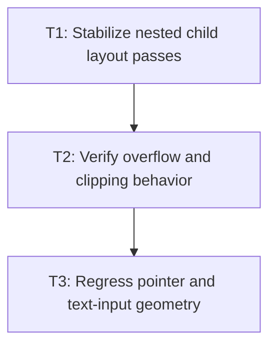

# P2: Integrate nested layout overflow and input

**Status:** Implemented subset

## Goal

Re-layout child content after grid sizing and prove existing overflow, clipping, rendering, and
input systems consume final grid geometry correctly.

## Non-Goals

- New renderer features or grid-specific paint primitives.

## Context

- Parent milestone: `docs/work/E3/M5 - Grid integration.md`.
- `LayoutServiceImpl` owns scroll/client metrics and layout-tree population after element layout.

## Phase Tasks

### T1: Stabilize nested child layout passes
**Purpose:** Ensure block, flex, inline, and nested grid children see their final available cell box.

**Depends on:** M5/P1/T3.
**Enables:** T2.
**Parallelizable with:** None.

**Changes:**
- [ ] Define the bounded first/second child layout pass around final cell assignment.
- [ ] Add nested block, flex, inline, and grid geometry regressions.
- [ ] Guard against repeated invalidation loops.

**Acceptance Checks:**
- [ ] Nested layouts converge to identical boxes on repeated frame layouts.
- [ ] Existing flex and inline tests remain green.

**Risks:** Stop and redesign if final sizes require more than one bounded re-layout pass.

### T2: Verify overflow and clipping behavior
**Purpose:** Keep grid containers and grid items consistent with existing scroll contracts.

**Depends on:** T1.
**Enables:** T3.
**Parallelizable with:** None.

**Changes:**
- [ ] Cover grid-container and grid-item overflow, client/scroll dimensions, and clipping.
- [ ] Verify implicit tracks and spanning items contribute to scroll extents.

**Acceptance Checks:**
- [ ] Scroll offsets clamp correctly for grid content.
- [ ] Hidden/absolute descendants follow existing overflow exclusion rules.

**Risks:** Do not duplicate `OverflowUtils` policy inside grid code.

### T3: Regress pointer and text-input geometry
**Purpose:** Verify final grid boxes are used by hit testing and interactive controls.

**Depends on:** T2.
**Enables:** M6/P1.
**Parallelizable with:** None.

**Changes:**
- [ ] Add pointer-target tests for aligned, clipped, and scrolled grid items.
- [ ] Exercise buttons, inputs, textareas, and text fragments inside nested grid cells.

**Acceptance Checks:**
- [ ] Pointer targets match visible final grid geometry.
- [ ] Input caret and viewport behavior remains valid in grid cells.

**Risks:** Renderer and event tests may need separate fixtures but share final geometry assertions.

## Verification Strategy

- Run `./gradlew :spinygui.core:test --tests '*Grid*' --tests '*Overflow*' --tests '*Input*'`.

## Dependency Graph

