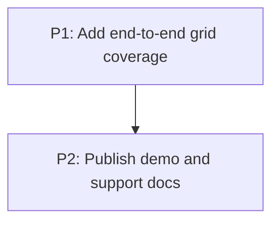

# M6: Grid proof and documentation

## Goal

Prove the delivered Grid Level 1 subset through end-to-end tests and a real demo, then publish an
accurate support contract.

**Depends on:** M5.
**Enables:** None.
**Parallelizable with:** None.

## Context

- Parent epic: `docs/work/E3 - CSS Grid support.md`.
- M5 completes layout and interaction integration; documentation must now follow tested behavior.

## Phases

### P1: Add end-to-end grid coverage
**Document:** [P1 - Add end-to-end grid coverage](M6/P1%20-%20Add%20end-to-end%20grid%20coverage.md)
**Purpose:** Cover representative rendering and interaction scenarios across the delivered subset.

**Depends on:** M5/P2.
**Enables:** P2.
**Parallelizable with:** None.

### P2: Publish demo and support docs
**Document:** [P2 - Publish demo and support docs](M6/P2%20-%20Publish%20demo%20and%20support%20docs.md)
**Purpose:** Make the supported contract visible and preserve it through a manual proof surface.

**Depends on:** P1.
**Enables:** None.
**Parallelizable with:** None.

## Validation

- Full focused grid, affected core/backend regressions, and the complex demo build pass.

## Dependency Graph

