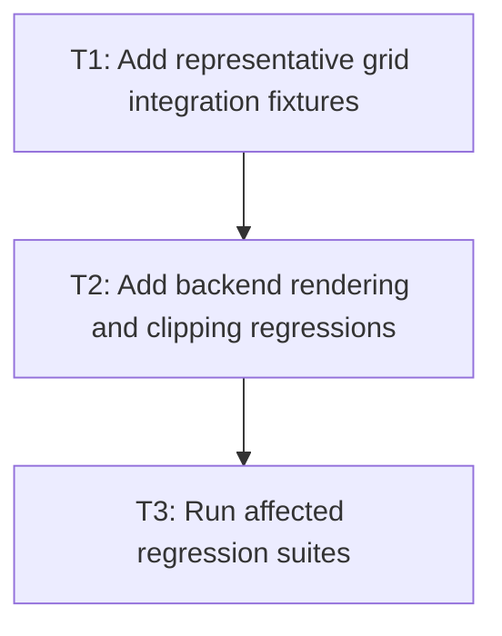

# P1: Add end-to-end grid coverage

**Status:** In progress

## Goal

Prove the delivered grid subset across style resolution, layout geometry, NanoVG rendering, and
interaction without relying solely on unit-level algorithms.

## Non-Goals

- Adding unimplemented Grid Level 2 features to reach test coverage.

## Context

- Parent milestone: `docs/work/E3/M6 - Grid proof and documentation.md`.
- M1–M5 establish the supported Grid Level 1 subset.

## Phase Tasks

### T1: Add representative grid integration fixtures
**Purpose:** Build compact fixtures that combine tracks, gaps, placement, areas, nesting, and
overflow.

**Depends on:** M5/P2/T3.
**Enables:** T2.
**Parallelizable with:** None.

**Changes:**
- [ ] Add reusable core test fixtures for fixed/flexible tracks, areas, auto-flow, and nested
  controls.
- [ ] Keep fixture CSS inside the delivered support subset.

**Acceptance Checks:**
- [ ] Each fixture has an explicit expected geometry and occupancy assertion.
- [ ] No fixture relies on undocumented browser behavior.

**Risks:** Avoid monolithic tests that hide which grid rule failed.

### T2: Add backend rendering and clipping regressions
**Purpose:** Verify NanoVG consumes final grid layout geometry correctly.

**Depends on:** T1.
**Enables:** T3.
**Parallelizable with:** None.

**Changes:**
- [ ] Add renderer tests for nested, clipped, and transformed content inside grid cells.
- [ ] Cover final border/background/text positions where the backend exposes test sinks.

**Acceptance Checks:**
- [ ] Renderer regressions prove cell geometry is honored after scrolling/clipping.
- [ ] Existing NanoVG regression suite remains green.

**Risks:** Keep layout assertions in core tests and paint assertions in backend tests.

### T3: Run affected regression suites
**Purpose:** Prove grid did not regress shared layout and event behavior.

**Depends on:** T2.
**Enables:** M6/P2.
**Parallelizable with:** None.

**Changes:**
- [ ] Run grid, block, flex, overflow, input, and NanoVG focused suites.
- [ ] Record any intentional behavior differences as support-matrix deferrals.

**Acceptance Checks:**
- [ ] All affected suites pass on the project JDK.
- [ ] Any unsupported case has a named follow-up before documentation begins.

**Risks:** None identified.

## Verification Strategy

- Run `./gradlew :spinygui.core:test :spinygui.core.backend.lwjgl.nanovg:test` with focused
  grid and affected-layout test filters first.

## Dependency Graph

