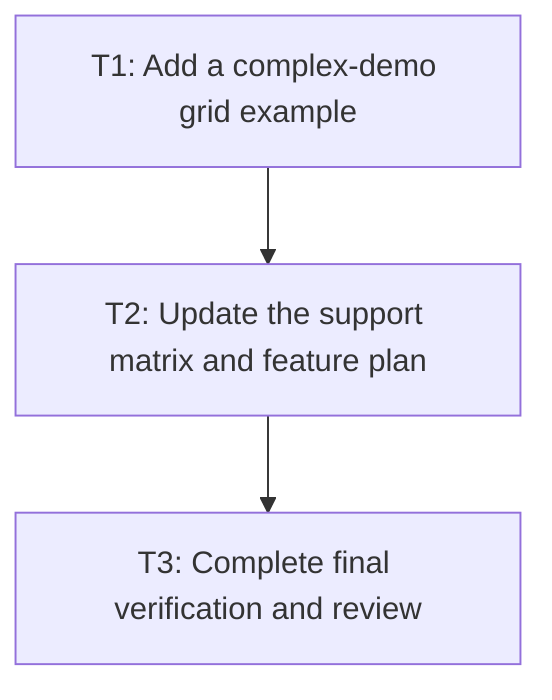

# P2: Publish demo and support docs

**Status:** In progress

## Goal

Create a manual grid proof surface and publish only the support claims backed by M6/P1 tests.

## Non-Goals

- Advertising unimplemented `subgrid`, masonry, or deferred baseline behavior.

## Context

- Parent milestone: `docs/work/E3/M6 - Grid proof and documentation.md`.
- Documentation is a final artifact; it must reflect executable behavior.

## Phase Tasks

### T1: Add a complex-demo grid example
**Purpose:** Give maintainers a repeatable visual proof of the delivered subset.

**Depends on:** M6/P1/T3.
**Enables:** T2.
**Parallelizable with:** None.

**Changes:**
- [ ] Add a demo screen/example using real grid tracks, gaps, spans/areas, auto placement, and
  nested content within the supported subset.
- [ ] Keep source CSS and labels explicit enough for manual geometry checks.

**Acceptance Checks:**
- [ ] The demo compiles and runs with the project launcher.
- [ ] Manual checks cover placement, scrolling/clipping, and pointer interaction.

**Risks:** A demo is proof, not a substitute for focused tests.

### T2: Update the support matrix and feature plan
**Purpose:** Publish the exact delivered Grid Level 1 contract and known deferrals.

**Depends on:** T1.
**Enables:** T3.
**Parallelizable with:** None.

**Changes:**
- [ ] Mark only implemented display/grid properties and behaviors as supported.
- [ ] Link deferred subgrid, masonry, auto-repeat, baseline, or intrinsic-sizing limitations to
  follow-up work.
- [ ] Update the feature plan’s completion status from test evidence.

**Acceptance Checks:**
- [ ] Documentation does not call raw parsing or block fallback “grid support.”
- [ ] Every support claim maps to a test or demo scenario.

**Risks:** None identified.

### T3: Complete final verification and review
**Purpose:** Hand off a reviewable, reproducible Grid Level 1 delivery.

**Depends on:** T2.
**Enables:** None.
**Parallelizable with:** None.

**Changes:**
- [ ] Run full core, NanoVG backend, and complex demo compilation checks.
- [ ] Inspect final support documentation and demo against the M1 contract.

**Acceptance Checks:**
- [ ] `./gradlew :spinygui.core:test :spinygui.core.backend.lwjgl.nanovg:test :spinygui.demo.complex:classes` passes.
- [ ] Review confirms no Level 2 feature is implied by the documentation.

**Risks:** Stop release documentation if any required regression suite is unavailable or failing.

## Verification Strategy

- Run the final command in T3 and manually exercise the complex demo.

## Dependency Graph

