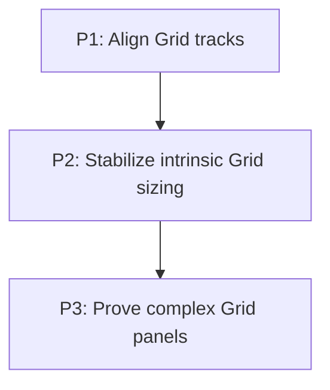

# M7 - Complete predictable Grid panels

## Document Context
- Status: In Progress
- Dependencies: M6/P2
- Parent: [E3 - CSS Grid support](../E3%20-%20CSS%20Grid%20support.md)
- Children: [P1 - Align Grid tracks](M7/P1%20-%20Align%20Grid%20tracks.md), [P2 - Stabilize intrinsic Grid sizing](M7/P2%20-%20Stabilize%20intrinsic%20Grid%20sizing.md), [P3 - Prove complex Grid panels](M7/P3%20-%20Prove%20complex%20Grid%20panels.md)
- Related: [Grid integration](M5%20-%20Grid%20integration.md), [Grid proof and documentation](M6%20-%20Grid%20proof%20and%20documentation.md)
- Next: P1 - Align Grid tracks

**Depends on:** M6/P2 — existing Grid proof, documentation, and manual-demo baseline.

## Goal

Finish the bounded Grid Level 1 work needed for complex application panels to keep their intended track alignment and intrinsic dimensions as content, controls, and available space change.

## Context

- `GridLayout` already resolves explicit and implicit tracks, gaps, placement, item stretch/self alignment, nesting, and overflow metrics.
- Container-level `justify-content` and `align-content` are still deferred, so unused space remains anchored rather than distributed according to CSS alignment.
- Auto-track sizing currently derives one-track contributions from prior child boxes. This needs a stable measured-input contract for controls, text, and nested layout without introducing a general browser-sized multi-pass engine.
- M6 remains the evidence/documentation path for the existing subset. This milestone adds the missing behavior first, then extends its proof surface.

## Non-Goals

- `subgrid`, masonry, baseline alignment, negative line indexes, and named-line or `span <name>` grammar.
- CSS Grid Level 2 features or a general replacement for the existing layout pipeline.
- Browser-perfect intrinsic algorithms beyond the explicitly tested fixed, auto, `minmax`, `fit-content`, and flexible-track cases.

## Phases

### P1: Align Grid tracks

**Purpose:** Apply container-level `justify-content` and `align-content` after track sizes and gaps are known.

**Depends on:** M6/P2.

**Architectural Proposition:** Keep track sizing unchanged. Compute one axis-specific offset and inter-track distribution from remaining space, then reuse final track coordinates for item placement, overflow, clipping, and hit-testing.

**Validation:** Geometry tests cover start/end/center and distributive alignment with fixed and flexible tracks, while negative free space retains existing overflow behavior.

### P2: Stabilize intrinsic Grid sizing

**Purpose:** Make auto/minmax/fit-content tracks derive repeatable contributions from text, controls, and nested layout.

**Depends on:** P1.

**Architectural Proposition:** Use a bounded pre-measure/final-layout sequence within `GridLayout`; only reflow an item when the assigned area changes. Do not introduce unconstrained iteration.

**Validation:** Tests prove stable final boxes and scroll metrics for text, buttons, inputs, textareas, nested block/flex/grid items, and mixed fixed/flexible tracks.

### P3: Prove complex Grid panels

**Purpose:** Turn the delivered alignment and intrinsic-sizing contract into regression evidence and a manual demo surface.

**Depends on:** P2.

**Architectural Proposition:** Keep geometry assertions in core, paint/clipping assertions in NanoVG, and use one compact complex demo as manual evidence.

**Validation:** Focused core/backend/demo suites and native demo checks cover alignment, resizing, scrolling, clipping, text/control interaction, and pointer targets.

## Cross-Cutting Risks

- A child whose intrinsic size depends on its final track can form a feedback loop. Bound the measurement sequence and retain the first stable result rather than iterating indefinitely.
- Distributive content alignment must not inflate scroll extents or alter item self-alignment.
- Existing Grid behavior is shared with overflow and rendering paths; each phase requires focused regression coverage before moving on.

## Verification / Review Strategy

- Run focused `GridStyleManagerTest`, `GridLayoutTest`, overflow, controls, and NanoVG regressions after each phase.
- Before closing M7, run `:spinygui.core:test :spinygui.core.backend.lwjgl.nanovg:test :spinygui.demo.complex:test` and manually check the complex Grid demo in a native window.

## Dependency Graph

