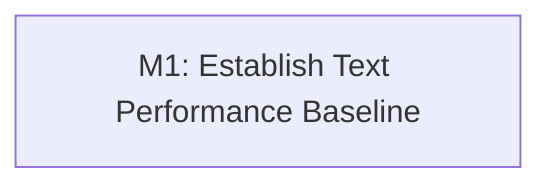

# E4: Text Performance Benchmarks

**Status:** Complete with verification caveat

## Goal

Add reproducible local benchmarks for text measurement, layout, allocation, and NanoVG rendering so performance changes can be compared on the same machine.

> **Verification note:** The benchmark baseline implementation and tracked acceptance work
> are complete. The full benchmark suite currently retains a known diagnostic fixture
> mismatch (`scaledCpuFixturesExposeCurrentQuadraticGlyphMovementWithoutClocks`: expected
> 28, actual 0).

## Milestones

### M1: Establish Text Performance Baseline

**Status:** Complete with verification caveat

**Depends on:** None.
**Enables:** None.
**Parallelizable with:** None.

Implement a standalone benchmark module, exercise representative text workloads, and capture an informational local baseline without adding hardware-sensitive checks to the normal build.

## Dependency Graph

