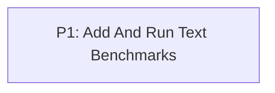

# M1: Establish Text Performance Baseline

**Status:** Complete

Parent plan: `docs/work/E4 - Text performance benchmarks.md`

## Goal

Provide repeatable CPU and GPU text benchmarks and document the first local result set.

## Phases

### P1: Add And Run Text Benchmarks

**Depends on:** None.
**Enables:** None.
**Parallelizable with:** None.

Add isolated benchmark infrastructure, JMH calculation workloads, a real hidden-context NanoVG harness, and baseline reports.

## Dependency Graph

## Verification Evidence

- On 2026-08-14, `./gradlew --no-daemon :spinygui.benchmark:test --console=plain`
  passed 17 suites and 112 tests with zero failures, errors, or skips.
- `./gradlew --no-daemon :spinygui.benchmark:benchmarkReport --dry-run --console=plain`
  confirmed the report-owned CPU and rendering stages in the supported paired workflow.
- The complete paired benchmark/report workflow passed and produced run
  `20260814-030310-481423700`: nine CPU operations, two 200-frame rendering scenes, and four
  approved structural-validation scenes covering 2,557 recorded commands.
- The CPU and rendering artifacts use the same run ID and `paired-report` identity. The generated
  manifest and HTML select that run, retain three eligible historical pairs, and keep excluded and
  diagnostic artifacts classified separately.
- The generated report remains self-contained with five canvases, five fallbacks, and no external
  script or stylesheet references. Timings are informational local evidence rather than portable
  pass/fail thresholds.
