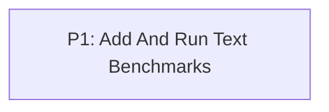

# M1: Establish Text Performance Baseline

**Status:** Complete with verification caveat

Parent plan: `docs/work/E4 - Text performance benchmarks.md`

## Goal

Provide repeatable CPU and GPU text benchmarks and document the first local result set.

## Phases

### P1: Add And Run Text Benchmarks

**Depends on:** None.
**Enables:** None.
**Parallelizable with:** None.

Add isolated benchmark infrastructure, JMH calculation workloads, a real hidden-context NanoVG harness, and baseline reports.

## Dependency Graph

