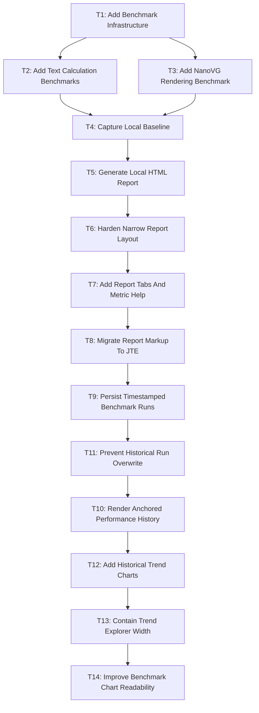

# P1: Add And Run Text Benchmarks

**Status:** Complete

Parent milestone: `docs/work/E4/M1 - Establish text performance baseline.md`

## Goal

Implement calculation and rendering benchmarks that produce reproducible local reports without affecting normal test or check tasks.

## Tasks

### T1: Add Benchmark Infrastructure

**Depends on:** None.
**Enables:** T2, T3.
**Parallelizable with:** None.

### T2: Add Text Calculation Benchmarks

**Depends on:** T1.
**Enables:** T4.
**Parallelizable with:** T3 after shared fixtures are stable.

### T3: Add NanoVG Rendering Benchmark

**Depends on:** T1.
**Enables:** T4.
**Parallelizable with:** T2 after shared fixtures are stable.

### T4: Capture Local Baseline

**Depends on:** T2, T3.
**Enables:** T5.
**Parallelizable with:** None.

### T5: Generate Local HTML Report

**Depends on:** T4.
**Enables:** T6.
**Parallelizable with:** None.

### T6: Harden Narrow Report Layout

**Depends on:** T5.
**Enables:** T7.
**Parallelizable with:** None.

### T7: Add Report Tabs And Metric Help

**Depends on:** T6.
**Enables:** T8.
**Parallelizable with:** None.

### T8: Migrate Report Markup To JTE

**Depends on:** T7.
**Enables:** T9.
**Parallelizable with:** None.

### T9: Persist Timestamped Benchmark Runs

**Depends on:** T8.
**Enables:** T11.
**Parallelizable with:** None.

### T10: Render Anchored Performance History

**Depends on:** T11.
**Enables:** None.
**Parallelizable with:** None.

### T11: Prevent Historical Run Overwrite

**Depends on:** T9.
**Enables:** T10.
**Parallelizable with:** None.

### T12: Add Historical Trend Charts

**Depends on:** T10.
**Enables:** T13.
**Parallelizable with:** None.

### T13: Contain Trend Explorer Width

**Depends on:** T12.
**Enables:** T14.
**Parallelizable with:** None.

### T14: Improve Benchmark Chart Readability

**Depends on:** T13.
**Enables:** None.
**Parallelizable with:** None.

## Dependency Graph

