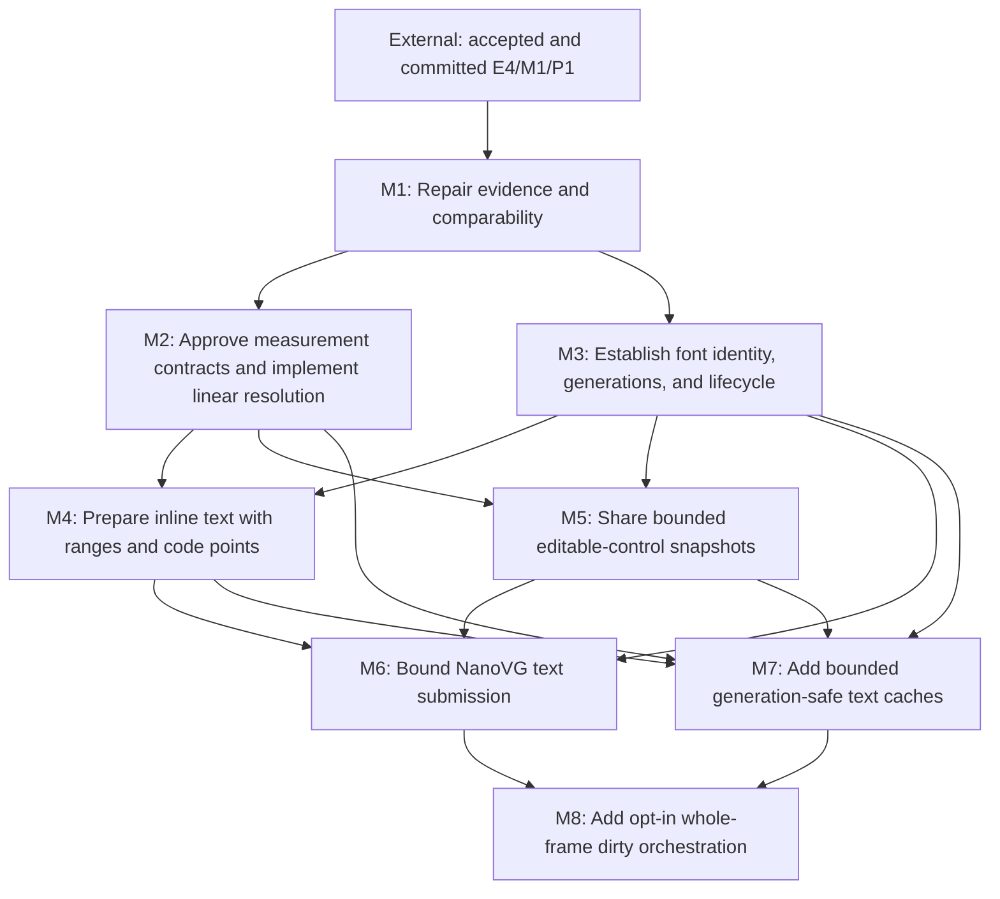

# E5: Text Performance Improvements

## Goal

Deliver an implementation-ready, dependency-first text-performance architecture that repairs the
evidence boundary, makes uncached measurement and inline preparation linear, establishes real font
identity and lifecycle, shares naturally bounded editable-control snapshots, bounds NanoVG
submission and persistent caches, and optionally skips whole style/layout domains only when an
explicit session proves their outputs current.

## External Prerequisite

- E4 benchmark infrastructure, through `docs/work/E4/M1/P1 - Add and run text benchmarks.md`, must
  be accepted and committed before E5/M1 starts. E5 extends that history and does not edit, merge,
  renumber, or replace E4 artifacts.

## Non-Goals

- Targeted subtree, formatting-context, or selector-indexed incremental layout.
- Full inline-fragment, retained-layout-result, or historical editable-control caching.
- Automatic interception of every existing public mutable alias; opt-in sessions require explicit
  invalidation for mutations they cannot observe, while legacy service calls remain force-full.
- Full shaping/HarfBuzz, bidi, grapheme editing, ligatures, or expanded Unicode line-breaking.
- Unbounded caches, weak ownership without an independent hard bound, or persistent native buffers
  per run.
- A mandatory dependency on the optional E2 frame runtime. M8 is backend-neutral and usable by a
  manual host; a future E2 adapter may consume it without duplicating its contract.
- Production implementation, tests, benchmarks, build changes, or generated output in this
  documentation revision.

## Architecture Constraints

- Font-registry mutation, text measurement/layout, cache use, and rendering are UI-thread confined.
  E5 does not introduce concurrent atomic registry snapshots.
- Existing `StyleManager.recalculate` and `LayoutService.layout` semantics remain force-full.
- Structural recordings and deterministic counters are portable primary evidence. Timings,
  allocations, and local image comparisons are supporting evidence under explicit comparability
  rules.
- Semantic workload/scenario IDs and comparability fingerprints contain only benchmark/workload/
  schema/behavior-contract identity, declared settings, and relevant environment/JVM/driver fields.
  The implementation-under-test/build/commit revision is reported metadata but is excluded from
  fingerprint equality because that revision is the intentional comparison dimension; a behavior-
  contract migration may instead bump the contract/workload version. Observed glyph/run/fragment
  counts and other outputs remain evidence under that fixed identity and never create a new series.
- Persistent font-dependent state consumes the real M3 generation. M5 must not ship against a fake
  or temporary version source.
- Every behavioral contradiction named by M2 is an approval gate with compatibility/migration
  impact; implementation cannot silently preserve or silently change it.
- Every persistent cache has immutable keys, UI-thread ownership, a hard entry/weight/admission
  policy, diagnostics, clear/teardown, oversized-value behavior, and disabled mode.
- M8 tracks monotonic source/output epochs and per-session consumer watermarks. It never treats a
  monotonic version as a globally cleared dirty flag.

## Milestones

### M1: Repair evidence and comparability

**Document:** [M1 - Repair evidence and comparability](E5/M1%20-%20Repair%20evidence%20and%20comparability.md)

**Purpose:** Make workload identity, diagnostics, reporting, renderer/control recordings, and
cross-run comparability trustworthy before optimization.

**Depends on:** Accepted and committed E4/M1/P1 (external).
**Enables:** M2, M3.
**Parallelizable with:** None.

**Architectural Proposition:** Timed/allocation runs are diagnostics-disabled; counter-only runs are
untimed and diagnostics-enabled. Semantic benchmark/workload/schema/behavior-contract identity,
relevant environment/JVM/driver fields, and declared settings decide whether a delta is comparable;
the reported implementation/build/commit revision does not participate in fingerprint equality.

**Key Work:**
- Identify every parameterized JMH workload and renderer/control/visible/offscreen/unchanged scene
  by declared behavior-affecting inputs/configuration only; preserve distinct E4 and E5 series while
  keeping changed output counts under the same scenario ID.
- Distinguish source scans, logical resolutions, native probes/calls, builder work, complete control
  layouts, all `TextMeasurer` entry points, UTF-8/NanoVG work, and culling.
- Add text/input/textarea recording seams, including a textarea renderer seam; replace non-black
  smoke as correctness evidence with structural recording plus an opt-in image policy.
- Correct the rendering pre-measure sequence: the alternating loop warms small/large 30/30, then
  pixel validation renders/synchronizes small once for an actual 31/30 asymmetry. Either validate
  outside a fresh equal warmup/measurement sequence or report that complete distribution, then
  recapture the baseline.
- Produce exactly one paired archived run per `benchmarkReport` invocation and never rerun the pair
  under a mismatched identifier merely to regenerate a report.

**Validation:** Incomparable contract/workload/environment/settings fingerprints suppress or mark
deltas, while a changed reported implementation revision remains comparable by design; deterministic
evidence exposes current duplicate work; one diagnostics-disabled paired invocation captures the
reviewed baseline.

### M2: Approve measurement contracts and implement linear resolution

**Document:** [M2 - Approve measurement contracts and implement linear resolution](E5/M2%20-%20Approve%20measurement%20contracts%20and%20implement%20linear%20resolution.md)

**Purpose:** Resolve ambiguous behavior explicitly, then eliminate duplicate glyph resolution and
quadratic suffix/run copying before persistent caches exist.

**Depends on:** M1.
**Enables:** M4, M5, M7.
**Parallelizable with:** M3, only after M1 and only while approved public contracts/files are
partitioned.

**Architectural Proposition:** A code-point scan appends width-independent resolved primitives to
measurement-local private run/line builders. Public `TextLineMetrics`, `ResolvedTextRun`, and caret
arrays freeze exactly once only after P3 final wrapping, deferred-suffix placement, and line-start
kerning reset; wrapping reuses scanned primitives without repeated native probes.

**Key Work:**
- Approve `wordWrap`, replacement face, empty-chain, CR/LF, UTF-16 `charCount`, immutability,
  fallback vertical metrics, zero/narrow width, surrogate-interior setter, and source-coordinate
  contracts plus exact horizontal/vertical rounding/accumulation order and caret midpoint ties with
  migration impact.
- Keep raw base advance, pair-kerning inputs, and UTF-16 boundaries on width-independent primitives;
  after wrapping/reset, freeze one rebased cumulative caret-advance array per final line. Reject a
  source-global cumulative array.
- Let P2 validate private mutable/frozen builder invariants, but do not publish incomplete public
  line/run/caret results; any P2 immutable fixture is private or already at a proven final boundary.
- Add an internal compatible range-aware measurement overload/adapter so M4 does not allocate one
  temporary `String` per measured range while current public `TextMeasurer` APIs remain compatible.
- Distinguish logical glyph resolution from the multiple native glyph-index probes fallback may
  require.
- Prove linear builder/freeze work against long deferred suffixes, narrow widths, fallback
  transitions, and line-start kerning resets.

**Validation:** Contract decisions are approved; public UTF-16 indices and code-point atomicity are
tested; cold/disabled counters show no repeated scan/probe solely for wrapping or run construction
and no quadratic suffix copying/moving.

### M3: Establish font identity, generations, and lifecycle

**Document:** [M3 - Establish font identity generations and lifecycle](E5/M3%20-%20Establish%20font%20identity%20generations%20and%20lifecycle.md)

**Purpose:** Create one real core font registry/resource identity, monotonic semantic generations,
central resolver use, and deterministic core/NanoVG resource teardown before inline preparation,
snapshots, rendering, and caches consume font-dependent state.

**Depends on:** M1.
**Enables:** M4, M5, M6, M7.
**Parallelizable with:** M2, only after M1 and only while approved public contracts/files are
partitioned.

**Architectural Proposition:** Registry content and generation are observed consistently on the UI
thread. Core semantic generation is independent of context-local NanoVG face creation, while all
font bytes, STB info, face buffers, contexts, and services have explicit owners and close order.

**Key Work:**
- Define generation effects for bootstrap, add/replace, underlying-byte reload/replacement,
  clear/removal if supported, duplicate/no-op, and failure; route or reject every public mutation
  alias (`Font.addFont`, `SystemFontLoader`, `FontStorage.loadFont`, and bootstrap registration).
- Replace bypasses through `FontChainResolver.DEFAULT` with injected/central resolver ownership and
  make mutation aliases delegate atomically on the UI thread.
- Bound or naturally scope `FontStorageImpl` bytes, `FontServiceImpl` STB info, NanoVG buffers/info/
  faces, and contexts; honor `freeData=false` until context deletion.
- Decide the mutable direct-buffer compatibility/lifetime contract, including previously returned
  aliases, and select an active-context same-path reload strategy that cannot retain old
  `freeData=false` buffers without a hard bound/forced rotation.
- Define context replacement support/rejection, repeated destroy, use-after-destroy, face-creation
  failure, and teardown sequencing.

**Validation:** UI-thread violations are rejected/documented, generation observations are coherent,
and context deletion precedes buffer/info release. M3 exposes the centralized resolver/thread
contract and production generation consumed by M4/M5/M6/M7.

### M4: Prepare inline text with ranges and code points

**Document:** [M4 - Prepare inline text with ranges and code points](E5/M4%20-%20Prepare%20inline%20text%20with%20ranges%20and%20code%20points.md)

**Purpose:** Reduce temporary strings/units and repeated preparation while initially preserving the
durable fragment structure exposed by current tests.

**Depends on:** M2, M3.
**Enables:** M6, M7.
**Parallelizable with:** M5 after M3 completes and the shared M2 text contract is frozen.

**Architectural Proposition:** One whitespace scan produces immutable prepared text and explicit
UTF-16 mappings among original-node, normalized, unit/range, fragment-local, and resolved-run
coordinates. Inline work references code-point-safe ranges and materializes current durable
fragments at the existing output boundary.

**Key Work:**
- Define mappings for tabs, collapse, CR/LF decisions, replacement, splits, and wrap boundaries.
- Define form-feed and vertical-tab behavior alongside tabs/collapse, and replace temporary
  substrings/per-character units with prepared ranges and compact special units.
- Gate implementation that resolves/reuses font chains on M3/P2 central resolver/mutation ownership.
- Consume M2's range-aware measurement boundary with zero temporary range strings; materialize
  exactly one `String` for each preserved text-bearing fragment that requires one and zero for
  null-text spacer, element, or union fragments, with explicit counters.
- Reuse immutable typography/font-chain values only within one UI-thread-confined pass.
- Preserve fragment count/text/ownership and explicitly assert node reference identity because
  `InlineFragment.equals` excludes `node`.

**Validation:** One normalization scan and code-point-safe range traversal reduce temporary
allocation; durable-string counters equal the preserved text-bearing fragment subset and remain zero
for null-text spacer/element/union fragments. Durable allocation is not claimed eliminated, and
fragment coalescing remains a separately approved behavior change.

### M5: Share bounded editable-control snapshots

**Document:** [M5 - Share bounded editable-control snapshots](E5/M5%20-%20Share%20bounded%20editable-control%20snapshots.md)

**Purpose:** Give each input/textarea one lazily validated immutable text-local geometry snapshot
shared by every render, event, caret, selection, hit-test, scroll, and viewport consumer.

**Depends on:** M2, M3.
**Enables:** M6, M7.
**Parallelizable with:** M4 after M3 completes and the shared M2 text contract is frozen.

**Architectural Proposition:** A core `ControlTextLayoutService`-style boundary manages one snapshot
slot on each control. The slot is excluded from generated equality/hash/toString; core remains
NanoVG-independent; consumers explicitly convert text-local geometry through layout, viewport,
ancestor scroll, and presentation transforms.

**Key Work:**
- Validate the effective key on every query because current mutable aliases are not observable.
- Key exact value, complete effective typography/line height, measurement context/configuration,
  real M3 generation, and textarea content width/current actual wrap policy.
- Keep input placement/content height and color/focus/caret/selection/scroll outside the text-layout
  key; retain no history or global control identity map.
- Define whole-control/paragraph/visual-line/fragment/run/replacement mappings and multi-paragraph
  wrapped fallback fixtures.
- Route normal and debug renderer paths plus control-specific behaviors through the same service/slot,
  then migrate shared listener/provider dispatch in a separate integration phase.

**Validation:** Warm non-key queries call no `TextMeasurer` entry point; an invalidating edit/key/char
operation causes exactly one rebuild at the next required query, after which warm queries call zero;
non-invalidating presentation/interaction changes reuse. Debug/listener paths share the service,
surrogate-interior setters follow M2, and textarea tests use the current wrap constant unless M2
separately approves an API.

### M6: Bound NanoVG text submission

**Document:** [M6 - Bound NanoVG text submission](E5/M6%20-%20Bound%20NanoVG%20text%20submission.md)

**Purpose:** Reduce and bound rendered-text preparation, UTF-8 staging, NanoVG text/state calls, and
only culling backed by conservative visibility evidence.

**Depends on:** M3, M4, M5.
**Enables:** M8.
**Parallelizable with:** M7 only for backend-only phases after M6/P1 freezes shared data/lifecycle
contracts and the phases do not share benchmark/report files.

**Architectural Proposition:** Keep the public `ResolvedTextRun` record components, canonical
constructor, accessors, equality/hash/toString semantics compatible; do not assume a record can add
an instance cache. A reviewed compatible representation or direct glyph-to-staging path feeds a
renderer/context-owned frame-scoped or hard-capped UTF-8 staging owner.

**Key Work:**
- Prove native call lifetime against a pinned or reproducibly identified LWJGL/NanoVG implementation.
- Share one observable submission seam across text/input/textarea, with oversized fallback, reset,
  teardown, text alignment, known save/restore boundaries, and face-failure x-advance behavior.
- Track state only while all relevant mutations are mediated; invalidate at unknown boundaries.
- Gate textarea lines and general fragments/runs alike on conservative ink bounds plus propagated
  Java-side clip/transform evidence covering fallback, overhang, and antialias fringe. Defer either
  class when proof/data are absent; never use line/advance rectangles as ink bounds.

**Validation:** Structural recordings/counters are primary; local image comparisons validate
boundaries; context/font lifecycle matches M3; no unbounded or per-run native retention appears.

### M7: Add bounded generation-safe text caches

**Document:** [M7 - Add bounded generation-safe text caches](E5/M7%20-%20Add%20bounded%20generation-safe%20text%20caches.md)

**Purpose:** Add independently reviewable bounded cache families on corrected data boundaries after
uncached algorithms, generations, and naturally bounded snapshots are stable.

**Depends on:** M2, M3, M4, M5.
**Enables:** M8.
**Parallelizable with:** M6 only for backend-only M6 phases after M6/P1 and with disjoint files/tests.

**Architectural Proposition:** Cache width-independent resolved primitives—source boundaries,
face/glyph choices, base advances, and pair-kerning inputs—not final line-specific
`ResolvedTextRun` values. Final runs materialize after wrapping and line-start kerning reset; width
exists only in exact wrap keys based on P1's immutable semantic resolved-primitive value key, not an
evictable cache-entry identity.

**Key Work:**
- Define immutable key tables, UI-thread ownership, hard bounds/weight/admission, oversized behavior,
  hit/miss/eviction/retained-weight diagnostics, clear/teardown, and disabled mode.
- Split font-chain, metrics, glyph/miss, advance, kerning, prepared-node, resolved-primitives, and
  wrap families into reviewable phases.
- Prohibit persistent keys/references from using cache-entry identity; define immutable semantic
  value-key/value reference direction, explicit shared-object weight accounting, independent clear,
  and downstream-to-upstream teardown.
- Include existing M3 font/native resources in aggregate retention claims and preserve M5's one-slot
  snapshots rather than adding a global control cache.

**Validation:** Cold, warm, churn, and disabled workloads prove exact keys, bounded aggregate
retention, generation safety, and linear disabled behavior. Pre-laid-out rendering scenes alone do
not count as cache-reuse proof.

### M8: Add opt-in whole-frame dirty orchestration

**Document:** [M8 - Add opt-in whole-frame dirty orchestration](E5/M8%20-%20Add%20opt-in%20whole-frame%20dirty%20orchestration.md)

**Purpose:** Add a backend-neutral opt-in session that skips complete style/layout domains for a
whole frame when current without changing legacy force-full service behavior.

**Depends on:** M6, M7.
**Enables:** None.
**Parallelizable with:** None.

**Architectural Proposition:** Monotonic source epochs, produced/output epochs, and per-session
consumer watermarks govern whole-frame decisions under a UI-thread, non-reentrant/queued-mutation
model. Successful/converged outcomes alone advance watermarks. A failed attempt produces no session-
renderable output, cannot render through session-managed paths, and advances no watermarks; direct
legacy renderer bypass is an explicit host obligation and unsupported misuse.

**Key Work:**
- Keep direct `StyleManager`/`LayoutService` calls force-full; add explicit manual-host/session
  invalidation for unobservable aliases and optional adapters for known runtime/event sources.
- Require an outcome-capable layout subinterface/adapter for skip-aware session eligibility without
  adding a source-breaking abstract method to `LayoutService`; legacy/custom services remain
  force-full unless truthfully adapted.
- Skip only complete style/layout domains, never targeted subtrees or formatting contexts.
- Require force-full retry after failure/unconverged max-pass results; no transactional rollback is
  promised. Session-managed paths reject invalid output; direct renderer bypass on the shared frame
  remains an explicit unsupported host misuse. Permit only one active skip-aware session per frame.
- Define staged host ordering as capture pre-style source state, resolve style, invoke a host
  transition tick whose outcome records expected presentation-domain changes, capture post-tick
  state, re-decide required layout/presentation-transform/render work for the same frame, then render.
  Expected tick changes are the explicit exception to ordinary in-flight supersession; unrelated
  mutations still supersede publication. Include pseudo-state/transition scenarios without E2.
- Resolve presentation transforms separately on transform-only frames while geometry changes
  invalidate percentage/origin-dependent transforms.
- Keep static scrollbar geometry layout-owned but derive thumb position from current scroll at
  render/input time only after an explicit `ScrollbarGeometry.Metrics` compatibility decision. Paint
  cleanliness never implies renderer skipping for immediate-mode hosts.

**Validation:** The scenario matrix covers unchanged, paint-only, scroll-only, transform-only,
expected same-frame transition geometry/transform/paint changes, unrelated mutation during a tick,
hover/focus/active pseudo-state changes, edit, font generation, resize, DOM/style, convergence/max-
pass/failure, explicit invalidation, legacy force-full/custom-service eligibility, and mutation queued
during processing. Expected transition changes cause neither endless retry nor one-frame latency;
completion proves only whole-frame skipping.

## Remaining Evidence-Driven Decision Gates

- M1 must account for the actual 30/30 alternating warmup plus synchronized small-scene image
  validation (31/30 pre-measure). It must move validation outside a fresh equal sequence or report the
  complete distribution, then recapture the baseline.
- M2 must approve each listed behavior/immutability/index/coordinate outcome and migration impact
  before the linear builder path is implemented.
- M3 must select exact registry/resource bounds and either support or explicitly reject renderer
  context replacement under the approved UI-thread lifecycle.
- M6 must select the public-compatible rendered-text path and bounded staging design from pinned
  native-source evidence; general fragment/run culling remains gated on conservative ink and
  Java-side clip/transform proof.
- M7 must select per-family entry/weight/admission defaults and enablement from bounded churn and
  aggregate retention evidence, not only warm latency.
- M8 must finalize the compatible outcome/session API shape and epoch overflow policy while retaining
  the already approved whole-frame-only, force-full legacy, failure, and manual-invalidation rules.

## Cross-Cutting Risks and Stop Criteria

- Stop any phase that can split a valid surrogate pair or loses a required source-coordinate mapping.
- Stop font-dependent retention until M3 generation and teardown are production-ready.
- Stop a cache lacking a hard/natural bound, independent clear semantics, or explainable aggregate
  weight; weak ownership alone is not a bound.
- Stop staging or buffer reuse unless native pointer lifetime and teardown order are reproducible.
- Defer textarea-line or general text culling when conservative ink bounds or effective clip/
  transform propagation are absent.
- Treat any unresolved M2 contradiction as a prerequisite decision, not an implementation default.
- Treat incomplete session mutation coverage as an explicit manual-invalidation requirement, not a
  claim of automatic incremental correctness.

## Verification / Review Strategy

- Use supported focused tasks such as `./gradlew :spinygui.core:test`,
  `./gradlew :spinygui.core.backend.lwjgl.nanovg:test`, and
  `./gradlew :spinygui.benchmark:test`; phase documents name verified class filters.
- Capture a paired timed/allocation report by invoking
  `./gradlew :spinygui.benchmark:benchmarkReport` once. Do not run `jmhCpu` and `jmhRendering` first
  and then invoke `benchmarkReport`, because that would archive another pair.
- Use `jmhCpu` or `jmhRendering` alone only for an explicitly unpaired local investigation whose
  output is not presented as the paired E5 baseline.
- Keep diagnostics-enabled counter-only execution separate from diagnostics-disabled timed and
  allocation evidence.
- Run `./gradlew test` at milestone integration boundaries; no benchmark latency or image threshold
  enters normal `test`/`check`.

## Dependency Graph

