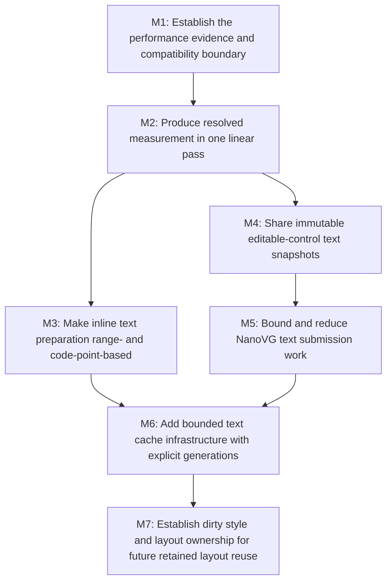

# E5: Text Performance Improvements

## Goal

Improve text preparation, measurement and layout, editable-control reuse, and NanoVG submission
performance while preserving current UTF-16 source indices, fallback-font selection, wrapping,
metrics, caret behavior, and visual output.

## Non-Goals / Deferred Work

- Full shaping, grapheme-cluster editing, Unicode line-breaking conformance, bidirectional text,
  ligatures, or HarfBuzz integration. This epic remains code-point based and treats valid surrogate
  pairs atomically under the current UTF-16 contract.
- Unbounded Java or native-memory caches, native buffers retained per run, or fragment
  concatenation that could change fallback faces, kerning boundaries, metrics, or draw order.
- Using mutable `ResolvedStyle` identity as a persistent cache key.
- Full inline-fragment caching before reliable style and layout dirty versions exist.
- Making broad dirty style/layout ownership a prerequisite for safe algorithmic fixes, pass-local
  reuse, bounded primitive caches, control snapshots, or renderer staging.
- Hardware-sensitive performance thresholds in normal CI. Local benchmark results remain
  informational and comparable only on equivalent environments.
- General layout-object, parser/style, or non-text rendering cleanup unless measurement shows it
  is necessary to realize a milestone in this epic.

## Context

- E4 and the current `spinygui.benchmark` workspace establish JMH CPU/allocation workloads and a
  hidden-context NanoVG harness. The checked-in/current local baseline reports approximately
  37.6 ms and 368 MB/op for 5K+ character single-font measurement, 394 us and 931 KB/op for
  text-dense inline layout, and 4.69 ms CPU submission / 6.31 ms GPU-complete for 1,000 fragments
  and 3,000 resolved runs.
- `FontServiceImpl.measureText` resolves glyphs while measuring width and wrapping, then
  `addLine`/`resolveRuns` resolves them again. Extending a same-font run removes and reconstructs
  immutable glyph lists, producing quadratic copying in the dominant benchmark.
- `InlineWhitespace` performs replacement and regex passes. `InlineFormattingContext` creates
  substrings and per-space/per-character units, resolves the same font chain for temporary units,
  and can split by UTF-16 `char` rather than code point.
- `NvgInputRenderer` measures the complete value and prefix substrings during rendering.
  `MultilineTextControlMetrics` and `NvgTextareaRenderer` repeatedly split, wrap, and measure the
  complete value; a K-line selection can cause roughly `2K + 3` complete layouts.
- `ResolvedTextRun.renderedText()` rebuilds immutable run text on demand. Text, input, and textarea
  NanoVG paths allocate and free UTF-8 native buffers per run and repeat font, size, and color
  state; the large E4 scene submits 3,000 runs.
- Existing long-lived reuse covers font bytes, STB font info, NanoVG faces, an inline-style parse
  LRU, and pass-local `InlineUnit` measurements. Font-chain, font-metric, glyph/miss,
  advance/kerning, prepared-node-text, resolved-sequence, wrapped-layout, and control-result reuse
  do not yet have explicit ownership and invalidation contracts.
- The complex demo recalculates style and layout every frame, and `LayoutServiceImpl` may repeat
  layout for scrollbar convergence. Reliable dirty ownership is therefore a larger architectural
  boundary than the local text fixes.

## Assumptions and Open Questions

- Assumption: E4 remains the benchmark-infrastructure epic; E5 extends its workloads and consumes
  its local reports rather than replacing or renumbering E4 artifacts.
- Assumption: optimized outputs must remain structurally and visually equivalent under the current
  pixel-rounding and replacement-marker behavior, even when an alternative would be faster.
- Assumption: caches introduced here are bounded or have naturally bounded owners, expose
  diagnostics, and can be cleared or invalidated deterministically.
- Question: whether resolved-sequence reuse belongs inside the font service or behind a dedicated
  immutable text-preparation boundary. M2 must stabilize the uncached result contract before M6
  chooses the owner.
- Question: whether renderer staging should use a frame arena, a reusable growable buffer with a
  hard cap, or stack/native interop for small runs. M5 must select using allocation counters and
  explicit teardown behavior rather than retaining one native allocation per run.

## Milestones

### M1: Establish the performance evidence and compatibility boundary

**Document:** [M1 - Establish the performance evidence and compatibility boundary](E5/M1%20-%20Establish%20the%20performance%20evidence%20and%20compatibility%20boundary.md)

**Purpose:** Extend E4 evidence so algorithmic complexity, reuse effectiveness, and renderer
submission work can be evaluated without replacing correctness with machine-specific timing goals.

**Depends on:** None.
**Enables:** M2.
**Parallelizable with:** None.

**Architectural Proposition:** Treat benchmark workloads, operation counters, behavioral
regressions, and pixel checks as complementary evidence. Latency and allocation reports remain
local and informational; deterministic complexity and call-count assertions may be automated.

**Key Work:**

- Extend the benchmark boundary with input and textarea workloads, size-scaled measurement and
  wrapping cases, unchanged-frame scenarios, and visible/offscreen text scenes.
- Add counters for glyph lookup, advance/kerning lookup, resolved-run construction, complete
  control layouts, UTF-8 bytes/allocations, NanoVG text calls, state changes, and culled work.
- Define representative scaling points that distinguish linear growth from the current
  same-font-run quadratic behavior and expose the `2K + 3` textarea-selection pattern.
- Freeze compatibility fixtures for UTF-16 ranges, surrogate-pair atomicity, fallback and missing
  glyph runs, wrapping boundaries, line metrics, caret/hit testing, selection, and pixels.
- Preserve the E4 baseline and report format as historical local evidence; record environment and
  workload shape rather than introducing absolute CI pass/fail budgets.

**Open Questions:**

- Which renderer counters can be gathered through existing sinks and which require a narrow
  diagnostic boundary that remains disabled or near-zero-cost outside benchmarks?

**Validation:**

- Reports show latency, normalized allocation, workload size, and deterministic counters for the
  new scenarios.
- A reviewer can identify superlinear measurement and repeated control layouts from scaling and
  counters without relying on a specific CPU or GPU.
- Existing E4 files and the benchmark module remain intact and continue to run independently of
  normal `test` and `check` tasks.

### M2: Produce resolved measurement in one linear pass

**Document:** [M2 - Produce resolved measurement in one linear pass](E5/M2%20-%20Produce%20resolved%20measurement%20in%20one%20linear%20pass.md)

**Purpose:** Remove the dominant duplicate glyph resolution and quadratic immutable-list copying
before adding persistent caches.

**Depends on:** M1.
**Enables:** M3, M4.
**Parallelizable with:** None.

**Architectural Proposition:** `FontServiceImpl` should scan code points once into mutable,
measurement-local line and run builders that retain resolved glyph identity, UTF-16 source ranges,
advances, and wrap candidates. Builders become immutable `TextMetrics`, `TextLineMetrics`, and
`ResolvedTextRun` values only at completed line/result boundaries; wrapping reuses scanned data
rather than resolving the accepted range again.

**Key Work:**

- Define the single-pass result contract for explicit newlines, word wrapping, offset widths,
  replacement markers, font-run transitions, kerning resets, pixel rounding, and line ranges.
- Replace same-font run reconstruction with append-only mutable builders whose final immutable
  copy cost is linear in output size.
- Ensure wrap backtracking or replay does not repeat font and native metric lookup for already
  scanned code points; bound any retained candidate state by the active line.
- Make caret advances available from the same resolved primitives where doing so preserves current
  API behavior, without coupling measurement to a persistent cache.
- Keep correctness tests and M1 counters able to compare old and new outputs during review.

**Open Questions:**

- Whether line builders retain every cumulative advance or only the source boundaries needed by
  current consumers. The decision must support M4 without turning all measurements into
  control-specific snapshots.

**Validation:**

- Single-font and fallback workloads scale approximately linearly in code-point count and no
  glyph range is resolved a second time solely to construct runs.
- Long single-font allocation drops by orders of magnitude relative to the E4 local baseline,
  while exact line widths, ranges, runs, fallback choice, and replacement behavior remain covered.
- Supplementary code points are never split and all public source indices remain UTF-16 indices.

### M3: Make inline text preparation range- and code-point-based

**Document:** [M3 - Make inline text preparation range- and code-point-based](E5/M3%20-%20Make%20inline%20text%20preparation%20range-%20and%20code-point-based.md)

**Purpose:** Reduce transient strings, temporary units, repeated font-chain resolution, and
duplicate measurements in text-dense inline layout.

**Depends on:** M2.
**Enables:** M6.
**Parallelizable with:** M4, M5.

**Architectural Proposition:** Normalize each text node with one deterministic scan and represent
inline work as ranges over prepared immutable text plus explicit break/space metadata. Split and
wrap at code-point boundaries, resolve typography once per compatible pass-local style value, and
materialize fragment text only at the durable output boundary.

**Key Work:**

- Replace chained replacement/regex normalization with a single-pass prepared-text result that
  preserves the current `white-space` and `tab-size` behavior.
- Replace substring-backed and per-character `InlineUnit` proliferation with source/prepared ranges,
  code-point-safe break candidates, and compact special units for newlines, collapsible spaces,
  spacers, and inline blocks.
- Reuse font chains, font size, line height, and measurements within one formatting pass when their
  value inputs are identical; do not key pass-local reuse by mutable style object identity.
- Preserve line-edge whitespace trimming, wrapping modes, fallback runs, fragment ownership,
  baselines, inline-element union boxes, and existing layout output contracts.
- Keep full inline-fragment reuse out of this milestone; scrollbar convergence may invoke the
  improved algorithm repeatedly until M7 supplies trustworthy dirty versions.

**Open Questions:**

- Whether prepared normalized text should be stored on a text node immediately or remain
  pass-local until M6 establishes bounded ownership and invalidation.

**Validation:**

- The text-dense inline workload shows materially lower allocation and avoids one temporary object
  per UTF-16 code unit in break-all/preserved-space cases.
- Complexity and counters demonstrate one normalization scan and value-based font-chain reuse per
  compatible pass.
- Existing whitespace, wrapping, alignment, fallback, supplementary-code-point, and inline-element
  regressions produce equivalent fragments and geometry.

### M4: Share immutable editable-control text snapshots

**Document:** [M4 - Share immutable editable-control text snapshots](E5/M4%20-%20Share%20immutable%20editable-control%20text%20snapshots.md)

**Purpose:** Compute input and textarea layout once per relevant state and share it across
rendering, caret placement, hit testing, viewport behavior, selection, and event handling.

**Depends on:** M2.
**Enables:** M5.
**Parallelizable with:** M3.

**Architectural Proposition:** Each editable control owns at most its current immutable text
snapshot. A snapshot contains resolved typography, line/range/run metrics, and cumulative
code-point-safe caret advances so reads are cheap and consistent. Caret, selection, focus, color,
and scroll are consumers, not snapshot invalidators.

**Key Work:**

- Define one shared snapshot contract for single-line and multiline controls, with line lookup,
  UTF-16 caret boundaries, cumulative advances, hit testing, content extent, and resolved runs.
- Invalidate on exact value, typography, or font-registry generation changes; additionally
  invalidate textarea snapshots when content width or wrapping policy changes.
- Explicitly avoid invalidation for caret/selection/focus/color/scroll changes so unchanged text
  remains reusable while presentation and viewport state vary.
- Route `NvgInputRenderer`, `MultilineTextControlMetrics`, `NvgTextareaRenderer`, input viewport,
  and event behavior through the same snapshot owner instead of full-value and prefix-substring
  remeasurement.
- Keep one current snapshot per control or another naturally bounded equivalent; do not create a
  history keyed by every edited value or width.

**Open Questions:**

- Whether the snapshot owner is the control node or a control-text service. The selected owner must
  be reachable by renderer and event code without making the core depend on NanoVG.

**Validation:**

- A K-line selection performs one complete layout for a valid snapshot, not approximately
  `2K + 3`, and caret/prefix widths come from cumulative advances rather than substring measures.
- Unchanged-frame and caret/selection/scroll-only scenarios reuse the same snapshot; value,
  typography, font-generation, width, and wrap changes rebuild exactly when required.
- Existing input/textarea editing, fallback, UTF-16 caret, hit-test, selection, and viewport tests
  remain behaviorally equivalent.

### M5: Bound and reduce NanoVG text submission work

**Document:** [M5 - Bound and reduce NanoVG text submission work](E5/M5%20-%20Bound%20and%20reduce%20NanoVG%20text%20submission%20work.md)

**Purpose:** Lower per-run native allocation, repeated immutable text construction, redundant
NanoVG state changes, and offscreen draw submission without changing run boundaries or pixels.

**Depends on:** M4.
**Enables:** M6.
**Parallelizable with:** M3.

**Architectural Proposition:** Immutable resolved runs retain their rendered text once, while the
renderer owns a frame-scoped or bounded reusable UTF-8 staging strategy with explicit reset and
destroy behavior. State is hoisted only across adjacent draws where face, size, color, transform,
clip, opacity, and ordering semantics prove it safe.

**Key Work:**

- Make rendered run text an immutable prepared value rather than rebuilding it on every
  `renderedText()` call.
- Select a renderer-owned UTF-8 staging design using M1 counters, enforce a documented upper bound,
  release native memory on renderer destruction, and fall back safely for oversized runs.
- Share the staging and state-tracking boundary across text, input, and textarea paths while
  preserving backend neutrality in core data models.
- Suppress redundant face/size/color state changes only when NanoVG save/restore, transforms,
  clipping, animated presentation values, and control draw ordering remain equivalent.
- Cull complete text fragments and textarea lines conservatively against established clip/content
  bounds; retain any draw whose bounds are uncertain. Do not concatenate runs or fragments merely
  to reduce calls.

**Open Questions:**

- Whether NanoVG internally copies UTF-8 bytes synchronously for every supported backend; staging
  lifetime must cover the documented native call contract before reuse.

**Validation:**

- The 3,000-run scene shows reduced native allocations and state calls, with renderer counters
  explaining the improvement separately from GPU variance.
- Offscreen scenes and scrolled textareas submit fewer text calls while boundary-touching glyphs,
  fallback transitions, selections, carets, transforms, clips, and animated colors remain visible.
- Hidden-context pixel validation and recording-sink tests confirm unchanged run order, x advances,
  faces, state, and output.

### M6: Add bounded text cache infrastructure with explicit generations

**Document:** [M6 - Add bounded text cache infrastructure with explicit generations](E5/M6%20-%20Add%20bounded%20text%20cache%20infrastructure%20with%20explicit%20generations.md)

**Purpose:** Capture repeated primitive and immutable text work only after the uncached algorithms
and ownership boundaries are efficient and observable.

**Depends on:** M3, M5.
**Enables:** M7.
**Parallelizable with:** None.

**Architectural Proposition:** Every persistent cache declares an exact value key, owner, lifetime,
size policy, invalidation/generation rule, diagnostics, and clear path. Width participates only in
wrapping keys, not font-chain, glyph, advance, prepared-text, or resolved-sequence keys.

**Key Work:**

- Add a monotonic font-registry generation and define stable font identity/generation values for
  all text caches. Font-chain keys contain ordered family names, requested style/weight/stretch,
  and registry generation.
- Define bounded font-service primitive caches: font metrics keyed by font identity/generation,
  size, line height, and rounding mode; glyph indices including misses keyed by font
  identity/generation and code point; advances and kerning keyed by font identity/generation,
  glyph or glyph pair, size, and rounding mode.
- Define prepared-node-text reuse keyed by exact content, `white-space`, and `tab-size`, with a
  node-scoped/weak or bounded owner and deterministic replacement on content changes.
- Define resolved-sequence keys from exact UTF-16 text, ordered font identities/generations, size,
  rounding mode, and reserved future shaping attributes. Keep width out of this key.
- Define wrapped-layout keys by the resolved-sequence identity/key plus exact width, offset,
  wrapping mode, and line-breaking policy. Bound retained widths/results rather than accumulating
  every resize value.
- Reuse M4's naturally bounded per-control snapshot contract instead of adding a second global
  control-layout cache. Expose hit/miss/eviction and retained-size diagnostics to M1 workloads.

**Open Questions:**

- Which primitive caches are per `FontServiceImpl` versus shared by a registry, and what
  synchronization cost is acceptable if services are used concurrently?
- What entry-count or weight bounds reflect real text sizes without allowing a few large strings
  to dominate retained memory? Validate with churn workloads before selecting defaults.

**Validation:**

- Key-equivalence and invalidation tests prove that every listed input changes reuse exactly as
  documented, including cached missing glyphs and font-generation changes.
- Churn tests demonstrate bounded Java/native retention and observable eviction; cache-disabled
  mode remains correct and useful for benchmark comparison.
- Unchanged-value scenarios reduce native font calls and preparation work without hiding
  superlinear behavior or changing UTF-16, wrapping, metrics, fallback, or pixels.

### M7: Establish dirty style and layout ownership for future retained layout reuse

**Document:** [M7 - Establish dirty style and layout ownership for future retained layout reuse](E5/M7%20-%20Establish%20dirty%20style%20and%20layout%20ownership%20for%20future%20retained%20layout%20reuse.md)

**Purpose:** Create the later architectural boundary required to avoid whole-frame style/layout
recalculation and to make future inline-fragment caching safe.

**Depends on:** M6.
**Enables:** None.
**Parallelizable with:** None.

**Architectural Proposition:** Nodes and frame orchestration should expose explicit style,
intrinsic/text, geometry, overflow, and presentation invalidation with monotonic versions and
upward/downward propagation rules. Scrollbar-convergence passes remain a bounded layout concern,
not implicit evidence that every node is dirty.

**Key Work:**

- Define ownership and propagation for DOM/value changes, stylesheet and inherited-style changes,
  font-registry generations, viewport/containing-block changes, controls, scrolling, and animated
  paint-only presentation values.
- Separate style dirtiness, layout dirtiness, paint dirtiness, and text/intrinsic invalidation so
  paint-only changes do not discard M4/M6 text results.
- Specify how `StyleManagerImpl`, `LayoutServiceImpl`, optional frame runtime work, and manually
  composed hosts consume and clear versions across failed or repeated passes.
- Prove unchanged-frame skipping and targeted subtree invalidation before authorizing persistent
  inline-fragment or full layout-result caching in a later epic or milestone plan.
- Keep parser/style hot-path and general layout-object optimization as evidence-driven follow-up,
  not implicit scope expansion.

**Open Questions:**

- Whether invalidation versions live directly on nodes or in a runtime-owned side table for hosts
  that use services independently.
- How style rule changes communicate the smallest safe affected subtree without requiring a full
  selector dependency index in the first iteration.

**Validation:**

- An architecture review records version owners, mutation entry points, propagation, service
  ordering, and manual-host compatibility before implementation-level planning.
- Unchanged-frame and targeted-mutation evidence demonstrates that skipped work is explainable and
  stale layout cannot survive font, style, text, width, or scrollbar-gutter changes.
- Full inline-fragment caching remains deferred until these invariants are executable and reliable.

## Cross-Cutting Risks

- **Behavior drift from faster algorithms:** A width, kerning reset, fallback, replacement, or
  wrap-boundary change can desynchronize layout and rendering. Compare structural outputs and
  pixels, not timing alone.
- **UTF-16/code-point confusion:** Range units and cumulative advances must expose UTF-16 indices
  while scanning code points. Stop a milestone if a valid surrogate pair can be split.
- **Cache staleness:** The global font registry is mutable today. No font-dependent persistent
  cache is safe until its generation is part of the contract.
- **Memory moved rather than removed:** Cached strings, glyph arrays, control snapshots, and native
  staging can trade allocation rate for retained memory. Require bounds, churn evidence, teardown,
  and diagnostics.
- **Unsafe renderer batching:** NanoVG state, clipping, transforms, opacity, fallback faces, and
  ordering can make adjacent calls appear mergeable when they are not. Prefer state suppression
  and staging over concatenation.
- **Benchmark overfitting:** Optimize workload causes and complexity, then verify representative
  mixed scripts, wrapping, controls, and offscreen scenes. Do not tune only the 5K single-font case.
- **Parallel change conflicts:** M3 and M4 are safe to pursue in parallel after M2 because their
  primary ownership is inline layout versus controls. M5 waits for M4 because both integrate input
  and textarea rendering, but M5 can proceed in parallel with unfinished M3 work.
- **Dirty-layout scope expansion:** M7 must not delay M2-M6 or retroactively make local caches depend
  on full-frame orchestration. Conversely, M2-M6 must not claim safe full-fragment retention.

## Verification / Review Strategy

- Review M1 as the evidence and compatibility contract before performance implementation. Preserve
  local environment metadata and avoid absolute CI latency thresholds.
- Review M2 with complexity scaling, allocation profiles, glyph/run counters, and exact metric/run
  equivalence before considering persistent caching.
- After M2, M3 and M4 may be planned and reviewed independently. Re-run focused font, inline
  whitespace/layout, input viewport/behavior, textarea metrics/behavior, and supplementary Unicode
  regressions at each boundary.
- Review M5 with recording sinks, state/call counters, native-allocation diagnostics, conservative
  culling boundary cases, hidden-context pixel validation, and local CPU/GPU-complete reports.
- Review M6 cache families separately by ownership and key contract. Require generation,
  invalidation, bound/weight, eviction, clear/teardown, and cache-disabled comparison evidence for
  each family before enabling it by default.
- Treat E4 baseline values as comparison points on equivalent hardware only. Use scaling shape,
  normalized allocation, deterministic operation counts, behavioral tests, and pixels as the
  portable review evidence.
- Review M7 as an architecture initiative with explicit mutation/ownership tables and unchanged-
  frame/subtree scenarios before creating any nested implementation plan for retained layout.

## Dependency Graph

