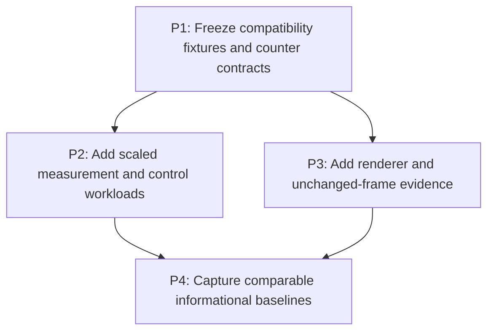

# M1: Establish the performance evidence and compatibility boundary

## Goal

Extend E4's benchmark boundary with deterministic compatibility and operation-count evidence that
can distinguish algorithmic improvements from machine-specific timing variation.

**Depends on:** None.
**Enables:** M2.
**Parallelizable with:** None.

## Context

- Parent epic: `docs/work/E5 - Text performance improvements.md`.
- E4 and `spinygui.benchmark` already provide local CPU/allocation, hidden-context rendering, and
  HTML report tasks; this milestone extends rather than replaces those artifacts.
- Normal CI must not acquire hardware-sensitive latency or GPU thresholds.

## Phases

### P1: Freeze compatibility fixtures and counter contracts
**Document:** [P1 - Freeze compatibility fixtures and counter contracts](M1/P1%20-%20Freeze%20compatibility%20fixtures%20and%20counter%20contracts.md)
**Purpose:** Define deterministic outputs and diagnostic operations before optimized paths change.

**Depends on:** None.
**Enables:** P2, P3.
**Parallelizable with:** None.

**Architectural Proposition:** Structural metrics, UTF-16 boundaries, control behavior, renderer
recordings, and pixels are the correctness boundary; counters are narrow diagnostics rather than a
new production telemetry subsystem.

**Key Work:**
- Freeze fixtures for fallback, missing glyphs, wrapping, caret behavior, selections, and pixels.
- Specify counter names, scopes, reset semantics, and disabled-path cost.

**Validation:**
- Fixtures fail on changed ranges, runs, geometry, behavior, or pixels.
- Counters can be compared per operation without depending on elapsed time.

### P2: Add scaled measurement and control workloads
**Document:** [P2 - Add scaled measurement and control workloads](M1/P2%20-%20Add%20scaled%20measurement%20and%20control%20workloads.md)
**Purpose:** Expose text-size complexity and repeated input/textarea layout through stable workloads.

**Depends on:** P1.
**Enables:** P4.
**Parallelizable with:** P3.

**Architectural Proposition:** Workload size and deterministic operation counts reveal scaling;
latency and allocation remain local supporting evidence.

**Key Work:**
- Add representative size series for single-font, fallback, wrapping, input, and textarea cases.
- Include unchanged-value and K-line selection scenarios without changing workload shape between
  comparisons.

**Validation:**
- Reports expose the current superlinear same-run behavior and repeated control layouts.
- Existing E4 benchmark tasks and normal tests remain independently runnable.

### P3: Add renderer and unchanged-frame evidence
**Document:** [P3 - Add renderer and unchanged-frame evidence](M1/P3%20-%20Add%20renderer%20and%20unchanged-frame%20evidence.md)
**Purpose:** Measure text submission, state, staging, culling, and unchanged-frame work separately.

**Depends on:** P1.
**Enables:** P4.
**Parallelizable with:** P2.

**Architectural Proposition:** Recording sinks and renderer counters explain CPU submission changes;
hidden-context timing and pixels validate the real backend without becoming portable budgets.

**Key Work:**
- Add visible/offscreen and unchanged-frame scenes for text, input, and textarea rendering.
- Count UTF-8 work, text calls, state changes, and culled candidates.

**Validation:**
- Recording and hidden-context evidence preserve run order, state, and pixels.
- Counters separate reduced submission work from GPU and driver variance.

### P4: Capture comparable informational baselines
**Document:** [P4 - Capture comparable informational baselines](M1/P4%20-%20Capture%20comparable%20informational%20baselines.md)
**Purpose:** Publish the pre-change evidence set and comparison rules consumed by M2-M7.

**Depends on:** P2, P3.
**Enables:** M2/P1.
**Parallelizable with:** None.

**Architectural Proposition:** Baselines are historical local observations with environment and
workload metadata; only deterministic correctness and operation-count contracts are portable.

**Key Work:**
- Extend reports without renumbering or deleting E4 evidence.
- Record equivalent-environment and workload-shape requirements for every comparison.

**Validation:**
- `jmhCpu`, `jmhRendering`, and `benchmarkReport` cover the approved scenarios and counters.
- No absolute timing threshold is wired into normal `test` or `check`.

## Risks and Stop Criteria

- Stop counter expansion if it materially perturbs non-benchmark execution; prefer benchmark-only
  wrappers or disabled diagnostics.
- Reject fixtures that encode accidental machine-specific pixels or timings instead of stable
  behavior.

## Dependency Graph

