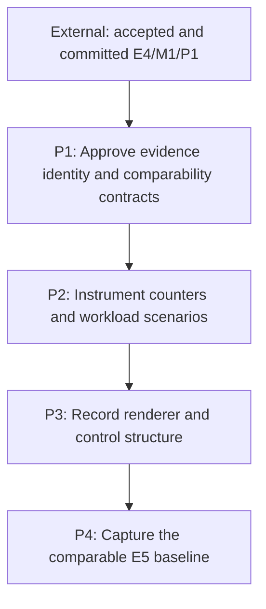

# M1: Repair Evidence and Comparability

**Status:** Complete

Parent plan: `docs/work/E5 - Text performance improvements.md`

## Goal

Make E5 performance evidence semantically identifiable, diagnostically precise, structurally
portable, and comparable before any optimization changes the measured paths.

## Context

- Entry requires accepted and committed E4 benchmark infrastructure through E4/M1/P1; this
  milestone extends that history without editing or merging E4 workloads.
- Diagnostics-enabled counter runs and diagnostics-disabled timed/allocation runs are different
  evidence products and must never be compared as though they were the same workload.
- Structural renderer recordings are the portable correctness source. Image comparison remains a
  local opt-in supplement with an explicit environment/reference policy.

## Phases

### P1: Approve evidence identity and comparability contracts

**Document:** [P1 - Approve evidence identity and comparability contracts](M1/P1%20-%20Approve%20evidence%20identity%20and%20comparability%20contracts.md)

**Purpose:** Define stable semantic identities, fingerprints, run modes, pairing, and warmup
metadata rules before schemas or workloads change.

**Depends on:** Accepted and committed E4/M1/P1 (external).
**Enables:** P2.
**Parallelizable with:** None.

**Architectural Proposition:** A result is comparable only when its benchmark/workload/schema/
behavior-contract identity, relevant environment/JVM/driver fields, and declared settings match.
Every behavior-affecting JMH parameter and renderer/control scenario dimension declared before
execution participates in semantic identity. The implementation-under-test/build/commit revision is
reported separately and excluded from equality; observed outputs remain evidence under that identity.

**Key Work:**
- Specify canonical workload/scenario IDs for parameterized JMH methods and normal text, input,
  textarea, visible, offscreen, and unchanged-submission rendering scenes.
- Exclude observed output counts from IDs/fingerprints and prove an output-count regression retains
  the same semantic series.
- Define environment/workload/benchmark/settings/behavior-contract fingerprint fields,
  canonicalization, schema evolution, separate implementation-revision metadata, and report behavior
  for missing or mismatched equality fields.
- Separate counter-only diagnostics runs from timed/allocation runs and define one paired archive
  lifecycle per `benchmarkReport` invocation.
- Resolve the actual pre-measure sequence: 60 alternating frames produce 30/30, then synchronized
  small-scene pixel validation produces 31/30. Either move validation outside a fresh equal warmup/
  measurement sequence or report the complete 31/30 distribution.

**Validation:** A reviewed contract makes identity collisions, output-derived series changes,
implementation revision accidentally entering equality, incomplete run-ID pairs, diagnostics mode
confusion, and the 31/30 warmup/validation asymmetry observable before P2 implementation.

**Risks / Stop Criteria:** Stop schema implementation if a behavior-affecting parameter can change
without changing semantic identity, or if mismatched fingerprints can still produce an unqualified
delta.

### P2: Instrument counters and workload scenarios

**Document:** [P2 - Instrument counters and workload scenarios](M1/P2%20-%20Instrument%20counters%20and%20workload%20scenarios.md)

**Purpose:** Make duplicate scans, native probes, builder work, control relayout, UTF-8 work, state
submission, and culling independently observable across scaled and adversarial workloads.

**Depends on:** P1.
**Enables:** P3.
**Parallelizable with:** None.

**Architectural Proposition:** Narrow injectable diagnostics collect deterministic operation counts
with explicit reset/sample scope and near-zero disabled cost; they are not general production
telemetry.

**Key Work:**
- Implement the complete approved counter vocabulary, including separate logical resolution and
  fallback native-probe counts and every public/default `TextMeasurer` entry point.
- Add scaled measurement/wrapping, input, textarea, fallback, narrow-width, deferred-suffix, and
  unchanged-submission scenarios with stable parameterized identities.
- Verify diagnostics are enabled only for untimed/counter-only execution and disabled for timing,
  allocation, and paired baseline capture.

**Validation:** Existing duplicate glyph work and repeated complete control layouts are visible in
deterministic counts without contaminating timed/allocation samples.

**Risks / Stop Criteria:** Stop if instrumentation changes measured allocation/native-call shape or
if a composite count hides the required distinction between logical work and native probes.

### P3: Record renderer and control structure

**Document:** [P3 - Record renderer and control structure](M1/P3%20-%20Record%20renderer%20and%20control%20structure.md)

**Purpose:** Establish a shared observable command/sink boundary and portable structural fixtures
for normal text, input, and textarea rendering.

**Depends on:** P2.
**Enables:** P4.
**Parallelizable with:** None.

**Architectural Proposition:** Rendering correctness is primarily the ordered command stream—text,
face, size, color, alignment, x/baseline, state scope, clips, and control decorations—rather than a
non-black framebuffer.

**Key Work:**
- Plan and add compatible recording seams for all three text paths, including a dedicated textarea
  recording test surface.
- Freeze structural fixtures for fallback/replacement runs, alignment, clipping, selection, caret,
  visible/offscreen boundaries, and unchanged submissions.
- Replace the current non-black smoke criterion with structural assertions; define local image
  references, tolerance, update approval, environment fingerprint, and skip/failure policy.

**Validation:** The same fixture can explain command differences portably, while an explicitly
compatible local environment can opt into boundary-focused image comparison.

**Risks / Stop Criteria:** Stop if a recording seam bypasses production ordering/state scopes or if
image output becomes the only correctness oracle.

### P4: Capture the comparable E5 baseline

**Document:** [P4 - Capture the comparable E5 baseline](M1/P4%20-%20Capture%20the%20comparable%20E5%20baseline.md)

**Purpose:** Integrate identity, fingerprints, diagnostics separation, structural evidence, and
report comparability into one reviewed pre-optimization evidence set.

**Depends on:** P3.
**Enables:** None.
**Parallelizable with:** None.

**Architectural Proposition:** E4 history remains distinct and immutable. One diagnostics-disabled
`benchmarkReport` invocation creates one complete paired E5 baseline; report regeneration must not
rerun redundant benchmark tasks or manufacture incomplete/mismatched pairs.

**Key Work:**
- Update report ingestion and presentation to suppress deltas or mark them non-comparable when any
  required fingerprint differs, while retaining raw historical entries.
- Report implementation/build/commit revision for traceability but prove a revision change alone does
  not suppress the intentional before/after implementation comparison.
- Prove parameterized workloads remain separate semantic series rather than being merged into one
  benchmark name.
- Prove changed observed output counters remain evidence under the same declared-input semantic ID.
- Capture counter-only diagnostics separately, then invoke the paired report exactly once for the
  accepted timed/allocation baseline after the pre-measure correction and record truthful warmup/
  validation metadata.

**Validation:** A reviewer can trace every result to one semantic workload/scenario, equality
fingerprint, and separately reported implementation revision; cannot mistake incomparable values for
a regression/improvement; and can inspect one complete E5 pair without altering E4 history.

**Risks / Stop Criteria:** Do not approve M1 if a report silently computes a delta across different
fingerprints or if the accepted pair was produced by redundant task invocations.

## Milestone Validation

- `./gradlew :spinygui.benchmark:test`
- `./gradlew :spinygui.core:test`
- `./gradlew :spinygui.core.backend.lwjgl.nanovg:test`
- Invoke `./gradlew :spinygui.benchmark:benchmarkReport` once only after all deterministic evidence
  and metadata are reviewed.

## Dependency Graph

