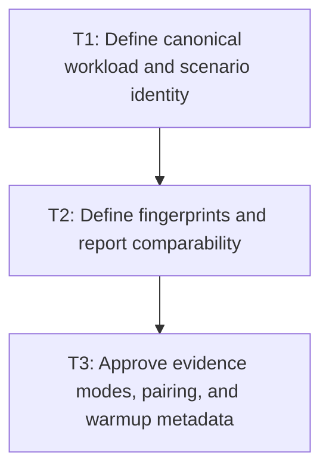

# P1: Approve Evidence Identity and Comparability Contracts

## Goal

Approve canonical workload/scenario identity, comparability fingerprints, evidence modes, paired-run
semantics, and corrected warmup metadata before extending benchmark schemas.

## Non-Goals

- Adding optimization code or capturing the E5 baseline.
- Merging parameterized workloads into historical E4 series.

## Context

- Parent milestone: `docs/work/E5/M1 - Repair evidence and comparability.md`.
- Phase entry gate: E4/M1/P1 is accepted and committed.
- Current rendering code alternates 60 total warmup frames (30 small/30 large), then pixel validation
  renders and synchronizes the small scene once through `glReadPixels`; actual pre-measure exposure is
  therefore 31 small/30 large while report metadata records 60 for each scene.

## Phase Tasks

### T1: Define canonical workload and scenario identity
**Purpose:** Prevent distinct parameterized operations or rendering scenes from collapsing into one
semantic series.

**Depends on:** None.
**Enables:** T2.
**Parallelizable with:** None.

**Changes:**
- [x] Inventory every CPU/JMH workload, behavior-affecting parameter, benchmark mode, renderer path,
  control type, visibility/offscreen state, unchanged-submission state, scene size, font/fallback
  shape, wrapping policy, and measurement configuration.
- [x] Specify a canonical semantic ID and display label that include all behavior-affecting values
  declared before execution, with deterministic ordering/escaping and explicit schema version.
- [x] Explicitly exclude observed glyph, run, fragment, line, command, cull, and other output counts
  from workload/scenario IDs and comparability fingerprints; retain them as structural evidence.
- [x] Define how E4 unparameterized history remains addressable without being merged into a new E5
  parameterized workload.

**Acceptance Checks:**
- [x] Two cases that can execute different behavior cannot share an ID; presentation-only labels do
  not define identity.
- [x] Golden identity fixtures cover CPU, normal text, input, textarea, visible, offscreen, and
  unchanged-submission scenarios.
- [x] A golden fixture changes observed glyph/run/fragment and command counters while declared inputs
  remain fixed and asserts the semantic ID/fingerprint/series remain unchanged.

**Risks / Stop Criteria:** Stop if any JMH `@Param` or renderer/control scenario dimension can change
without changing semantic identity.

### T2: Define fingerprints and report comparability
**Purpose:** Ensure reports qualify or suppress deltas when behavior-contract, workload, relevant
environment/JVM/driver, or benchmark settings change without rejecting an intentional implementation
revision comparison.

**Depends on:** T1.
**Enables:** T3.
**Parallelizable with:** None.

**Changes:**
- [x] Define canonical environment fields (JVM/vendor/version, OS/architecture, CPU where available,
  and GL vendor/renderer/driver/version for rendering), workload content/shape/font hashes,
  benchmark settings, and benchmark/workload/schema/behavior-contract versions.
- [x] Restrict equality fingerprints to declared benchmark/workload/schema/behavior-contract identity,
  immutable workload/font inputs, relevant environment/JVM/driver fields, and execution settings;
  exclude measured outputs and implementation-under-test/build/commit revision.
- [x] Report implementation/build/commit revision as non-equality metadata so before/after revisions
  can be compared; represent a real behavior-contract migration by an approved contract/workload
  version bump instead of using commit identity as a proxy.
- [x] Specify canonical serialization/hash behavior, unknown-field evolution, missing legacy fields,
  and human-readable mismatch reasons.
- [x] Require report delta suppression or an explicit non-comparable marker whenever any required
  fingerprint differs; raw values/history remain visible.

**Acceptance Checks:**
- [x] Unit fixtures cover exact match, one-field mismatch in each equality fingerprint, missing legacy
  data, schema/behavior-contract version mismatch, and changed implementation revision with equal
  fingerprints but distinct reported metadata.
- [x] No report state presents a signed delta as comparable when a required fingerprint differs.
- [x] A changed implementation/build/commit revision alone does not suppress a delta or create a new
  workload series.

**Risks / Stop Criteria:** Stop if unstable values such as timestamps or implementation commit/build
identity enter equality, or if legacy missing metadata is silently treated as equal.

### T3: Approve evidence modes, pairing, and warmup metadata
**Purpose:** Separate diagnostic evidence from timed/allocation evidence and remove run/archive
ambiguity.

**Depends on:** T2.
**Enables:** None.
**Parallelizable with:** None.

**Changes:**
- [x] Define diagnostics-enabled untimed/counter-only execution and diagnostics-disabled timed/
  allocation execution as distinct modes included in identity/fingerprint metadata.
- [x] Define one shared run ID and one complete CPU/rendering pair produced by one
  `benchmarkReport` invocation; document unpaired `jmhCpu`/`jmhRendering` investigation output as
  ineligible for the accepted paired baseline.
- [x] Choose and document the pre-measure fix: either run image validation outside a subsequent fresh
  equal per-scene warmup/measurement sequence, or report the complete 30/30 alternating plus one
  synchronized small-scene validation exposure (31/30) without claiming 60 each.
- [x] Record schema migration behavior for incomplete pairs and previous warmup metadata.

**Acceptance Checks:**
- [x] Timed/allocation result metadata proves diagnostics were disabled; counter artifacts cannot be
  selected as timing baselines.
- [x] The approved warmup wording and metadata agree exactly with execution, and one report
  invocation cannot be mistaken for redundant independent runs.
- [x] Baseline acceptance requires recapture after the warmup/validation sequence or metadata is
  corrected; no pre-correction E5 baseline is retained as the accepted comparison point.

**Risks / Stop Criteria:** Do not start P2 while run mode, pair ownership, or warmup semantics remain
ambiguous.

## Verification Strategy

- Run `./gradlew :spinygui.benchmark:test --tests 'com.spinyowl.spinygui.benchmark.report.BenchmarkHtmlReportGeneratorTest'`.
- Run `./gradlew :spinygui.benchmark:test --tests 'com.spinyowl.spinygui.benchmark.TextWorkloadsTest'`.
- Review generated fixture JSON only; do not run benchmarks in this contract phase.

## Review Boundaries

- Review semantic identity before fingerprint rules; review evidence mode/pairing/warmup only after
  both identity and comparability are fixed.

## Deferred Work

- Counter hooks and workload implementation belong to P2.
- Renderer recordings/image policy belong to P3; baseline capture belongs to P4.

## Dependency Graph

