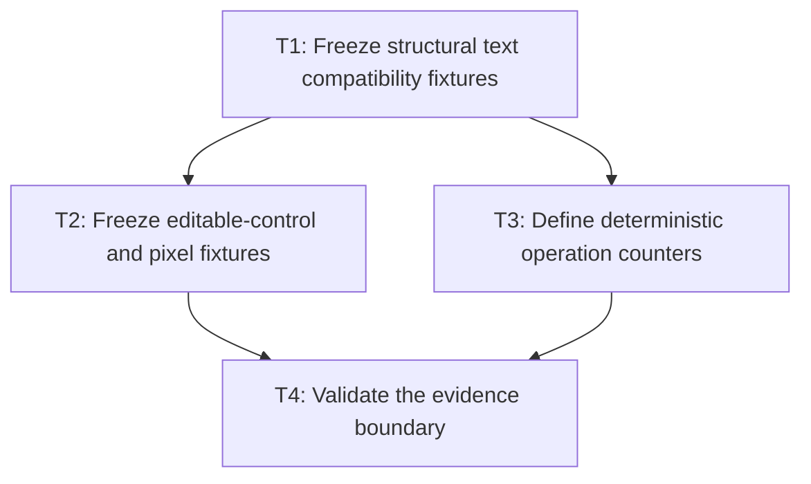

# P1: Freeze compatibility fixtures and counter contracts

## Goal

Establish deterministic compatibility fixtures and low-overhead operation-counter contracts before
performance implementations change the measured paths.

## Non-Goals

- Optimizing measurement, controls, or rendering.
- Adding machine-specific latency or pixel thresholds to CI.

## Context

- Parent milestone: `docs/work/E5/M1 - Establish the performance evidence and compatibility boundary.md`.
- Existing coverage includes `FontServiceImplTest`, inline whitespace/layout tests, input/textarea
  behavior tests, and NanoVG recording-sink tests.

## Phase Tasks

### T1: Freeze structural text compatibility fixtures
**Purpose:** Capture the exact immutable outputs later algorithms must preserve.

**Depends on:** None.
**Enables:** T2, T3.
**Parallelizable with:** None.

**Changes:**
- [ ] Add fixtures for UTF-16 line/run ranges, supplementary code points, explicit newlines,
  fallback transitions, missing-glyph replacement markers, wrapping, offsets, rounding, and metrics.
- [ ] Cover inline whitespace, wrapping, alignment, fragment ownership, baselines, and union boxes.

**Acceptance Checks:**
- [ ] Fixtures assert structure and geometry rather than only rendered strings.
- [ ] No fixture permits a valid surrogate pair to split across a line, run, caret, or fragment.

**Risks:** Avoid freezing undocumented behavior that conflicts with the approved epic contract.

### T2: Freeze editable-control and pixel fixtures
**Purpose:** Capture behavior shared by renderer and event consumers.

**Depends on:** T1.
**Enables:** T4.
**Parallelizable with:** T3.

**Changes:**
- [ ] Cover input/textarea caret, hit testing, selection, viewport, fallback, wrapping, and scroll.
- [ ] Extend recording-sink and hidden-context pixel fixtures for text, input, and textarea scenes.

**Acceptance Checks:**
- [ ] Event and renderer expectations agree on UTF-16 indexes and geometry.
- [ ] Pixel fixtures record environment-sensitive tolerances without defining performance budgets.

**Risks:** Hidden-context pixels can vary by backend; retain structural recording checks as primary evidence.

### T3: Define deterministic operation counters
**Purpose:** Make repeated work and algorithmic scaling observable without elapsed-time assumptions.

**Depends on:** T1.
**Enables:** T4.
**Parallelizable with:** T2.

**Changes:**
- [ ] Specify glyph, advance/kerning, run construction, complete control layout, UTF-8 byte/allocation,
  NanoVG text/state, and culling counters with reset and scope semantics.
- [ ] Select narrow injection or wrapper boundaries whose disabled production cost is near zero.

**Acceptance Checks:**
- [ ] Counter tests prove one operation cannot leak counts into another sample.
- [ ] Diagnostics remain optional and do not become a general telemetry framework.

**Risks:** Stop if instrumentation materially changes allocation or native-call behavior being measured.

### T4: Validate the evidence boundary
**Purpose:** Prove fixtures and counters can identify known duplicate work.

**Depends on:** T2, T3.
**Enables:** M1/P2, M1/P3.
**Parallelizable with:** None.

**Changes:**
- [ ] Run representative measurement, inline, control, and renderer fixtures with diagnostics enabled.
- [ ] Document which checks are deterministic CI candidates and which remain local observations.

**Acceptance Checks:**
- [ ] Current duplicate glyph resolution and repeated textarea layouts are visible in counts.
- [ ] Normal test execution has no hardware-sensitive pass/fail condition.

**Risks:** None identified.

## Verification Strategy

- Run `./gradlew :spinygui.core:test --tests '*FontServiceImplTest' --tests '*Inline*' --tests '*TextInput*' --tests '*Textarea*'`.
- Run `./gradlew :spinygui.core.backend.lwjgl.nanovg:test --tests '*NvgTextRendererTest' --tests '*NvgInputRendererTest'`.
- Run `./gradlew test` before phase completion.

## Review Boundaries

- Review compatibility fixtures before counter hooks; review benchmark-facing adapters only after
  counter semantics are stable.

## Deferred Work

- Workload expansion and baseline capture belong to P2-P4.
- Performance implementation belongs to M2-M7.

## Dependency Graph

