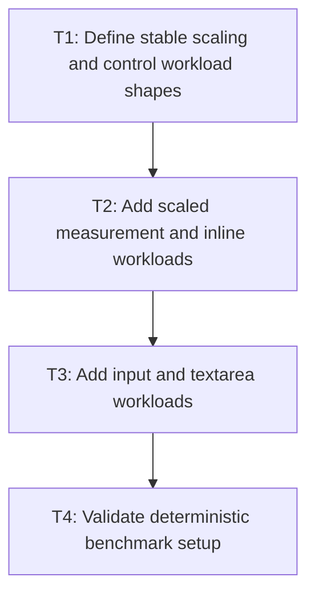

# P2: Add scaled measurement and control workloads

## Goal

Extend the E4 CPU/allocation workloads with stable size scaling, editable controls, and
unchanged-value cases that expose complexity and repeated complete layouts.

## Non-Goals

- Replacing E4 workloads or baseline files.
- Treating local timing as a CI gate.

## Context

- Parent milestone: `docs/work/E5/M1 - Establish the performance evidence and compatibility boundary.md`.
- `TextCalculationBenchmark` and `TextWorkloads` are the current CPU benchmark boundary.

## Phase Tasks

### T1: Define stable scaling and control workload shapes
**Purpose:** Prevent later comparisons from changing the work being measured.

**Depends on:** M1/P1/T4.
**Enables:** T2.
**Parallelizable with:** None.

**Changes:**
- [ ] Choose representative code-point and line-count series for single-font, fallback, wrapping,
  input, and textarea cases.
- [ ] Define unchanged-value, caret-only, selection-only, scroll-only, edit, and resize operations.

**Acceptance Checks:**
- [ ] Parameters report UTF-16 length, code-point count, line count, width, and operation shape.
- [ ] The size series can distinguish linear from quadratic growth without absolute timing budgets.

**Risks:** Excessive parameter combinations can make local runs impractical; retain the smallest
series that reveals scaling.

### T2: Add scaled measurement and inline workloads
**Purpose:** Expose duplicate resolution, same-run copying, normalization, and unit allocation.

**Depends on:** T1.
**Enables:** T3.
**Parallelizable with:** None.

**Changes:**
- [ ] Parameterize long single-font, fallback/missing, wrapped, supplementary, and text-dense inline cases.
- [ ] Report normalized allocation and M1 operation counters alongside latency.

**Acceptance Checks:**
- [ ] Current long same-font measurement displays superlinear operation/allocation shape.
- [ ] Inline cases preserve the same content, styles, widths, and counters across comparisons.

**Risks:** Benchmark setup must not be included accidentally in measured operations.

### T3: Add input and textarea workloads
**Purpose:** Quantify repeated complete layouts and prefix measurement.

**Depends on:** T2.
**Enables:** T4.
**Parallelizable with:** None.

**Changes:**
- [ ] Add input rendering/geometry and textarea layout, selection, caret, hit-test, and viewport cases.
- [ ] Include K-line selection and unchanged-value iterations that preserve state transition shape.

**Acceptance Checks:**
- [ ] The K-line selection count exposes approximately `2K + 3` complete layouts before M4.
- [ ] Control workloads report complete layout and prefix/caret measurement counts.

**Risks:** Keep event setup outside timed sections unless it is the explicit operation under test.

### T4: Validate deterministic benchmark setup
**Purpose:** Prove workloads execute the intended paths and remain independently runnable.

**Depends on:** T3.
**Enables:** M1/P4.
**Parallelizable with:** None.

**Changes:**
- [ ] Add fast setup tests for workload contents, parameters, state reset, and counter expectations.
- [ ] Confirm benchmark tasks remain detached from normal `test` and `check` dependencies.

**Acceptance Checks:**
- [ ] Setup tests catch accidental workload-shape or state-reset changes.
- [ ] `jmhCpu` emits scaled/control results with allocation and deterministic counters.

**Risks:** None identified.

## Verification Strategy

- Run `./gradlew :spinygui.benchmark:test`.
- Run `./gradlew :spinygui.benchmark:jmhCpu` locally; compare only equivalent environments and
  preserve workload parameters and counters.
- Run `./gradlew test` to verify benchmark execution is not added to normal tests.

## Review Boundaries

- Review workload definitions/setup separately from JMH methods and report integration.

## Deferred Work

- Renderer scenes belong to P3; report/baseline publication belongs to P4.

## Dependency Graph

