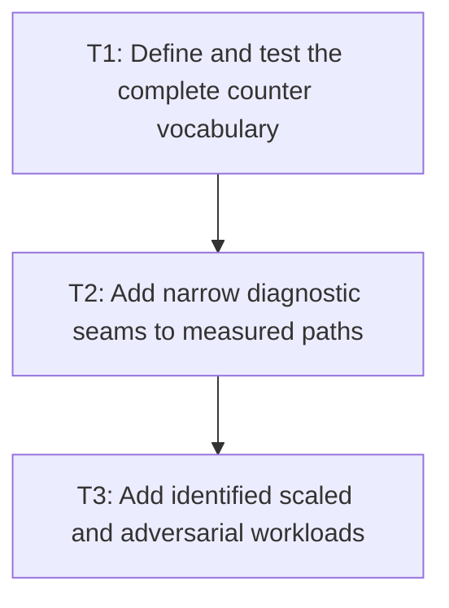

# P2: Instrument Counters and Workload Scenarios

## Goal

Add scoped deterministic diagnostics and semantically identified scaled/adversarial workloads that
expose source, measurement, builder, control, UTF-8, NanoVG, and culling work independently.

## Non-Goals

- Enabling diagnostics during accepted timing/allocation runs.
- Implementing M2-M8 optimizations or setting hardware-sensitive CI thresholds.

## Context

- Parent milestone: `docs/work/E5/M1 - Repair evidence and comparability.md`.
- Phase entry gate: M1/P1 contracts are approved.
- Diagnostics must count every `TextMeasurer` entry point, including default methods that delegate to
  another entry point, without confusing API calls with underlying complete measurements.

## Phase Tasks

### T1: Define and test the complete counter vocabulary
**Purpose:** Give every known source of duplicate or retained work an unambiguous unit and reset scope.

**Depends on:** None.
**Enables:** T2.
**Parallelizable with:** None.

**Changes:**
- [x] Define counters for source code points scanned; logical glyph resolutions; native glyph-index
  probes; advance calls; kerning calls; glyph slots copied/moved; builder appends/freezes;
  normalization scans; and font-chain resolutions.
- [x] Define counters for complete control layouts; each named/default `TextMeasurer` entry-point
  call; UTF-8 bytes and allocations; NanoVG text, face, size, color, alignment, save/restore, clip/
  transform state calls; considered/submitted/culled text and cull reason.
- [x] Specify per-operation/sample reset, nesting/delegation attribution, snapshot, disabled behavior,
  overflow posture, and no cross-thread aggregation under the UI-thread model.

**Acceptance Checks:**
- [x] Contract tests distinguish logical fallback resolution from multiple candidate native probes
  and distinguish API-entry calls from the complete underlying layout.
- [x] Reset/snapshot tests prove no count leaks between samples and disabled reads/hooks are stable.

**Risks / Stop Criteria:** Split any counter whose value combines semantically different work; stop
if required distinctions can only be inferred from timing.

### T2: Add narrow diagnostic seams to measured paths
**Purpose:** Instrument current behavior without materially changing the disabled allocation/native
call path.

**Depends on:** T1.
**Enables:** T3.
**Parallelizable with:** None.

**Changes:**
- [x] Add injectable/no-op diagnostics at font resolution/measurement, builders/current run assembly,
  inline preparation, resolver use, control metrics, UTF-8 staging/allocation, renderer command, and
  culling boundaries.
- [x] Count all `TextMeasurer` overload/default entry points and complete control layout builds using
  separate labels/counters.
- [x] Add deterministic tests that demonstrate current duplicate run resolution, quadratic glyph-slot
  movement, repeated input prefix measures, and repeated textarea complete layouts.
- [x] Measure or inspect the disabled path and remove hooks that allocate, synchronize, or alter
  native-call ordering when diagnostics are off.

**Acceptance Checks:**
- [x] Known duplicate work is visible in counts before optimization and exact current output remains
  unchanged.
- [x] Diagnostics-disabled tests show no diagnostic result objects or per-operation collections are
  allocated on the measured path.

**Risks / Stop Criteria:** Stop if instrumentation perturbs the behavior it is intended to measure or
becomes an always-on telemetry subsystem.

### T3: Add identified scaled and adversarial workloads
**Purpose:** Exercise the counters across input shapes that expose complexity, invalidation, and
submission boundaries.

**Depends on:** T2.
**Enables:** None.
**Parallelizable with:** None.

**Changes:**
- [x] Parameterize source size, font-chain/fallback transitions, wrap width/mode/offset, deferred
  suffix length, narrow/zero width, paragraph/line count, control selection span, visibility,
  offscreen ratio, and unchanged-submission state using P1 semantic IDs.
- [x] Add normal text, input, and textarea scenarios, including multi-paragraph wrapped fallback and
  line-start kerning transitions.
- [x] Provide an untimed diagnostics runner/artifact and ensure timed/allocation task configuration
  forces diagnostics disabled.

**Acceptance Checks:**
- [x] Scaling fixtures expose quadratic movement and repeated layout in the current implementation
  without relying on elapsed-time thresholds.
- [x] Every parameter value appears in semantic identity/fingerprint metadata and no two variants are
  merged by the report.
- [x] Changing observed glyph/run/fragment/state/culling counters without changing declared inputs
  leaves semantic identity/fingerprint fixed and surfaces the output change as evidence/regression.

Schema-v2 correction: finite-width `wordWrap=false` scenarios use canonical `character-wrap`
identity; only unbounded execution is `unwrapped`. Artifact construction validates exact per-category
declared and observed schemas. Every `observed-*` value is read from executed metrics/counters or the
prepared frame/container/control/node objects, and successful predecessor rendering is tracked
explicitly rather than inferred from `submission-state`.

**Risks / Stop Criteria:** Remove workloads that do not exercise their named path or whose setup work
is accidentally included/excluded contrary to the benchmark contract.

## Verification Strategy

- Run `./gradlew :spinygui.core:test --tests 'com.spinyowl.spinygui.core.system.font.impl.FontServiceImplTest'`.
- Run `./gradlew :spinygui.core:test --tests 'com.spinyowl.spinygui.core.system.input.*'`.
- Run `./gradlew :spinygui.benchmark:test`.
- Use the planned counter-only runner locally; do not invoke `benchmarkReport` yet.

## Review Boundaries

- Review vocabulary/test semantics, then disabled-cost seams, then workload expansion as separate
  changes so instrumentation is not hidden inside benchmark additions.

## Deferred Work

- Shared renderer/control structural recording belongs to P3.
- Baseline/report integration belongs to P4.

## Dependency Graph

