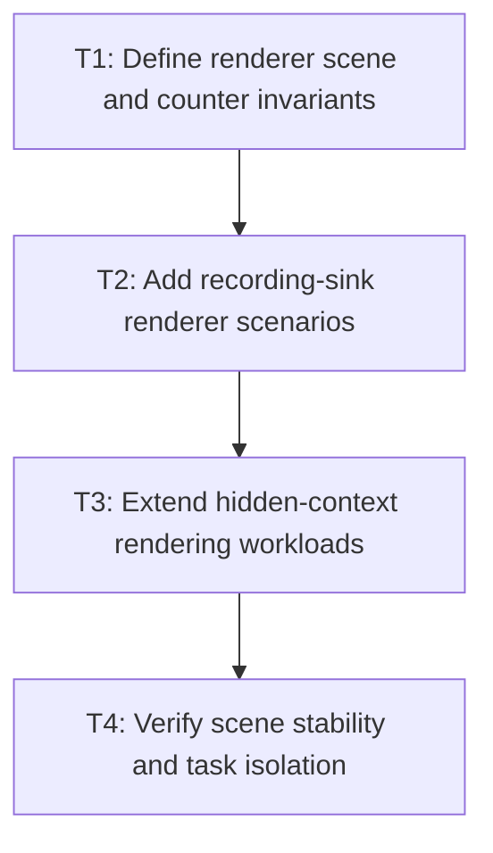

# P3: Add renderer and unchanged-frame evidence

## Goal

Extend recording and hidden-context renderer evidence with visible/offscreen controls and unchanged
frames while counting submission work independently from GPU timing.

## Non-Goals

- Optimizing NanoVG submission.
- Defining portable CPU/GPU latency thresholds.

## Context

- Parent milestone: `docs/work/E5/M1 - Establish the performance evidence and compatibility boundary.md`.
- `RenderingBenchmarkMain` currently owns the hidden 1280x720 context and synchronized GPU-complete timing.

## Phase Tasks

### T1: Define renderer scene and counter invariants
**Purpose:** Keep scene geometry, visibility, and draw shape stable across optimizations.

**Depends on:** M1/P1/T4.
**Enables:** T2.
**Parallelizable with:** None.

**Changes:**
- [ ] Specify visible, partially clipped, fully offscreen, scrolled textarea, input, and unchanged-frame scenes.
- [ ] Record expected fragment/run/text-call candidates, state changes, UTF-8 bytes/allocations, and culling counts.

**Acceptance Checks:**
- [ ] Scene metadata identifies viewport, clip, transform, run count, and control state.
- [ ] Boundary-touching text is classified as visible for conservative culling evidence.

**Risks:** Keep scene count bounded so hidden-context runs remain practical.

### T2: Add recording-sink renderer scenarios
**Purpose:** Make submission order and state deterministic without GPU variation.

**Depends on:** T1.
**Enables:** T3.
**Parallelizable with:** None.

**Changes:**
- [ ] Capture run order, x advance, face, size, color, clip/save/restore, text calls, and cull decisions.
- [ ] Exercise text, input, textarea, fallback transitions, selection, caret, and animated presentation color.

**Acceptance Checks:**
- [ ] Recorded operations match compatibility fixtures and reset between frames.
- [ ] Unchanged-frame scenes repeat the same visual operations before later skipping work.

**Risks:** Do not make tests depend on private NanoVG implementation behavior not owned by SpinyGUI.

### T3: Extend hidden-context rendering workloads
**Purpose:** Validate the same scenes through the real NanoVG backend.

**Depends on:** T2.
**Enables:** T4.
**Parallelizable with:** None.

**Changes:**
- [ ] Add scene selection and per-scene counters to the existing CPU/GPU-complete harness.
- [ ] Preserve warmup, measured-frame, clearing, synchronization, and report semantics.

**Acceptance Checks:**
- [ ] Reports separate CPU submission, GPU-complete timing, and deterministic counters.
- [ ] Pixel checks cover visible and culling-boundary content.

**Risks:** Driver variance remains local evidence and must not affect normal CI.

### T4: Verify scene stability and task isolation
**Purpose:** Ensure renderer evidence is comparable and opt-in.

**Depends on:** T3.
**Enables:** M1/P4.
**Parallelizable with:** None.

**Changes:**
- [ ] Add fast scene-construction tests and document equivalent-environment comparison requirements.
- [ ] Confirm rendering tasks remain outside normal `test` and `check` task graphs.

**Acceptance Checks:**
- [ ] Repeated runs report identical scene shape and deterministic candidate counts.
- [ ] `jmhRendering` remains explicitly invoked and hardware-sensitive results are informational.

**Risks:** None identified.

## Verification Strategy

- Run `./gradlew :spinygui.core.backend.lwjgl.nanovg:test`.
- Run `./gradlew :spinygui.benchmark:test`.
- Run `./gradlew :spinygui.benchmark:jmhRendering` locally in an equivalent environment and preserve
  scene shape/counters when comparing results.

## Review Boundaries

- Review deterministic recording scenes before hidden-context integration and report fields.

## Deferred Work

- Native staging, state suppression, and culling implementation belong to M5.

## Dependency Graph

