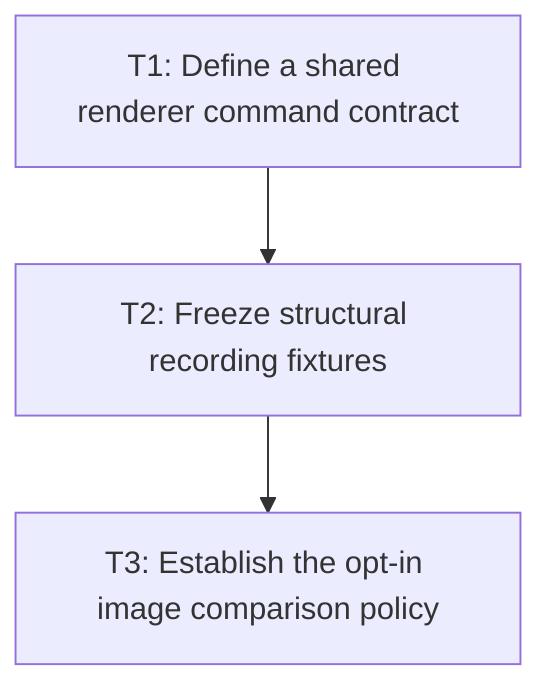

# P3: Record Renderer and Control Structure

## Goal

Create shared observable text-command seams and portable structural fixtures for normal text, input,
and textarea, with local image comparison governed by an explicit policy rather than a non-black
smoke check.

## Non-Goals

- Reducing NanoVG calls or adding culling.
- Making image references portable across unspecified hardware/drivers.

## Context

- Parent milestone: `docs/work/E5/M1 - Repair evidence and comparability.md`.
- Phase entry gate: M1/P2 diagnostics and identified scenarios are complete.
- `NvgTextRenderer` and `NvgInputRenderer` have test seams; textarea currently requires its own
  structural recording boundary and tests.

## Phase Tasks

### T1: Define a shared renderer command contract
**Purpose:** Observe equivalent text submission semantics across all renderer/control paths without
coupling core to NanoVG.

**Depends on:** None.
**Enables:** T2.
**Parallelizable with:** None.

**Changes:**
- [x] Define ordered command records for scope begin/end, clips/transforms, alignment, face, size,
  color, text/run bytes or semantic text, x/baseline, advance outcome, selection, caret, and culling.
- [x] Adapt or plan compatible sinks for normal text and input, and add a first-class textarea sink/
  seam that production rendering also traverses.
- [x] Include diagnostics IDs/counters without exposing NanoVG/native handles in core contracts.

**Acceptance Checks:**
- [x] All three text paths can be rendered to an in-memory recording with no real context.
- [x] Recording order and fields are sufficient to detect alignment, face-failure x advance, clip,
  fallback/replacement, and control-decoration differences.

**Risks / Stop Criteria:** Stop if a recording path reimplements rendering decisions rather than
observing production commands.

### T2: Freeze structural recording fixtures
**Purpose:** Establish portable primary evidence for visible and boundary behavior.

**Depends on:** T1.
**Enables:** T3.
**Parallelizable with:** None.

**Changes:**
- [x] Add normal text fixtures for fragment/run order, fallback/replacement faces, x advances,
  baseline/alignment, transforms, clipping, and visible/offscreen boundaries.
- [x] Add input and textarea fixtures for value/runs, selection/caret ordering, scroll offsets,
  multi-line clips, visible/offscreen lines, empty paragraphs, and unchanged submissions.
- [x] Assert command counters against recordings so counted state/text/culling operations reconcile
  exactly with the command stream.

**Acceptance Checks:**
- [x] A textarea recording test exists and detects reordered/missing lines, selection, caret, face,
  and clip commands.
- [x] Structural fixtures run in normal CI without GL/image dependence.

**Risks / Stop Criteria:** Stop if structural expectations encode unstable native IDs or omit a
consumer-visible ordering/state field.

### T3: Establish the opt-in image comparison policy
**Purpose:** Use images only as controlled local boundary evidence and retire the insufficient
non-black criterion.

**Depends on:** T2.
**Enables:** None.
**Parallelizable with:** None.

**Changes:**
- [x] Define reference naming/versioning, authoring/update review, exact environment fingerprint,
  pixel/color/edge tolerance, antialias fringe handling, and mismatch artifact retention.
- [x] Define opt-in/skip behavior when no compatible reference exists and prohibit reporting such a
  skip as a pass.
- [x] Replace non-black validation with structural assertions as the required gate and image
  comparison for approved local boundary scenes.

**Acceptance Checks:**
- [x] An all-wrong but non-black frame fails structural evidence; an incompatible environment is
  marked unvalidated rather than compared to an unrelated reference.
- [x] Boundary scenes include fallback/overhang, clipping, selection/caret, and transformed text.

**Risks / Stop Criteria:** Never make one local image reference the portable primary evidence or an
implicit performance threshold.

## Verification Strategy

- Run `./gradlew :spinygui.core.backend.lwjgl.nanovg:test --tests 'com.spinyowl.spinygui.core.backend.renderer.lwjgl.nanovg.NvgTextRendererTest'`.
- Run `./gradlew :spinygui.core.backend.lwjgl.nanovg:test --tests 'com.spinyowl.spinygui.core.backend.renderer.lwjgl.nanovg.NvgInputRendererTest'`.
- Run `./gradlew :spinygui.core.backend.lwjgl.nanovg:test` for the planned textarea recording tests.
- Run image comparison only with the explicit local opt-in and matching environment.

T3 verification: the benchmark executes source-bound production-command recordings for its
synchronized small-scene exposure and the four approved boundary scenes. The optional file workflow
performs exact manifest/environment checks before decoding, uses SHA-256 environment IDs, compares
decoded PNGs with edge-fringe tolerance, and retains all required mismatch artifacts. Normal tests do
not opt into local reference comparison.

The rendering artifact uses closed `structural-validation-report-v1` JSON with exact field types,
approved scene order, synchronized-small evidence, source-expectation and command-stream SHA-256
digests, and validator-success proof digests. Report parsing and baseline eligibility fail closed for
fabricated, incomplete, reordered, unknown, or type-coerced evidence. Local reference sidecars use an
equally closed exact schema before any image decoding.

## Review Boundaries

- Review command schema, then production seam integration, then fixtures, then optional image policy.

## Deferred Work

- Submission reduction/staging/state/culling belongs to M6.
- Comparable baseline capture belongs to P4.

## Dependency Graph

