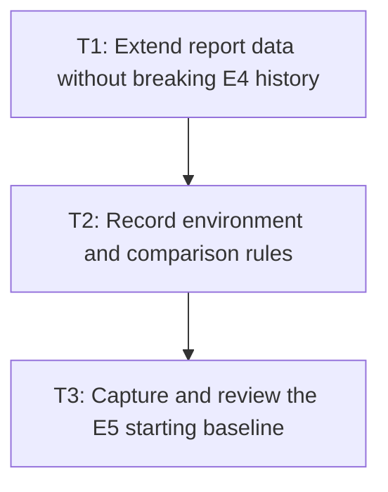

# P4: Capture comparable informational baselines

## Goal

Publish a pre-optimization local evidence set with environment and workload metadata while keeping
all hardware-sensitive results informational.

## Non-Goals

- Replacing or renumbering E4 artifacts.
- Establishing absolute pass/fail performance budgets.

## Context

- Parent milestone: `docs/work/E5/M1 - Establish the performance evidence and compatibility boundary.md`.
- `benchmarkReport` already refreshes CPU and rendering JSON before generating local HTML.

## Phase Tasks

### T1: Extend report data without breaking E4 history
**Purpose:** Present scaling, controls, renderer scenes, and counters in the existing report boundary.

**Depends on:** M1/P2/T4, M1/P3/T4.
**Enables:** T2.
**Parallelizable with:** None.

**Changes:**
- [ ] Add workload parameters, operation counters, and unchanged-frame/control sections to report inputs.
- [ ] Preserve existing E4 result interpretation and tolerate absent new fields in historical data.

**Acceptance Checks:**
- [ ] Historical E4 reports remain readable and current reports identify each workload shape.
- [ ] CPU/allocation, GPU-complete, and deterministic counters are not conflated.

**Risks:** Report schema changes must remain backward-tolerant for local historical files.

### T2: Record environment and comparison rules
**Purpose:** Prevent invalid claims across unlike machines or changed workloads.

**Depends on:** T1.
**Enables:** T3.
**Parallelizable with:** None.

**Changes:**
- [ ] Record JDK/JVM, OS, CPU, GPU/driver where relevant, benchmark settings, and workload parameters.
- [ ] State that comparisons require equivalent environments and unchanged workload shape/counters.

**Acceptance Checks:**
- [ ] Every local result can be traced to environment and scenario metadata.
- [ ] Documentation explicitly rejects hardware-sensitive CI gates.

**Risks:** Do not collect or publish host-specific secrets or unstable identifiers.

### T3: Capture and review the E5 starting baseline
**Purpose:** Establish evidence consumed by later milestone reviews.

**Depends on:** T2.
**Enables:** M2/P1.
**Parallelizable with:** None.

**Changes:**
- [ ] Run CPU and rendering workloads and generate the self-contained report.
- [ ] Record observed scaling/counter causes, including duplicate resolution and repeated control layouts.

**Acceptance Checks:**
- [ ] Results include latency, normalized allocation, sizes, scenes, and deterministic counters.
- [ ] Review conclusions rely on scaling/counters and compatibility evidence, not timing alone.

**Risks:** Re-run rather than compare if environment or workload metadata differs materially.

## Verification Strategy

- Run `./gradlew :spinygui.benchmark:test`.
- Run `./gradlew :spinygui.benchmark:jmhCpu` and `./gradlew :spinygui.benchmark:jmhRendering`.
- Run `./gradlew :spinygui.benchmark:benchmarkReport` and inspect the local self-contained report.

## Review Boundaries

- Review report/schema compatibility before capturing machine-local evidence; baseline files should
  not be mixed with unrelated benchmark implementation changes.

## Deferred Work

- All performance changes begin in M2 after this baseline is reviewed.

## Dependency Graph

