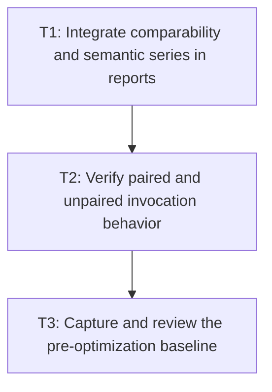

# P4: Capture the Comparable E5 Baseline

## Goal

Integrate fingerprints and semantic series into reporting, verify paired-run behavior, and capture
one reviewed diagnostics-disabled E5 baseline without altering E4 history.

## Non-Goals

- Optimizing production behavior or defining absolute CI performance budgets.
- Regenerating the accepted pair by running redundant benchmark tasks.

## Context

- Parent milestone: `docs/work/E5/M1 - Repair evidence and comparability.md`.
- Phase entry gate: M1/P3 structural/image evidence is complete.
- `benchmarkReport` owns the sequential `benchmarkReportCpu` and `benchmarkReportRendering` pair;
  invoking standalone `jmhCpu` or `jmhRendering` first creates separate unpaired investigation output
  and is prohibited for the accepted baseline workflow.

## Phase Tasks

### T1: Integrate comparability and semantic series in reports
**Purpose:** Prevent invalid deltas and preserve distinct parameterized histories.

**Depends on:** None.
**Enables:** T2.
**Parallelizable with:** None.

**Changes:**
- [x] Parse/store/display semantic identity, evidence mode, benchmark/workload/schema/behavior-
  contract/environment/JVM/driver/settings equality fingerprints, separately reported implementation/
  build/commit revision, corrected warmup metadata, and mismatch reasons.
- [x] Keep observed glyph/run/fragment/line/command/culling counts as report evidence under the
  declared-input identity; never group or fingerprint a series by those outputs.
- [x] Group history by exact semantic identity without merging parameter values or rewriting E4
  artifact contents.
- [x] Suppress signed deltas or label them non-comparable for missing/mismatched required fingerprints
  while retaining raw values and chronological history.

**Acceptance Checks:**
- [x] Golden report tests cover matching, mismatched, legacy missing, incomplete pair, and separate
  parameter-series cases.
- [x] Golden report tests prove a changed implementation revision remains comparable when all equality
  fields match, while a behavior-contract/workload version change is non-comparable unless migrated.
- [x] Report help/methodology explains diagnostics separation, fingerprints, warmup correction, and
  local/hardware-sensitive evidence.

**Risks / Stop Criteria:** Stop if the UI can visually imply comparability despite a mismatch marker
or if old E4 series are mutated/merged.

### T2: Verify paired and unpaired invocation behavior
**Purpose:** Ensure one accepted report invocation creates exactly one complete pair with truthful
metadata.

**Depends on:** T1.
**Enables:** T3.
**Parallelizable with:** None.

**Changes:**
- [x] Add task/integration fixtures for one shared reserved run ID across CPU/rendering outputs and
  report selection of complete pairs only.
- [x] Verify `jmhCpu` or `jmhRendering` alone is explicitly unpaired investigation evidence and is not
  selected as the accepted E5 pair.
- [x] Verify diagnostics cannot be enabled in the timed/allocation paired invocation and corrected
  warmup/validation execution matches each scene's complete recorded pre-measure exposure.

**Acceptance Checks:**
- [x] One `benchmarkReport` execution path produces one CPU JSON, one rendering JSON, and one report
  selection under a shared ID.
- [x] Incomplete/unpaired artifacts remain visible/diagnosable but cannot create a paired delta.

**Risks / Stop Criteria:** Stop if report regeneration implicitly reruns a second pair or if a stale
lock/incomplete artifact is treated as complete.

### T3: Capture and review the pre-optimization baseline
**Purpose:** Establish the accepted E5 comparison point and deterministic diagnostic explanation.

**Depends on:** T2.
**Enables:** None.
**Parallelizable with:** None.

**Changes:**
- [x] Run diagnostics-enabled counter-only workloads separately and archive/reference their semantic
  IDs/fingerprints without presenting latency/allocation deltas.
- [x] Discard any candidate captured before the 31/30 asymmetry is corrected/truthfully represented;
  retain historical E4 and the incomplete `20260812-151620-483386200` CPU-only artifact as raw,
  baseline-ineligible archive evidence, and accept only the fresh approved sequence.
- [x] With diagnostics disabled, invoke `./gradlew :spinygui.benchmark:benchmarkReport` exactly once
  to create the accepted complete pair.
- [x] Review structural recordings, equality-fingerprint match, separately reported implementation
  revision, workload identity, warmup metadata, complete pair, and report comparability state before
  recording the baseline as accepted.

**Accepted baseline record:** `20260812-155701-296656400` is the sole accepted E5 pre-optimization
baseline from one `:spinygui.benchmark:benchmarkReport` invocation. Its ignored local artifacts are
`reports/text-calculation-20260812-155701-296656400.json`,
`reports/nanovg-text-20260812-155701-296656400.json`, and `reports/index.html`. The CPU and rendering
artifacts share the paired-report ID, use diagnostics-disabled timed/allocation evidence, include valid
schema-v2 comparability and structural-validation metadata, and record the approved small/large 31/30
pre-measure exposures. The separately captured counter-only artifact is explanatory evidence only and
is baseline-ineligible. Review accepted this record without rewriting E4 artifacts or patching archives.

**Acceptance Checks:**
- [x] The baseline has one complete paired run ID, all required equality-fingerprint/mode metadata,
  and reported implementation revision; no redundant preliminary `jmhCpu`/`jmhRendering` invocation
  was used.
- [x] A reviewer can explain current duplicate work with counters independently of local timing and
  can distinguish all parameterized workload/scenario series.

**Risks / Stop Criteria:** Discard and recapture only through one fresh paired invocation if metadata,
mode, warmup, or pair completeness is wrong; never patch an archive to appear comparable.

## Verification Strategy

- Run `./gradlew :spinygui.benchmark:test` before any benchmark execution.
- Run the diagnostics counter-only command defined in P2 separately.
- Run `./gradlew :spinygui.benchmark:benchmarkReport` once for the accepted pair.
- Run `./gradlew test` after report/schema integration.

## Review Boundaries

- Merge/review report semantics and task-pairing tests before spending time on the local baseline run.

## Deferred Work

- Performance implementation begins in M2/M3 only after this baseline is accepted.
- Absolute latency/allocation thresholds remain outside normal `test`/`check`.

## Dependency Graph

