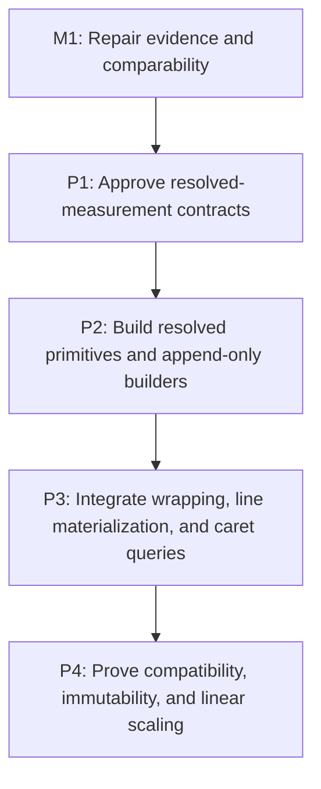

# M2: Approve Measurement Contracts and Implement Linear Resolution

**Status:** In progress

## Document Context

- **Parent:** [E5 - Text Performance Improvements](../E5%20-%20Text%20performance%20improvements.md)
- **Children:** [P1 - Approve resolved-measurement contracts](M2/P1%20-%20Approve%20resolved-measurement%20contracts.md), [P2 - Build resolved primitives and append-only builders](M2/P2%20-%20Build%20resolved%20primitives%20and%20append-only%20builders.md), [P3 - Integrate wrapping, line materialization, and caret queries](M2/P3%20-%20Integrate%20wrapping%20line%20materialization%20and%20caret%20queries.md), [P4 - Prove compatibility, immutability, and linear scaling](M2/P4%20-%20Prove%20compatibility%20immutability%20and%20linear%20scaling.md)
- **Prerequisite:** [M1 - Repair evidence and comparability](M1%20-%20Repair%20evidence%20and%20comparability.md)

## Goal

Encode the approved observable text behavior as executable compatibility fixtures, then implement
uncached resolved measurement with one code-point scan, append-only local builders, and linear
wrapping/freeze work.

## Context

- M1 supplies trustworthy counters, workload identities, and structural fixtures.
- The measurement contract was approved on 2026-08-14. P1 must now encode it in Javadoc,
  characterization/target fixtures, and explicit migration notes before P2 implementation starts.
- Public source indices remain UTF-16; valid surrogate pairs remain atomic during scanning,
  wrapping, caret placement, and run construction.
- A narrow append-only optimization is already present in `FontServiceImpl.resolveRuns`: accepted
  glyphs are appended linearly and frozen once at the run boundary. This is useful evidence, but it
  does not complete any M2 task because measurement still resolves accepted ranges more than once,
  wrap replay can revisit suffixes, and caret queries rescan independently.
- M2 is a bounded compatibility migration. It preserves existing public type signatures and
  `ResolvedTextRun` record components while intentionally correcting documented contract gaps.

## Phases

### P1: Approve resolved-measurement contracts

**Status:** In progress

**Document:** [P1 - Approve resolved-measurement contracts](M2/P1%20-%20Approve%20resolved-measurement%20contracts.md)

**Purpose:** Turn the approved compatibility/migration matrix into durable Javadoc and executable
characterization/target fixtures before builder implementation.

**Depends on:** M1.
**Enables:** P2.
**Parallelizable with:** None.

**Architectural Proposition:** The public contract explicitly decides wrapping semantics/API,
replacement and empty-chain behavior, newline normalization, index/coordinate systems, metrics,
immutability, narrow widths, and externally assigned surrogate-interior indices.

**Key Work:**
- Encode the approved `wordWrap`, replacement-glyph face selection, empty font-chain output,
  CR/LF/CRLF handling, UTF-16 ranges, primary-face vertical metrics, and numeric-input outcomes.
- Freeze the approved NanoVG/FontStash-compatible rounding/accumulation order and forward midpoint
  tie in fixtures before algorithm changes.
- Encode line/run/glyph/caret coordinate contracts and backward snapping for externally assigned
  caret/selection indices inside a surrogate pair.
- Specify line-local cumulative caret advances: width-independent primitives retain raw base advance,
  pair-kerning inputs, and UTF-16 boundaries, while P3 rebases/freezes each final line after wrapping
  and line-start reset. Reject a source-global cumulative array.
- Specify an internal optional range-aware capability consumed by M4 without per-range temporary strings
  while preserving current public API compatibility and immutability rules.
- Require deep immutable snapshots without changing current public signatures or
  `ResolvedTextRun` record components.

**Validation:** Each approved row has executable fixture expectations and explicit migration notes;
no P2 task contains an unresolved compatibility choice.

**Risks / Stop Criteria:** Stop before P2 if any contract row lacks executable target fixtures or an
explicit compatibility/migration statement.

### P2: Build resolved primitives and append-only builders

**Status:** Planned

**Document:** [P2 - Build resolved primitives and append-only builders](M2/P2%20-%20Build%20resolved%20primitives%20and%20append-only%20builders.md)

**Purpose:** Resolve each source code point once into measurement-local primitives and private
append-only glyph/run/line storage without immutable suffix reconstruction or premature publication.

**Depends on:** P1.
**Enables:** P3.
**Parallelizable with:** None.

**Architectural Proposition:** A logical resolution may issue multiple fallback native glyph-index
probes, but accepted code points retain their selected face/glyph, base advance, pair-kerning input,
source boundaries, and replacement state for later line materialization.

**Key Work:**
- Introduce code-point-safe resolved primitives carrying approved UTF-16 source boundaries.
- Add append-only measurement-local glyph/run/line builders; validate private mutable/frozen builder
  invariants without publishing incomplete public line/run/caret results.
- Add a compatible internal range-aware measurement boundary over source/prepared ranges without
  forcing a new public abstract method or one temporary `String` per call.
- Preserve raw primitive inputs and defensive-copy rules without adding a source-global cumulative
  array or persistent cache.

**Validation:** Counters distinguish source scans, logical resolutions, native probes, advance/
kerning calls, appends, private freezes, and copied/moved slots; P2 immutable fixtures are private or
already-final boundaries, and no incomplete public `TextLineMetrics`/`ResolvedTextRun`/caret array is
published.

**Risks / Stop Criteria:** Stop if a builder exposes mutable state, splits a surrogate pair, or
reconstructs a growing immutable run/list for each appended glyph.

### P3: Integrate wrapping, line materialization, and caret queries

**Status:** Planned

**Document:** [P3 - Integrate wrapping line materialization and caret queries](M2/P3%20-%20Integrate%20wrapping%20line%20materialization%20and%20caret%20queries.md)

**Purpose:** Reuse scanned primitives across wrapping and caret operations while applying line-local
kerning and the approved source-coordinate contract.

**Depends on:** P2.
**Enables:** P4.
**Parallelizable with:** None.

**Architectural Proposition:** Wrapping stores bounded active-line candidates and defers/moves
primitive ranges without rescanning source or repeating native glyph probes; each new line resets
pair kerning before final run advances are materialized.

**Key Work:**
- Integrate explicit newline, width/offset, word/character wrap, deferred suffix, and oversized-first-
  primitive handling from P1.
- Materialize and publish final public line-specific run advances only after all wrap decisions,
  deferred-suffix placement, and line-start kerning reset.
- Rebase/freeze one cumulative caret-advance array per final line after wrap decisions and line-start
  kerning reset; route caret lookup through those line-local boundaries/advances.
- Apply approved midpoint ties and surrogate-interior setter behavior to control-facing helpers.

**Validation:** Narrow widths, fallback transitions, long deferred suffixes, explicit line starts,
and supplementary code points produce approved ranges, coordinates, and call counts; each public
`TextLineMetrics`, `ResolvedTextRun`, and caret array freezes exactly once at its final P3 boundary.

**Risks / Stop Criteria:** Stop if replay performs native resolution again, copies a suffix
quadratically, or carries kerning across a line boundary.

### P4: Prove compatibility, immutability, and linear scaling

**Status:** Planned

**Document:** [P4 - Prove compatibility immutability and linear scaling](M2/P4%20-%20Prove%20compatibility%20immutability%20and%20linear%20scaling.md)

**Purpose:** Establish deterministic and benchmark evidence that the new uncached path satisfies the
approved contract and removes duplicate/superlinear work.

**Depends on:** P3.
**Enables:** None.
**Parallelizable with:** None.

**Architectural Proposition:** Correctness is proved structurally first; counter scaling proves the
algorithmic boundary; local timing/allocation evidence supports but does not replace those checks.

**Key Work:**
- Compare exact lines, glyphs, runs, replacement state, metrics, source indices, caret boundaries,
  coordinates, rounding/accumulation order, and midpoint ties across the M2/P1 measurement decision
  fixtures.
- Prove range-aware calls over shared prepared/source text allocate no per-range temporary `String`
  and remain structurally identical to compatible public API results.
- If immutable public results were selected, add top-level and nested-collection mutation attempts
  and document the observable compatibility impact.
- Run scaled/adversarial counter workloads for narrow widths, deferred suffixes, fallback chains,
  and line-start kerning, with caches absent/disabled.

**Validation:** Source scans, builder work, and slot movement scale linearly; accepted ranges are not
re-probed solely for wrapping/run construction; every `TextMeasurer` entry point follows one contract.

**Risks / Stop Criteria:** Do not proceed to M4/M5/M7 when any structural fixture drifts without an
approved migration or when counters retain quadratic growth.

## Milestone Validation

- `./gradlew :spinygui.core:test --tests 'com.spinyowl.spinygui.core.system.font.impl.FontServiceImplTest'`
- `./gradlew :spinygui.core:test --tests 'com.spinyowl.spinygui.core.system.input.*'`
- `./gradlew :spinygui.benchmark:test`
- Run `./gradlew test` after the final contract/complexity review.

## Dependency Graph

