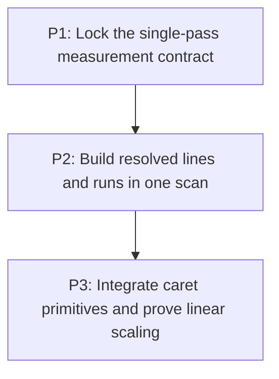

# M2: Produce resolved measurement in one linear pass

## Goal

Produce immutable text metrics, lines, and resolved runs from one code-point scan without duplicate
glyph resolution or quadratic same-run list copying.

**Depends on:** M1.
**Enables:** M3, M4.
**Parallelizable with:** None.

## Context

- Parent epic: `docs/work/E5 - Text performance improvements.md`.
- `FontServiceImpl.measureText` currently resolves glyphs while measuring and again in
  `addLine`/`resolveRuns`; extending a run reconstructs immutable glyph lists.
- Algorithmic correction precedes all persistent cache work in M6.

## Phases

### P1: Lock the single-pass measurement contract
**Document:** [P1 - Lock the single-pass measurement contract](M2/P1%20-%20Lock%20the%20single-pass%20measurement%20contract.md)
**Purpose:** Make every observable measurement and wrapping invariant executable before replacement.

**Depends on:** M1/P4.
**Enables:** P2.
**Parallelizable with:** None.

**Architectural Proposition:** Existing UTF-16 ranges, fallback and replacement choices, rounding,
kerning boundaries, and line geometry define the result contract, including edge cases.

**Key Work:**
- Add focused structural equivalence and counter assertions for newline, wrap, offset, and fallback.
- Specify active-line wrap candidate state and code-point-safe replay behavior.

**Validation:**
- Tests characterize all branches that a one-pass builder must preserve.
- A valid surrogate pair cannot be split by any accepted line or run boundary.

### P2: Build resolved lines and runs in one scan
**Document:** [P2 - Build resolved lines and runs in one scan](M2/P2%20-%20Build%20resolved%20lines%20and%20runs%20in%20one%20scan.md)
**Purpose:** Replace duplicate resolution and same-run reconstruction with measurement-local builders.

**Depends on:** P1.
**Enables:** P3.
**Parallelizable with:** None.

**Architectural Proposition:** Append-only mutable builders retain glyph identity, UTF-16 ranges,
advances, and wrap candidates only for the active measurement, then freeze once at result
boundaries.

**Key Work:**
- Build lines/runs without resolving accepted glyph ranges twice.
- Bound backtracking state to the active line and preserve kerning reset and pixel rounding rules.

**Validation:**
- Resolved-run construction and glyph lookup counters are linear in scanned code points.
- Immutable outputs are copied once per completed result boundary.

### P3: Integrate caret primitives and prove linear scaling
**Document:** [P3 - Integrate caret primitives and prove linear scaling](M2/P3%20-%20Integrate%20caret%20primitives%20and%20prove%20linear%20scaling.md)
**Purpose:** Expose reusable cumulative primitives needed by controls and validate the full result.

**Depends on:** P2.
**Enables:** M3/P1, M4/P1.
**Parallelizable with:** None.

**Architectural Proposition:** General metrics may expose code-point-safe cumulative boundaries, but
must not acquire control ownership or persistent caching responsibilities.

**Key Work:**
- Reuse resolved advances for caret queries where compatible with current APIs.
- Compare scaled workloads and allocations against the M1/E4 evidence on equivalent environments.

**Validation:**
- Single-font and fallback workloads scale approximately linearly by counters and workload size.
- Exact ranges, widths, lines, runs, fallback, replacement, wrapping, and UTF-16 behavior remain
  equivalent.

## Risks and Stop Criteria

- Stop if wrap replay must resolve an accepted code point again; revise the active-line builder.
- Do not accept allocation improvement that changes rounding, replacement markers, or source ranges.

## Dependency Graph

