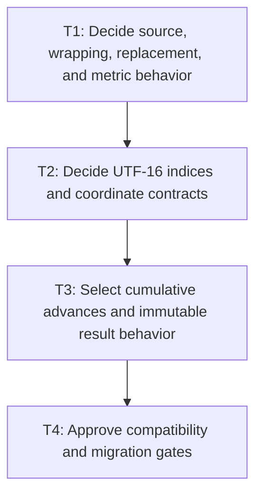

# P1: Approve Resolved-Measurement Contracts

## Goal

Approve every ambiguous measurement, wrapping, immutability, index, coordinate, and control-setter
behavior with explicit compatibility/migration impact before rewriting measurement.

## Non-Goals

- Implementing builders, caches, or renderer changes.
- Treating current behavior as correct merely because it is current.

## Context

- Parent milestone: `docs/work/E5/M2 - Approve measurement contracts and implement linear resolution.md`.
- Phase entry gate: M1 comparable evidence is accepted.
- `TextMeasurer` documentation and implementation currently leave or exhibit contradictory behavior;
  each item below is a prerequisite decision gate.

## Phase Tasks

### T1: Decide source, wrapping, replacement, and metric behavior
**Purpose:** Select observable text results independently of the current implementation strategy.

**Depends on:** None.
**Enables:** T2.
**Parallelizable with:** None.

**Changes:**
- [ ] Decide and document the exact `wordWrap` boolean meaning/API (word-boundary versus character-
  boundary behavior), including whether naming/signature changes require a compatibility bridge.
- [ ] Decide replacement-glyph face selection after fallback probes and the output for an empty font
  chain, including selected font/glyph/replacement state and failure behavior.
- [ ] Decide CR, LF, and CRLF handling in direct measurement, line source ranges/`charCount`, trailing
  separators, empty lines, and consistency with M4 normalization.
- [ ] Decide fallback vertical metrics aggregation/selection and zero, near-zero, negative, NaN, and
  infinite width/offset outcomes where public numeric inputs permit them.
- [ ] Decide the exact horizontal and vertical rounding/accumulation order: native/raw scaling,
  kerning/base-advance combination, per-glyph versus cumulative rounding, line width, baseline,
  line-height, and total-height accumulation.

**Acceptance Checks:**
- [ ] A decision table names selected behavior, previous observed behavior, affected APIs/tests, and
  compatibility/migration impact for every item.
- [ ] Fixtures cover empty text/chain, fallback/replacement, CR/LF/CRLF, narrow/invalid widths, and
  vertical metrics.
- [ ] Rounding fixtures use fractional base advances, kerning, line height, fallback metrics, and
  multiple lines so changing operation order produces a detectable expected difference.

**Risks / Stop Criteria:** Stop if a selected result relies on an undefined native behavior or if any
listed input is omitted from the decision table.

### T2: Decide UTF-16 indices and coordinate contracts
**Purpose:** Make every public/source/local coordinate and surrogate-boundary rule unambiguous.

**Depends on:** T1.
**Enables:** T3.
**Parallelizable with:** None.

**Changes:**
- [ ] Define UTF-16 semantics for line `startIndex`, `endIndex`, `charCount`, run/glyph source ranges,
  caret indices, selection endpoints, and newline inclusion/exclusion.
- [ ] Define line-local versus whole-source, text-local versus layout-space, x/advance/baseline/y, and
  offset-origin contracts consumed by M4/M5/M6.
- [ ] Decide how externally assigned caret/selection indices inside a valid surrogate pair are
  handled (reject, snap backward/forward, or another explicit rule) in both input and textarea APIs.
- [ ] Decide caret hit-testing midpoint ties exactly (`offset == currentX + advance / 2`), including
  zero/rounded advances and first/last boundary behavior.
- [ ] Define mapping expectations for replacement glyphs whose rendered code point differs from
  source and for deferred/wrapped primitives.

**Acceptance Checks:**
- [ ] Valid surrogate pairs are atomic at all line/run/glyph/caret/selection boundaries.
- [ ] Coordinate fixtures can be consumed without guessing whether an x/y is source-, line-, text-,
  layout-, viewport-, scroll-, or transform-relative.
- [ ] Caret fixtures cover values immediately below, exactly at, and immediately above a midpoint
  under the selected horizontal rounding/accumulation order.

**Risks / Stop Criteria:** Stop if input and textarea setters choose different surrogate-interior
policies or if a replacement loses its original source range.

### T3: Select cumulative advances and immutable result behavior
**Purpose:** Fix the builder-consumed caret representation and public mutation contract up front.

**Depends on:** T2.
**Enables:** T4.
**Parallelizable with:** None.

**Changes:**
- [ ] Select one rebased cumulative caret-advance array per final line, indexed by approved line-local
  UTF-16 code-point boundaries and covering line starts/ends, empty lines, and lookup complexity.
- [ ] Specify that width-independent primitives retain only raw base advance, pair-kerning inputs, and
  UTF-16 source boundaries; after wrapping and line-start reset M2/P3 computes/freezes line-local
  cumulative values. Explicitly reject a source-global cumulative array.
- [ ] Select an internal range-aware measurement overload/adapter over shared source/prepared text and
  start/end boundaries so M4 can avoid one temporary `String` per measured range while existing
  public `TextMeasurer` abstract/default APIs remain source compatible.
- [ ] Decide whether `TextMetrics`, `TextLineMetrics`, `ResolvedTextRun`, glyph lists, line lists, and
  any nested collections are immutable and defensively copied.
- [ ] Specify canonical construction/freeze, equality/hash/string impact, and compatibility behavior
  for existing builders/records/accessors.

**Acceptance Checks:**
- [ ] The selected representation supports M5 caret/hit tests without substring measurement and does
  not force every measurement to retain unrelated control state.
- [ ] The range-aware boundary has explicit source-index translation, validation, counter attribution,
  and parity fixtures against current public methods without adding a source-breaking abstract method.
- [ ] If immutability is selected, planned tests attempt mutation through every exposed top-level and
  nested collection/reference boundary.

**Risks / Stop Criteria:** Stop if builders must choose between two cumulative representations or if
“immutable” still exposes mutable nested state.

### T4: Approve compatibility and migration gates
**Purpose:** Turn the selected contract into an authorized implementation target.

**Depends on:** T3.
**Enables:** None.
**Parallelizable with:** None.

**Changes:**
- [ ] Review all decisions with source/binary/behavioral compatibility and affected renderer/layout/
  control consumers.
- [ ] Add approved characterization/target fixtures and mark intentional behavior changes explicitly
  instead of comparing blindly to old output.
- [ ] Update API/Javadoc migration notes where selected behavior contradicts existing names/docs or
  observable mutable results.

**Acceptance Checks:**
- [ ] No implementation task in P2/P3 is asked to choose behavior; every contradiction has explicit
  approval and migration handling.
- [ ] M4/M5/M6/M7 can cite one coordinate, immutability, replacement, and wrap contract.

**Risks / Stop Criteria:** Do not start P2 with an “open,” “preserve current,” or “fix later” entry in
the required decision matrix.

## Verification Strategy

- Run `./gradlew :spinygui.core:test --tests 'com.spinyowl.spinygui.core.system.font.impl.FontServiceImplTest'`.
- Run `./gradlew :spinygui.core:test --tests 'com.spinyowl.spinygui.core.system.input.TextInputBehaviorTest' --tests 'com.spinyowl.spinygui.core.system.input.TextareaBehaviorTest'`.
- Review Javadoc and fixtures; do not add performance implementation in this phase.

## Review Boundaries

- Review text/metrics/rounding decisions, then indices/coordinates/midpoint ties, then line-local
  cumulative/range-aware/immutability contracts, then one compatibility sign-off.

## Deferred Work

- Primitive/builders belong to P2; wrapping/caret integration belongs to P3; proof belongs to P4.
- Shaping, bidi, grapheme editing, and expanded Unicode line breaking remain non-goals.

## Dependency Graph

