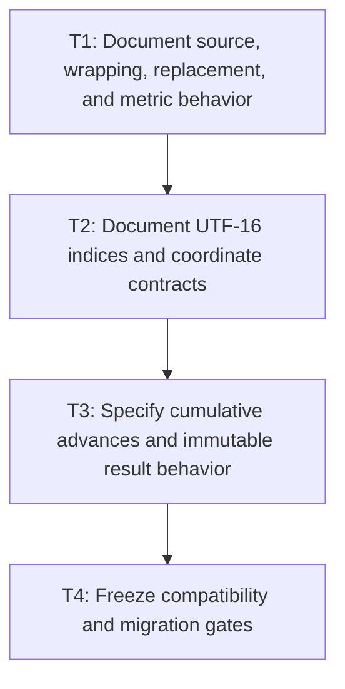

# P1: Approve Resolved-Measurement Contracts

**Status:** Complete

## Document Context

- **Parent:** [M2 - Approve measurement contracts and implement linear resolution](../M2%20-%20Approve%20measurement%20contracts%20and%20implement%20linear%20resolution.md)
- **Previous:** [M1 - Repair evidence and comparability](../M1%20-%20Repair%20evidence%20and%20comparability.md)
- **Next:** [P2 - Build resolved primitives and append-only builders](P2%20-%20Build%20resolved%20primitives%20and%20append-only%20builders.md)

## Goal

Encode the approved measurement, wrapping, immutability, index, coordinate, and control-setter
contract in Javadoc and executable compatibility/migration fixtures before rewriting measurement.

## Non-Goals

- Implementing builders, caches, or renderer changes.
- Treating current behavior as correct merely because it is current.

## Context

- Parent milestone: `docs/work/E5/M2 - Approve measurement contracts and implement linear resolution.md`.
- Phase entry gate: M1 comparable evidence is accepted.
- The contract below was approved on 2026-08-14. The remaining phase work is documentation,
  characterization, and migration-fixture implementation, not further behavioral design.

## Approved Measurement Contract

| Area | Approved behavior | Compatibility and migration handling |
| --- | --- | --- |
| Wrapping | `wordWrap=true` wraps at a word boundary; `false` wraps at a character boundary. If no word boundary fits, fall back to a character boundary. | Correct the reversed Javadoc. Preserve the boolean API and characterize current compatible behavior. Do not add a public wrapping enum in M2. |
| Empty font chain | Normalize an empty chain to `Font.DEFAULT`. A measured width must never be published without corresponding resolved-run evidence. | Preserve existing public signatures; migrate inconsistent empty-chain results to one normalized path. |
| Missing glyph | Select the first face containing the source glyph; otherwise the first face containing U+FFFD; otherwise the primary face's `.notdef`. Preserve the original source range and set `replacement=true` for fallback rendering. | Align run face, glyph, and replacement evidence across `resolveGlyph`, `resolveRuns`, and measurement. |
| Newlines | LF, CR, and CRLF are separators; CRLF is atomic. Separators are excluded from line text/ranges, and a trailing separator creates an empty final line. | Intentional migration for current CR behavior. Keep expanded Unicode line breaking out of scope. |
| Numeric inputs | `fontSize` is finite and positive; `lineHeight` and `offsetX` are finite and nonnegative; `maxWidth` is finite and nonnegative or positive infinity. Reject NaN and invalid negative values. Zero width is valid and must make progress. | Replace implicit near-zero empty-output behavior with validated, testable outcomes while preserving signatures. |
| Vertical metrics | Use the primary face consistently; fallback selection does not change line height. | Characterize current compatible primary-face behavior. |
| Rounding and accumulation | Preserve the current NanoVG/FontStash-compatible per-glyph advance and kerning operation order. | Freeze fractional fixtures before refactoring. |
| Source indices | Public indices are absolute UTF-16 offsets with exclusive ends. Valid surrogate pairs and CRLF separators are atomic boundaries. | Preserve public index type/signatures and add boundary fixtures. |
| External caret/selection indices | Clamp to the valid source range, then snap backward to the preceding valid code-point boundary. Input and textarea use the same rule. | Intentional migration for surrogate-interior assignments; preserve setters. |
| Caret midpoint tie | An exact midpoint advances to the following caret stop. | Characterize current compatible comparison behavior. |
| Coordinates and offset | Source ranges are absolute; glyph/run/caret advances are line-local. Layout, viewport, scroll, and presentation transforms remain outside measurement. First-line `offsetX` reduces available width and contributes to occupied extent. | Make coordinate ownership explicit for M4/M5/M6 consumers. |
| Caret representation | Each final line owns immutable paired absolute UTF-16 boundaries and line-local cumulative advances. No source-global cumulative array is retained. | Add internal representation without changing current public APIs unnecessarily. |
| Immutability | `TextMetrics`, lines, characters, runs, glyphs, and nested collections are deep immutable snapshots with defensive copies. Do not change `ResolvedTextRun` record components. | Intentional tightening of observable mutability while preserving public construction/signatures where possible. |
| Range measurement | Add an optional internal/capability interface over shared source `[start,end)` ranges. Production uses zero-copy ranges; existing `TextMeasurer` implementations remain source compatible with no new abstract method. | Capability adoption is internal and incremental; whole-string public entry points remain supported. |

## Current-State Reconciliation

- Current `wordWrap` implementation already treats `true` as word-boundary wrapping, but its Javadoc
  describes the opposite.
- Empty-chain metric selection defaults to the primary font while current run resolution can publish
  no run evidence; replacement-face choice also differs between glyph and run resolution paths.
- Direct measurement recognizes LF but not CR/CRLF, and the near-zero-width shortcut can return no
  lines rather than a progressing zero-width layout.
- Public indices are UTF-16 and the current midpoint comparison advances exact ties, while
  input/textarea setters currently permit surrogate-interior indices.
- Primary-face vertical metrics and the NanoVG/FontStash-compatible per-glyph rounding order are
  current compatible behaviors to preserve.
- `ResolvedTextRun` already copies its glyph list, but other result/nested values still require a
  complete defensive-copy audit and target fixtures.

## Phase Tasks

### T1: Document source, wrapping, replacement, and metric behavior
**Purpose:** Encode approved observable text results independently of the implementation strategy.

**Depends on:** None.
**Enables:** T2.
**Parallelizable with:** None.

**Decision and fixture matrix:**

| Area | Selected behavior | Previous observed behavior | Affected APIs / fixtures | Compatibility / migration impact |
| --- | --- | --- | --- | --- |
| Wrapping | `true` uses a preceding word boundary with character fallback; `false` uses a character boundary. | Runtime behavior matched, but public Javadoc described the boolean in reverse. | `TextMeasurer.measureText`, `getTextMetrics`; active `wordWrap*` fixtures. | Javadoc correction only; no API or compatible runtime change. |
| Empty text / font chain | Empty text retains one empty measured line. Empty font chains normalize to `Font.DEFAULT` with matching run evidence. | Empty text already retained a line; empty chains measured with default metrics but published no runs. | List-font `measureText`; active empty-text fixture and disabled empty-chain target. | Empty-chain run evidence is an intentional P2/P3 migration; signatures remain unchanged. |
| Source and replacement glyphs | Use the first source face, then the first U+FFFD face, then the primary `.notdef`; retain source range and `replacement=true`. | Source fallback matched; run resolution could select the primary face even when a later face owned U+FFFD. | `ResolvedGlyph`, `ResolvedTextRun`; active source/`.notdef` fixtures and disabled U+FFFD-face target. | Replacement-face alignment is an intentional P2/P3 migration. |
| Separators | LF, CR, and atomic CRLF are excluded from line ranges; a trailing separator creates an empty final line. | LF matched; CR was measured as a glyph and CRLF was not atomic. | `TextLineMetrics` ranges; active LF fixture and disabled CR/CRLF targets. | CR and CRLF handling intentionally changes in P2/P3. |
| Numeric domains | Positive finite `fontSize`; finite nonnegative `lineHeight`/`offsetX`; nonnegative finite or positive-infinite `maxWidth`; zero width progresses. Invalid values throw `IllegalArgumentException`. | Inputs were not validated and widths below `0.1` returned empty metrics. | Full `measureText` overloads; active valid/narrow fixtures and disabled invalid/zero-width targets. | Validation and zero-width progress are intentional P2/P3 migrations. |
| Vertical metrics | The primary face owns ascent, descent, gap, baseline, and line height even when glyphs use fallback faces. | Current runtime behavior matched. | `FontMetrics`, `TextLineMetrics`; active primary/fallback fixture. | Compatibility fixture; no selected behavior change. |
| Rounding / accumulation | Preserve NanoVG/FontStash raw scaling, kerning-plus-base order, per-glyph horizontal rounding, component vertical rounding, and per-line height accumulation. | Current runtime behavior matched but only integer-width smoke coverage existed. | `FontMetrics`, run advances, line/total metrics; active fractional fallback/kerning and pixel-rounding fixtures. | Exact native-backed values are frozen before builder work. |

**Changes:**
- [x] Correct `wordWrap` Javadoc and add word-boundary, character-boundary, and character-fallback
  fixtures without changing the boolean API.
- [x] Add target fixtures for the approved source-glyph, U+FFFD, `.notdef`, replacement-state, and
  `Font.DEFAULT` empty-chain behavior.
- [x] Add CR, LF, and atomic CRLF fixtures covering excluded separator ranges, trailing empty lines,
  and consistency with M4 normalization.
- [x] Add primary-face vertical-metric fixtures and validation fixtures for the approved finite,
  nonnegative, positive, infinite, and zero numeric boundaries.
- [x] Freeze the exact horizontal and vertical rounding/accumulation order: native/raw scaling,
  kerning/base-advance combination, per-glyph versus cumulative rounding, line width, baseline,
  line-height, and total-height accumulation.

**Acceptance Checks:**
- [x] A decision table names selected behavior, previous observed behavior, affected APIs/tests, and
  compatibility/migration impact for every item.
- [x] Fixtures cover empty text/chain, fallback/replacement, CR/LF/CRLF, narrow/invalid widths, and
  vertical metrics.
- [x] Rounding fixtures use fractional base advances, kerning, line height, fallback metrics, and
  multiple lines so changing operation order produces a detectable expected difference.

**Risks / Stop Criteria:** Stop if a selected result relies on an undefined native behavior or if any
listed input is omitted from the decision table.

### T2: Document UTF-16 indices and coordinate contracts
**Purpose:** Make every public/source/local coordinate and surrogate-boundary rule unambiguous.

**Depends on:** T1.
**Enables:** T3.
**Parallelizable with:** None.

**Index and coordinate matrix:**

| Value / boundary | Selected meaning | Current behavior / fixture | Migration handling |
| --- | --- | --- | --- |
| Line `startIndex` / `endIndex` / `charCount` | Absolute offsets into the measured source, counted in UTF-16 code units; end is exclusive and `charCount = end - start`. Recognized separators are excluded. Valid surrogate pairs and approved CRLF separators are atomic boundaries. | Active wrapped-supplementary and LF fixtures; disabled CR/CRLF targets. | CR and atomic CRLF boundaries activate with P2/P3 separator migration. |
| Run/glyph source ranges | Absolute, exclusive-end UTF-16 ranges into the measured source. `sourceCodePoint` and its original range remain unchanged when `renderedCodePoint` is U+FFFD or `.notdef` is used. | Active source, fallback, replacement, `.notdef`, and wrapped-supplementary fixtures; disabled replacement-face target. | P2/P3 aligns replacement face without translating or shortening source ranges. |
| Measurement caret index | UTF-16 offset into the exact `text` argument passed to `getTextCaretMetrics`; callers measuring a range translate that text-local offset to their owning source. | Active supplementary/replacement end-caret and midpoint fixtures. | P2/P3 line representations pair absolute owning-source boundaries with line-local advances. |
| Control caret/selection endpoints | Absolute UTF-16 offsets into the control value. External assignments clamp to `[0, value.length()]`, then snap backward when the clamped value is inside a valid surrogate pair. Input and textarea use the identical rule. | Active current numeric-clamp/interior characterization plus mirrored disabled input/textarea snap targets. | Intentional P2/P3 migration; public Javadocs describe current clamp-only behavior until enabled. |
| Line/run/caret x and advance | Text-local and line-local horizontal pixels. Run and caret advances exclude layout, viewport, scroll, and presentation transforms. A supplied `offsetX` reduces first-line available width and contributes to its occupied extent; it does not change run/caret advance. | Active finite-width first-line capacity and occupied-extent fixture. | M4/M5/M6 translate measurement coordinates when composing layout and controls. |
| Height / baseline / y | Line height and baseline are line-local; baseline is measured from the line top. `TextMetrics.height` accumulates lines. Measurement owns no layout-space, viewport-space, scroll-space, transformed-space, or absolute y coordinate. | Active vertical/offset fixtures plus metric Javadocs. | Layout and presentation consumers retain translation ownership. |
| Caret midpoint | Hit-testing immediately below a glyph midpoint selects its preceding stop; an exact tie and immediately above select the following stop. The same forward tie rule applies to zero/rounded advances, with explicit start/end clamps. | Active fractional-neighbor, zero-advance, first-boundary, and last-boundary fixtures. | Preserve current `<` comparison semantics during P2/P3 integration. |

**Changes:**
- [x] Document absolute, exclusive-end UTF-16 semantics for line `startIndex`, `endIndex`, `charCount`,
  run/glyph source ranges,
  caret indices, selection endpoints, and newline inclusion/exclusion.
- [x] Define line-local versus whole-source, text-local versus layout-space, x/advance/baseline/y, and
  offset-origin contracts consumed by M4/M5/M6.
- [x] Specify clamp-then-snap-backward handling for externally assigned caret/selection indices
  inside a valid surrogate pair in both input and textarea APIs.
- [x] Freeze forward caret hit-testing midpoint ties (`offset == currentX + advance / 2`), including
  zero/rounded advances and first/last boundary behavior.
- [x] Define mapping expectations for replacement glyphs whose rendered code point differs from
  source and for deferred/wrapped primitives.

**Acceptance Checks:**
- [x] Valid surrogate pairs are atomic at all line/run/glyph/caret/selection boundaries.
- [x] Coordinate fixtures can be consumed without guessing whether an x/y is source-, line-, text-,
  layout-, viewport-, scroll-, or transform-relative.
- [x] Caret fixtures cover values immediately below, exactly at, and immediately above a midpoint
  under the selected horizontal rounding/accumulation order.

**Risks / Stop Criteria:** Stop if input and textarea setters choose different surrogate-interior
policies or if a replacement loses its original source range.

### T3: Specify cumulative advances and immutable result behavior
**Purpose:** Fix the builder-consumed caret representation and public mutation contract up front.

**Depends on:** T2.
**Enables:** T4.
**Parallelizable with:** None.

**Final-line caret representation:**

| Property | Selected contract |
| --- | --- |
| Storage | An internal immutable `ResolvedMeasurement` aligns each published `TextLineMetrics` with one `FinalLineCaretStops` value. Each caret value privately owns two same-length arrays: absolute UTF-16 code-point boundaries and line-local cumulative advances. The arrays have one entry per caret stop, not per UTF-16 code unit, and are exposed only through indexed reads/lookup rather than mutable array access. |
| Start / end | Entry zero is `(line.startIndex, 0)`. The final entry is `(line.endIndex, final text advance)`, excluding the first-line `offsetX`. A non-empty line therefore has `codePointCount + 1` entries. |
| Empty lines | An empty line owns one entry `(line.startIndex, 0)`; for a trailing separator `startIndex == endIndex` after the excluded separator. |
| Finalization | Width-independent primitives keep source boundaries, raw base advance, and pair-kerning inputs only. P3 resets the preceding-glyph state at each final line start, applies the approved rounding order, and freezes cumulative advances exactly once after wrapping/deferred-suffix placement. |
| Lookup | Advances are finite and nondecreasing. Caret hit testing performs an `O(log n)` search over adjacent-stop midpoints using the approved strict-below rule: equality advances to the following stop, including through duplicate zero-advance stops. Source-index lookup is an `O(log n)` search over the strictly increasing UTF-16 boundary array. Lookup increments an internal comparison counter but performs no source scan, substring/prefix measurement, glyph probe, advance call, or complete measurement. |
| Rejected representation | No source-global cumulative array is built or retained. It cannot represent line-start kerning reset or rebased line-local x without correction state and retains unrelated control/source geometry. |

**Optional range capability:**

| Property | Selected contract |
| --- | --- |
| Compatibility seam | P2 adds the exact immutable internal `PreparedRange` request and private `PrivatePreparedMeasurement` result without changing `TextMeasurer`. P3 adds a separate internal `RangeTextMeasurerCapability` and `RangeTextMeasurerAdapter` together with final `ResolvedMeasurement` publication; existing implementations continue to compile and use whole-string methods. The adapter projects `ResolvedMeasurement.metrics()` when the capability is present and may use an allocating whole-string/translation fallback for legacy implementations. Production `FontServiceImpl` uses the zero-copy capability path only after final materialization exists. |
| Request / result | P2's `PreparedRange` retains the exact immutable shared `String`, half-open `[start,end)` range, fonts, and numeric/wrap inputs and routes only to a private prepared result. In P3, capability method `measureRange(String source, int start, int end, float offsetX, List fonts, float fontSize, float lineHeight, float maxWidth, boolean wordWrap)` preserves that request and returns the internal final `ResolvedMeasurement`. The capability, adapter, resolved measurement, and caret-stop types live under the internal font package rather than the public `TextMeasurer` surface. |
| Validation | Require `0 <= start <= end <= source.length()`. Reject boundaries inside a valid surrogate pair or between CR and LF with `IllegalArgumentException`; an empty range is valid. Apply the same numeric/font-chain rules as whole-string measurement. |
| Result translation | Public result line/run/glyph boundaries and internal caret boundaries remain absolute offsets into `source`; characters expose only selected line content. Widths, run advances, and caret advances remain line-local. Whole-string parity compares characters, scalar/vertical metrics, runs, glyphs, and replacement state directly and compares every nested source boundary after adding the range origin to whole-string fixture indices. |
| Counter attribution | A P2 private preparation has its own range-preparation count and increments no public API entry or final `COMPLETE_TEXT_MEASUREMENTS` counter. Source scans, logical resolutions, probes, advance/kerning calls, and builder appends count only actual work for `[start,end)`. P3 final capability/adapter dispatch attributes exactly one complete measurement without double-counting public/default delegation. |

**Snapshot and compatibility matrix:**

| Boundary | Canonical freeze and compatibility behavior |
| --- | --- |
| `TextMetrics` | The all-arguments constructor and both builder collection/singular paths defensively copy the line list once at final publication; `lines()` returns an unmodifiable list. Existing constructor, builder, getters, and scalar value semantics remain available. |
| `TextLineMetrics` | Snapshot `characters` to an immutable value and defensively copy `runs` once. Source mutation cannot change the result; accessors expose no mutable alias. Existing constructor/builder/accessor signatures remain available. |
| `ResolvedTextRun` | Retain the existing record components and constructor. Continue the canonical-constructor `List.copyOf(glyphs)` freeze; do not add caret arrays or change record shape. |
| Glyphs / metrics | `ResolvedGlyph` and `FontMetrics` remain scalar immutable values. Every containing collection is defensively copied and unmodifiable. No builder/private mutable collection escapes. |
| Equality / hash / string | Equality and hash codes use frozen canonical values, not mutable input identity. Character snapshots compare by text content, and existing human-readable `TextLineMetrics.toString()` continues to return line text. Tightening aliasing is an intentional behavioral compatibility change; public signatures and `ResolvedTextRun` record components remain unchanged. |

**Evidence classification and migration targets:**

| Claim | P1 executable evidence | Required implementation proof |
| --- | --- | --- |
| Final-line caret representation | Active fixtures characterize absolute/rebased stops. Disabled `finalLineCaretRepresentation_*` targets require one aligned caret value per final line, no escaped arrays, no offset contamination, identical line-start reset for repeated wrapped text, midpoint behavior, no measurement work during lookup, and a declared comparison counter bounded for both a two-glyph line and 1,025 caret stops. | P3 enables the targets. Source review must confirm no source-global cumulative array and no substring/prefix measurement path; P4 repeats comparison-growth proof across adversarial sizes. |
| Range semantics | P2 targets cover the exact immutable request, invalid/reversed/out-of-bounds/surrogate-interior/CRLF-interior boundaries, valid empty ranges, numeric/font-chain parity, private absolute indices, and preparation/scan/resolution attribution. P3 targets add final absolute line/run/glyph translation, direct capability and legacy-adapter parity, and complete-measurement/API-entry attribution. | P2 source/bytecode review must show the private production seam never calls `substring`; P3 preserves that path when activating the approved final capability signature. P4 allocation profiling/counters prove zero temporary range `String` values. The later legacy adapter fallback is explicitly excluded from the zero-copy claim. |
| Deep immutable snapshots | Active fixtures preserve current immutable top-level/run-glyph boundaries. Disabled constructor-and-builder targets mutate every source/accessor list or `CharSequence` and compare canonical equality, hash, and string results for both `TextMetrics` and `TextLineMetrics`. | P2/P3 enable all targets after single final freezes. Review confirms every public constructor and builder path funnels through the same defensive-copy/canonicalization seam. |

**Changes:**
- [x] Specify one rebased cumulative caret-advance array per final line, paired with absolute UTF-16
  code-point boundaries and covering line starts/ends, empty lines, and lookup complexity.
- [x] Specify that width-independent primitives retain only raw base advance, pair-kerning inputs, and
  UTF-16 source boundaries; after wrapping and line-start reset M2/P3 computes/freezes line-local
  cumulative values. Explicitly reject a source-global cumulative array.
- [x] Specify an optional internal range-aware capability over shared source/prepared text and
  start/end boundaries so M4 can avoid one temporary `String` per measured range while existing
  public `TextMeasurer` abstract/default APIs remain source compatible.
- [x] Require deep immutable snapshots for `TextMetrics`, `TextLineMetrics`, `ResolvedTextRun`, glyph
  lists, line lists, characters, and nested collections without changing record components.
- [x] Specify canonical construction/freeze, equality/hash/string impact, and compatibility behavior
  for existing builders/records/accessors.

**Acceptance Checks:**
- [x] The selected representation supports M5 caret/hit tests without substring measurement and does
  not force every measurement to retain unrelated control state.
- [x] The range-aware boundary has explicit source-index translation, validation, counter attribution,
  and parity fixtures against current public methods without adding a source-breaking abstract method.
- [x] If immutability is selected, planned tests attempt mutation through every exposed top-level and
  nested collection/reference boundary.

**Risks / Stop Criteria:** Stop if builders must choose between two cumulative representations or if
“immutable” still exposes mutable nested state.

### T4: Freeze compatibility and migration gates
**Purpose:** Turn the approved contract into an executable implementation gate.

**Depends on:** T3.
**Enables:** None.
**Parallelizable with:** None.

**Compatibility matrix:**

| Surface | Source compatibility | Binary/shape compatibility | Behavioral classification and gate |
| --- | --- | --- | --- |
| `TextMeasurer` | Preserve every existing method signature and the five-method abstract surface. The range capability is a separate internal interface, so existing implementations do not add a method. | Existing descriptors/default methods remain; internal capability/adapter/result types are additive and outside the supported public surface. | Corrected `wordWrap` Javadoc matches current behavior. Production range measurement is additive; the legacy adapter may allocate and must retain whole-string parity. |
| `ResolvedTextRun` / `ResolvedGlyph` | Preserve constructor/accessor signatures and every `ResolvedTextRun` record component. | Record shape, generated equality/hash/string behavior, and reflection-visible component order remain unchanged. | Existing glyph-list defensive copy remains. Replacement-face alignment changes selected face/evidence only where the disabled target currently differs. |
| `TextMetrics` / `TextLineMetrics` | Preserve all-arguments constructors, builders, accessors, and scalar/`CharSequence` types. | Constructor descriptors and builder/accessor method shapes remain unchanged; no caret array becomes a record/class constructor component. | Defensive copies, unmodifiable nested lists, and canonical immutable character snapshots intentionally remove mutable aliasing. Content-based equality/hash may replace mutable-`CharSequence` identity behavior; disabled constructor/builder targets gate activation. |
| `InputElement` / `TextareaElement` | Preserve value, caret, anchor, and selection setter/getter signatures. | No field or method descriptor changes are required. | Numeric clamping remains, but surrogate-interior assignments intentionally snap backward after P3. Mirrored disabled targets gate both controls and current Javadocs remain clamp-only until activation. |
| Measurement results | Preserve absolute exclusive-end UTF-16 integer ranges, line-local advances/baselines, primary vertical metrics, current rounding order, midpoint ties, and boolean wrap API. | No public result component is added or removed. Internal `ResolvedMeasurement` owns aligned `FinalLineCaretStops`. | Empty-chain evidence, replacement-face choice, CR/CRLF separators, invalid numeric rejection, valid zero-width progress, deep immutability, and surrogate snapping are approved behavior migrations with disabled targets. Active fixtures protect compatible behavior. |

**Affected consumer map:**

| Consumer / milestone | Contract consumed | Required handling |
| --- | --- | --- |
| `FontServiceImpl`, `BlockLayout`, and direct `TextMeasurer` callers | Wrap, replacement, numeric, vertical/rounding, UTF-16, and result-freeze rules | P2/P3 use one resolution/materialization path; public callers retain signatures and receive only final snapshots. Layout continues to translate text-local output. |
| `InlineFormattingContext` and M4 prepared ranges | Absolute source mappings, atomic UTF-16/CRLF boundaries, range validation, replacement evidence, and adapter parity | M4 calls `RangeTextMeasurerAdapter`; production `FontServiceImpl` dispatch is zero-copy, while legacy allocation is compatibility-only and cannot support a production allocation claim. |
| `InputElement`, `TextareaElement`, `MultilineTextControlMetrics`, `TextInputViewportBehavior`, and M5 listeners/services | Absolute control indices, clamp-then-snap, per-line caret stops, midpoint ties, deep immutable snapshots, and coordinate ownership | Snapshot geometry stays text-local; layout/viewport/scroll/transform conversion remains consumer-owned and both controls share one boundary policy. |
| `NvgTextRenderer`, `NvgInputRenderer`, `NvgTextareaRenderer`, `NvgDebugRenderer`, and M6 submission | Stable run components, selected font/replacement glyphs, rendered order, and line-local run advance | Renderer work must not alter `ResolvedTextRun` shape or reinterpret source ranges; presentation placement remains outside measurement. |
| M7 primitive and wrap caches | Width-independent source/font/glyph/base/kerning values; exact wrap inputs; immutable final `ResolvedMeasurement` | Primitive keys exclude width/offset/final line state. Wrapped values retain independent per-final-line caret stops and public snapshots without mutable aliases or source-global cumulative geometry. |

**Characterization and migration gate:**

| Classification | Executable evidence | Activation owner / Javadoc action |
| --- | --- | --- |
| Compatible and active | Word/character/fallback wrapping; source-face fallback and primary `.notdef`; LF and empty text; primary vertical metrics; exact rounding; absolute supplementary boundaries; source/replacement ranges; text-local coordinates/offset extent; midpoint/zero-advance behavior; current abstract surface; existing top-level/run-glyph immutability. | P2/P3 must keep these active. The reversed `wordWrap` docs and current coordinate/index docs are already corrected. |
| Approved migration, disabled | Empty font-chain run evidence; first U+FFFD face; CR/atomic CRLF/trailing empty line; numeric rejection and zero-width progress; input/textarea surrogate snapping; final range capability/parity/counters; actual final-line caret representation; constructor/builder deep immutability and canonical value semantics. | P2 enables primitive/private-builder/prepared-request targets; P3 enables final range/line/caret/public snapshot/setter targets. Remove `@Disabled` only with implementation and focused proof. |
| Public Javadoc activation | Current setter docs truthfully state clamp-only/surrogate-interior behavior; current metric docs describe coordinates/ranges without claiming deep immutability; `TextMeasurer` does not yet promise new validation/newline/range behavior. | When each migration activates, update the affected setter/value docs, metric class/collection/character docs, and measurement validation/separator/empty-chain/replacement documentation in the same P2/P3 change. Never publish approved future behavior as current before its target passes. |
| Allocation/performance claims | Functional range/caret targets prove parity and absence of counted remeasurement only. | P2 source/bytecode review and P4 allocation/counter evidence are required for production zero-copy/substring-free claims; the legacy adapter is excluded from zero-copy claims. |

**P2/P3 decision audit:**

- P2 owns the exact `String` range request, validation, private zero-copy source/range seam, primitive
  fields, and append-only storage. It does not add a capability/adapter or publish incomplete public
  metrics or final caret values.
- P3 owns wrapping, CR/LF/CRLF materialization, line-start kerning reset, one final freeze into
  `ResolvedMeasurement`/`FinalLineCaretStops` plus public snapshots, production capability wiring,
  caret lookup, and control setter migration.
- P2/P3 may select data structures and algorithms that satisfy these contracts; they have no remaining
  authority to choose observable wrapping, replacement, numeric, index, coordinate, immutability,
  range, or caret behavior.

**Changes:**
- [x] Record source/binary/behavioral compatibility and affected renderer/layout/
  control consumers.
- [x] Add characterization/target fixtures and mark intentional behavior changes explicitly
  instead of comparing blindly to old output.
- [x] Update API/Javadoc migration notes where approved behavior contradicts existing names/docs or
  observable mutable results.

**Acceptance Checks:**
- [x] No implementation task in P2/P3 is asked to choose behavior; every contradiction has explicit
  approval and migration handling.
- [x] M4/M5/M6/M7 can cite one coordinate, immutability, replacement, and wrap contract.

**Risks / Stop Criteria:** Do not start P2 with an “open,” “preserve current,” or “fix later” entry in
the required decision matrix.

## Phase Exit

P1 is complete. P2 may implement only the private primitives, builders, and exact prepared-range seam
defined here. The capability/adapter/final result plus wrapping/publication/caret/setter behavior
remain owned by P3.

## Verification Strategy

- Run `./gradlew :spinygui.core:test --tests 'com.spinyowl.spinygui.core.system.font.impl.FontServiceImplMeasurementContractTest' --tests 'com.spinyowl.spinygui.core.system.font.impl.FontServiceImplTest' -x :spinygui.core:jacocoTestReport`.
  The JaCoCo report task is excluded because of its known unrelated report-output failure; the
  selected test task still executes both the primary contract suite and the implementation suite.
- Run `./gradlew :spinygui.core:test --tests 'com.spinyowl.spinygui.core.system.input.TextInputBehaviorTest' --tests 'com.spinyowl.spinygui.core.system.input.TextareaBehaviorTest'`.
- Review Javadoc and fixtures; do not add performance implementation in this phase.

## Review Boundaries

- Review text/metrics/rounding decisions, then indices/coordinates/midpoint ties, then line-local
  cumulative/range-aware/immutability contracts, then one compatibility sign-off.

## Deferred Work

- Primitive/builders belong to P2; wrapping/caret integration belongs to P3; proof belongs to P4.
- Shaping, bidi, grapheme editing, and expanded Unicode line breaking remain non-goals.

## Dependency Graph

