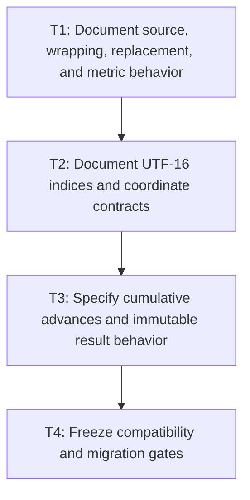

# P1: Approve Resolved-Measurement Contracts

**Status:** In progress

## Document Context

- **Parent:** [M2 - Approve measurement contracts and implement linear resolution](../M2%20-%20Approve%20measurement%20contracts%20and%20implement%20linear%20resolution.md)
- **Previous:** [M1 - Repair evidence and comparability](../M1%20-%20Repair%20evidence%20and%20comparability.md)
- **Next:** [P2 - Build resolved primitives and append-only builders](P2%20-%20Build%20resolved%20primitives%20and%20append-only%20builders.md)

## Goal

Encode the approved measurement, wrapping, immutability, index, coordinate, and control-setter
contract in Javadoc and executable compatibility/migration fixtures before rewriting measurement.

## Non-Goals

- Implementing builders, caches, or renderer changes.
- Treating current behavior as correct merely because it is current.

## Context

- Parent milestone: `docs/work/E5/M2 - Approve measurement contracts and implement linear resolution.md`.
- Phase entry gate: M1 comparable evidence is accepted.
- The contract below was approved on 2026-08-14. The remaining phase work is documentation,
  characterization, and migration-fixture implementation, not further behavioral design.

## Approved Measurement Contract

| Area | Approved behavior | Compatibility and migration handling |
| --- | --- | --- |
| Wrapping | `wordWrap=true` wraps at a word boundary; `false` wraps at a character boundary. If no word boundary fits, fall back to a character boundary. | Correct the reversed Javadoc. Preserve the boolean API and characterize current compatible behavior. Do not add a public wrapping enum in M2. |
| Empty font chain | Normalize an empty chain to `Font.DEFAULT`. A measured width must never be published without corresponding resolved-run evidence. | Preserve existing public signatures; migrate inconsistent empty-chain results to one normalized path. |
| Missing glyph | Select the first face containing the source glyph; otherwise the first face containing U+FFFD; otherwise the primary face's `.notdef`. Preserve the original source range and set `replacement=true` for fallback rendering. | Align run face, glyph, and replacement evidence across `resolveGlyph`, `resolveRuns`, and measurement. |
| Newlines | LF, CR, and CRLF are separators; CRLF is atomic. Separators are excluded from line text/ranges, and a trailing separator creates an empty final line. | Intentional migration for current CR behavior. Keep expanded Unicode line breaking out of scope. |
| Numeric inputs | `fontSize` is finite and positive; `lineHeight` and `offsetX` are finite and nonnegative; `maxWidth` is finite and nonnegative or positive infinity. Reject NaN and invalid negative values. Zero width is valid and must make progress. | Replace implicit near-zero empty-output behavior with validated, testable outcomes while preserving signatures. |
| Vertical metrics | Use the primary face consistently; fallback selection does not change line height. | Characterize current compatible primary-face behavior. |
| Rounding and accumulation | Preserve the current NanoVG/FontStash-compatible per-glyph advance and kerning operation order. | Freeze fractional fixtures before refactoring. |
| Source indices | Public indices are absolute UTF-16 offsets with exclusive ends. Valid surrogate pairs and CRLF separators are atomic boundaries. | Preserve public index type/signatures and add boundary fixtures. |
| External caret/selection indices | Clamp to the valid source range, then snap backward to the preceding valid code-point boundary. Input and textarea use the same rule. | Intentional migration for surrogate-interior assignments; preserve setters. |
| Caret midpoint tie | An exact midpoint advances to the following caret stop. | Characterize current compatible comparison behavior. |
| Coordinates and offset | Source ranges are absolute; glyph/run/caret advances are line-local. Layout, viewport, scroll, and presentation transforms remain outside measurement. First-line `offsetX` reduces available width and contributes to occupied extent. | Make coordinate ownership explicit for M4/M5/M6 consumers. |
| Caret representation | Each final line owns immutable paired absolute UTF-16 boundaries and line-local cumulative advances. No source-global cumulative array is retained. | Add internal representation without changing current public APIs unnecessarily. |
| Immutability | `TextMetrics`, lines, characters, runs, glyphs, and nested collections are deep immutable snapshots with defensive copies. Do not change `ResolvedTextRun` record components. | Intentional tightening of observable mutability while preserving public construction/signatures where possible. |
| Range measurement | Add an optional internal/capability interface over shared source `[start,end)` ranges. Production uses zero-copy ranges; existing `TextMeasurer` implementations remain source compatible with no new abstract method. | Capability adoption is internal and incremental; whole-string public entry points remain supported. |

## Current-State Reconciliation

- Current `wordWrap` implementation already treats `true` as word-boundary wrapping, but its Javadoc
  describes the opposite.
- Empty-chain metric selection defaults to the primary font while current run resolution can publish
  no run evidence; replacement-face choice also differs between glyph and run resolution paths.
- Direct measurement recognizes LF but not CR/CRLF, and the near-zero-width shortcut can return no
  lines rather than a progressing zero-width layout.
- Public indices are UTF-16 and the current midpoint comparison advances exact ties, while
  input/textarea setters currently permit surrogate-interior indices.
- Primary-face vertical metrics and the NanoVG/FontStash-compatible per-glyph rounding order are
  current compatible behaviors to preserve.
- `ResolvedTextRun` already copies its glyph list, but other result/nested values still require a
  complete defensive-copy audit and target fixtures.

## Phase Tasks

### T1: Document source, wrapping, replacement, and metric behavior
**Purpose:** Encode approved observable text results independently of the implementation strategy.

**Depends on:** None.
**Enables:** T2.
**Parallelizable with:** None.

**Changes:**
- [ ] Correct `wordWrap` Javadoc and add word-boundary, character-boundary, and character-fallback
  fixtures without changing the boolean API.
- [ ] Add target fixtures for the approved source-glyph, U+FFFD, `.notdef`, replacement-state, and
  `Font.DEFAULT` empty-chain behavior.
- [ ] Add CR, LF, and atomic CRLF fixtures covering excluded separator ranges, trailing empty lines,
  and consistency with M4 normalization.
- [ ] Add primary-face vertical-metric fixtures and validation fixtures for the approved finite,
  nonnegative, positive, infinite, and zero numeric boundaries.
- [ ] Freeze the exact horizontal and vertical rounding/accumulation order: native/raw scaling,
  kerning/base-advance combination, per-glyph versus cumulative rounding, line width, baseline,
  line-height, and total-height accumulation.

**Acceptance Checks:**
- [ ] A decision table names selected behavior, previous observed behavior, affected APIs/tests, and
  compatibility/migration impact for every item.
- [ ] Fixtures cover empty text/chain, fallback/replacement, CR/LF/CRLF, narrow/invalid widths, and
  vertical metrics.
- [ ] Rounding fixtures use fractional base advances, kerning, line height, fallback metrics, and
  multiple lines so changing operation order produces a detectable expected difference.

**Risks / Stop Criteria:** Stop if a selected result relies on an undefined native behavior or if any
listed input is omitted from the decision table.

### T2: Document UTF-16 indices and coordinate contracts
**Purpose:** Make every public/source/local coordinate and surrogate-boundary rule unambiguous.

**Depends on:** T1.
**Enables:** T3.
**Parallelizable with:** None.

**Changes:**
- [ ] Document absolute, exclusive-end UTF-16 semantics for line `startIndex`, `endIndex`, `charCount`,
  run/glyph source ranges,
  caret indices, selection endpoints, and newline inclusion/exclusion.
- [ ] Define line-local versus whole-source, text-local versus layout-space, x/advance/baseline/y, and
  offset-origin contracts consumed by M4/M5/M6.
- [ ] Specify clamp-then-snap-backward handling for externally assigned caret/selection indices
  inside a valid surrogate pair in both input and textarea APIs.
- [ ] Freeze forward caret hit-testing midpoint ties (`offset == currentX + advance / 2`), including
  zero/rounded advances and first/last boundary behavior.
- [ ] Define mapping expectations for replacement glyphs whose rendered code point differs from
  source and for deferred/wrapped primitives.

**Acceptance Checks:**
- [ ] Valid surrogate pairs are atomic at all line/run/glyph/caret/selection boundaries.
- [ ] Coordinate fixtures can be consumed without guessing whether an x/y is source-, line-, text-,
  layout-, viewport-, scroll-, or transform-relative.
- [ ] Caret fixtures cover values immediately below, exactly at, and immediately above a midpoint
  under the selected horizontal rounding/accumulation order.

**Risks / Stop Criteria:** Stop if input and textarea setters choose different surrogate-interior
policies or if a replacement loses its original source range.

### T3: Specify cumulative advances and immutable result behavior
**Purpose:** Fix the builder-consumed caret representation and public mutation contract up front.

**Depends on:** T2.
**Enables:** T4.
**Parallelizable with:** None.

**Changes:**
- [ ] Specify one rebased cumulative caret-advance array per final line, paired with absolute UTF-16
  code-point boundaries and covering line starts/ends, empty lines, and lookup complexity.
- [ ] Specify that width-independent primitives retain only raw base advance, pair-kerning inputs, and
  UTF-16 source boundaries; after wrapping and line-start reset M2/P3 computes/freezes line-local
  cumulative values. Explicitly reject a source-global cumulative array.
- [ ] Specify an optional internal range-aware capability over shared source/prepared text and
  start/end boundaries so M4 can avoid one temporary `String` per measured range while existing
  public `TextMeasurer` abstract/default APIs remain source compatible.
- [ ] Require deep immutable snapshots for `TextMetrics`, `TextLineMetrics`, `ResolvedTextRun`, glyph
  lists, line lists, characters, and nested collections without changing record components.
- [ ] Specify canonical construction/freeze, equality/hash/string impact, and compatibility behavior
  for existing builders/records/accessors.

**Acceptance Checks:**
- [ ] The selected representation supports M5 caret/hit tests without substring measurement and does
  not force every measurement to retain unrelated control state.
- [ ] The range-aware boundary has explicit source-index translation, validation, counter attribution,
  and parity fixtures against current public methods without adding a source-breaking abstract method.
- [ ] If immutability is selected, planned tests attempt mutation through every exposed top-level and
  nested collection/reference boundary.

**Risks / Stop Criteria:** Stop if builders must choose between two cumulative representations or if
“immutable” still exposes mutable nested state.

### T4: Freeze compatibility and migration gates
**Purpose:** Turn the approved contract into an executable implementation gate.

**Depends on:** T3.
**Enables:** None.
**Parallelizable with:** None.

**Changes:**
- [ ] Record source/binary/behavioral compatibility and affected renderer/layout/
  control consumers.
- [ ] Add characterization/target fixtures and mark intentional behavior changes explicitly
  instead of comparing blindly to old output.
- [ ] Update API/Javadoc migration notes where approved behavior contradicts existing names/docs or
  observable mutable results.

**Acceptance Checks:**
- [ ] No implementation task in P2/P3 is asked to choose behavior; every contradiction has explicit
  approval and migration handling.
- [ ] M4/M5/M6/M7 can cite one coordinate, immutability, replacement, and wrap contract.

**Risks / Stop Criteria:** Do not start P2 with an “open,” “preserve current,” or “fix later” entry in
the required decision matrix.

## Verification Strategy

- Run `./gradlew :spinygui.core:test --tests 'com.spinyowl.spinygui.core.system.font.impl.FontServiceImplTest'`.
- Run `./gradlew :spinygui.core:test --tests 'com.spinyowl.spinygui.core.system.input.TextInputBehaviorTest' --tests 'com.spinyowl.spinygui.core.system.input.TextareaBehaviorTest'`.
- Review Javadoc and fixtures; do not add performance implementation in this phase.

## Review Boundaries

- Review text/metrics/rounding decisions, then indices/coordinates/midpoint ties, then line-local
  cumulative/range-aware/immutability contracts, then one compatibility sign-off.

## Deferred Work

- Primitive/builders belong to P2; wrapping/caret integration belongs to P3; proof belongs to P4.
- Shaping, bidi, grapheme editing, and expanded Unicode line breaking remain non-goals.

## Dependency Graph

