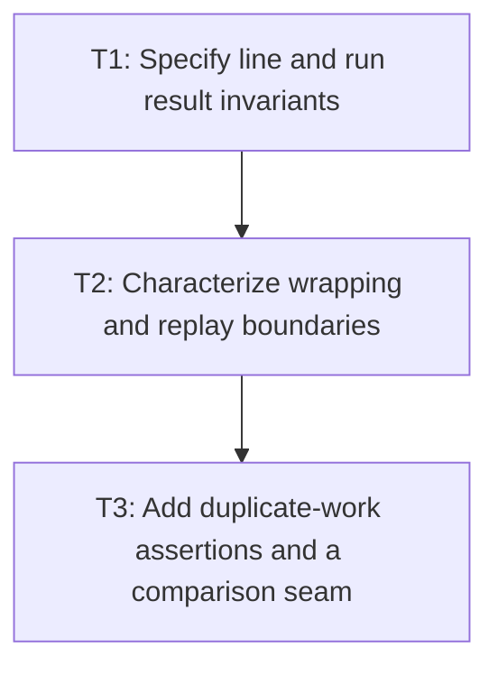

# P1: Lock the single-pass measurement contract

## Goal

Characterize every result and edge condition that the single-pass measurement rewrite must preserve.

## Non-Goals

- Implementing builders or persistent caches.
- Changing public UTF-16 index semantics or wrapping policy.

## Context

- Parent milestone: `docs/work/E5/M2 - Produce resolved measurement in one linear pass.md`.
- `FontServiceImpl.measureText` currently tracks wrap candidates, then `addLine` resolves accepted
  text again into runs.

## Phase Tasks

### T1: Specify line and run result invariants
**Purpose:** Define immutable output equivalence independently of the current algorithm.

**Depends on:** M1/P4/T3.
**Enables:** T2.
**Parallelizable with:** None.

**Changes:**
- [ ] Enumerate line width/height/baseline, start/end/char count, run ranges, font, glyphs, advance,
  and replacement-marker invariants.
- [ ] Specify empty text, narrow/negative width, trailing newline, primary-font metrics, and empty font-chain behavior.

**Acceptance Checks:**
- [ ] Tests assert exact immutable result structure for each edge case.
- [ ] All public indices remain UTF-16 offsets while scanning is code-point based.

**Risks:** Preserve current pixel-rounding behavior even where alternatives appear cleaner.

### T2: Characterize wrapping and replay boundaries
**Purpose:** Define how accepted and deferred glyphs behave at line transitions.

**Depends on:** T1.
**Enables:** T3.
**Parallelizable with:** None.

**Changes:**
- [ ] Cover word wrap, non-word wrap, offset width, spaces, explicit newline, oversized first glyph,
  fallback transitions, and kerning reset at lines/runs.
- [ ] Define active-line candidate state sufficient to resume without resolving accepted ranges again.

**Acceptance Checks:**
- [ ] Expected line/range geometry matches current fixtures exactly.
- [ ] Supplementary characters are accepted or deferred atomically.

**Risks:** Stop contract work if current tests disagree on a boundary; resolve the compatibility decision first.

### T3: Add duplicate-work assertions and a comparison seam
**Purpose:** Make the intended algorithmic change reviewable through deterministic evidence.

**Depends on:** T2.
**Enables:** M2/P2.
**Parallelizable with:** None.

**Changes:**
- [ ] Add diagnostics for glyph resolution and immutable run/list construction on fixed fixtures.
- [ ] Define a test-only old/new structural comparison strategy that does not become a production dual path.

**Acceptance Checks:**
- [ ] Current behavior demonstrates duplicate resolution on completed lines/runs.
- [ ] Comparison output includes ranges, glyph identity, widths, runs, and replacement state.

**Risks:** Remove or isolate any temporary reference path after the new implementation is proven.

## Verification Strategy

- Run `./gradlew :spinygui.core:test --tests '*FontServiceImplTest'`.
- Run `./gradlew :spinygui.benchmark:test` for diagnostic fixture setup.

## Review Boundaries

- Review result invariants and wrapping cases before adding diagnostic/comparison seams.

## Deferred Work

- Measurement builders belong to P2; caret integration and scaling proof belong to P3.

## Dependency Graph

