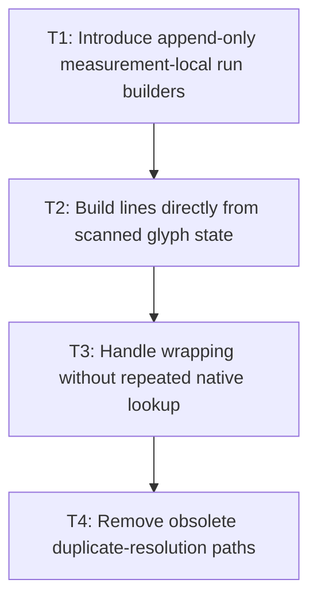

# P2: Build resolved lines and runs in one scan

## Goal

Replace duplicate glyph resolution and quadratic immutable-list reconstruction with bounded,
measurement-local line and run builders.

## Non-Goals

- Persistent resolved-sequence or primitive caches.
- Changing `TextMetrics`, `TextLineMetrics`, or `ResolvedTextRun` observable behavior.

## Context

- Parent milestone: `docs/work/E5/M2 - Produce resolved measurement in one linear pass.md`.
- Builders may retain mutable state only for the active measurement and freeze at completed boundaries.

## Phase Tasks

### T1: Introduce append-only measurement-local run builders
**Purpose:** Eliminate remove-and-recopy growth of same-font glyph lists.

**Depends on:** M2/P1/T3.
**Enables:** T2.
**Parallelizable with:** None.

**Changes:**
- [ ] Accumulate resolved glyphs, source start/end, font, and advance append-only for the current run.
- [ ] Freeze glyphs and rendered run values once when a run completes.

**Acceptance Checks:**
- [ ] Long same-font runs perform linear append/final-copy work by counters.
- [ ] Font transitions and replacement glyphs close runs at the same boundaries as fixtures.

**Risks:** Keep mutable builders private to one measurement; never expose partially built values.

### T2: Build lines directly from scanned glyph state
**Purpose:** Remove `addLine`/`resolveRuns` re-resolution of accepted text.

**Depends on:** T1.
**Enables:** T3.
**Parallelizable with:** None.

**Changes:**
- [ ] Accumulate line width, ranges, run builders, and wrap candidates during the code-point scan.
- [ ] Freeze completed `TextLineMetrics` and the final `TextMetrics` without rescanning accepted ranges.

**Acceptance Checks:**
- [ ] Each accepted code point resolves a glyph once solely for result construction.
- [ ] Explicit newline, empty final line, offset, and primary metrics remain exact.

**Risks:** A line builder must not retain the complete input beyond immutable result requirements.

### T3: Handle wrapping without repeated native lookup
**Purpose:** Preserve backtracking semantics while reusing already scanned glyph/advance state.

**Depends on:** T2.
**Enables:** T4.
**Parallelizable with:** None.

**Changes:**
- [ ] Retain bounded active-line break candidate state for word wrapping and deferred suffix replay.
- [ ] Reset line and kerning state exactly at wrap/newline boundaries without repeated font lookup.

**Acceptance Checks:**
- [ ] Wrapped fixtures have identical widths, ranges, runs, and pixel rounding.
- [ ] Replay counters do not show repeated glyph or native metric lookup for scanned code points.

**Risks:** Stop if candidate state grows beyond the active line or can split a surrogate pair.

### T4: Remove obsolete duplicate-resolution paths
**Purpose:** Leave one authoritative measurement implementation after equivalence is proven.

**Depends on:** T3.
**Enables:** M2/P3.
**Parallelizable with:** None.

**Changes:**
- [ ] Remove or collapse old `resolveRuns`/same-run reconstruction paths no longer used.
- [ ] Retain focused diagnostics required by M1 without keeping duplicate production algorithms.

**Acceptance Checks:**
- [ ] No completed line is re-resolved solely to build runs.
- [ ] Full font-service regression coverage passes with unchanged public results.

**Risks:** Avoid unrelated font-loading or parser cleanup.

## Verification Strategy

- Run `./gradlew :spinygui.core:test --tests '*FontServiceImplTest' --tests '*FontChainResolverTest'`.
- Run `./gradlew :spinygui.core:test` before phase completion.

## Review Boundaries

- Review run builders, line construction, and wrap replay as separate changes; remove old paths only
  after structural equivalence is demonstrated.

## Deferred Work

- Caret cumulative APIs and benchmark comparison belong to P3; persistent caches belong to M6.

## Dependency Graph

