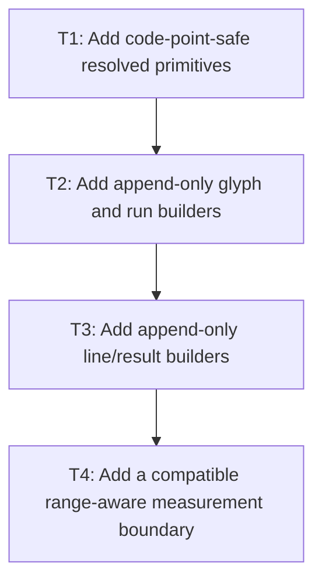

# P2: Build Resolved Primitives and Append-Only Builders

## Goal

Scan source code points once into measurement-local resolved primitives and private append-only glyph/
run/line builders whose invariant checks, optional private freeze, and slot movement are linear in
output size without publishing incomplete public line results.

## Non-Goals

- Persistent caching or final width-keyed reuse.
- Changing any P1-approved behavior during implementation.
- Publishing public `TextLineMetrics`, `ResolvedTextRun`, or caret arrays before P3 final wrapping,
  deferred-suffix placement, and line-start kerning reset.

## Context

- Parent milestone: `docs/work/E5/M2 - Approve measurement contracts and implement linear resolution.md`.
- Phase entry gate: M2/P1 decisions and fixtures are approved.
- Current `resolveRuns` repeats glyph selection and reconstructs growing immutable run glyph lists.

## Phase Tasks

### T1: Add code-point-safe resolved primitives
**Purpose:** Retain all width-independent information needed after each logical source resolution.

**Depends on:** None.
**Enables:** T2.
**Parallelizable with:** None.

**Changes:**
- [ ] Define a measurement-local primitive with original UTF-16 start/end, source/rendered code point,
  selected semantic font/face, glyph index, replacement state, base advance input/value, and previous-
  pair kerning inputs needed for later line materialization.
- [ ] Resolve each source code point logically once while counting every candidate native glyph-index
  probe separately; apply P1 empty-chain/replacement selection exactly.
- [ ] Carry approved CR/LF/newline and UTF-16 code-point boundaries without splitting valid surrogate
  pairs; retain no source-global cumulative advance array.

**Acceptance Checks:**
- [ ] Fixtures show one logical resolution per measured source code point and potentially multiple
  native probes for fallback, with exact selected source/rendered mappings.
- [ ] No primitive contains max width, wrap offset, final line x, or final line-specific run advance.
- [ ] Primitive advance state is limited to raw base advance and pair-kerning inputs/values that P3
  can rebase after line-start reset.

**Risks / Stop Criteria:** Stop if resolution data must be recomputed to identify a later line/run or
if the primitive conflates source and rendered code points.

### T2: Add append-only glyph and run builders
**Purpose:** Eliminate remove/copy/recreate behavior when extending same-face runs.

**Depends on:** T1.
**Enables:** T3.
**Parallelizable with:** None.

**Changes:**
- [ ] Add measurement-local append-only storage for resolved glyphs and contiguous face runs with
  amortized-linear growth and explicit slot append/move counters.
- [ ] Represent run boundaries as ranges over builder storage until P3's one final public freeze rather
  than replacing a public run on each glyph; any P2 frozen snapshot is a private test representation.
- [ ] Reserve P1 defensive-copy/record compatibility for P3's final public publication boundary; do
  not construct an incomplete public `ResolvedTextRun` in P2.

**Acceptance Checks:**
- [ ] A long single-face run performs one append per glyph and at most one private invariant-fixture
  freeze in P2, not a growing prefix copy per glyph.
- [ ] Fallback/replacement transitions create exact private run ranges; already-final boundary fixtures
  may freeze once, while incomplete pre-wrap ranges remain unpublished.

**Risks / Stop Criteria:** Stop if a builder leaks through a public result or if final immutability is
achieved by repeated intermediate `List.copyOf` calls.

### T3: Add append-only line/result builders
**Purpose:** Prepare private line/result storage while leaving public lines/runs and final line-local
cumulative advances to post-wrap P3 materialization and publication.

**Depends on:** T2.
**Enables:** T4.
**Parallelizable with:** None.

**Changes:**
- [ ] Add line/result builders that retain primitive ranges, UTF-16 caret boundaries, source ranges/
  `charCount`, raw/rebased advance slots, width/height/baseline, and selected vertical metrics.
- [ ] Provide private mutable/frozen builder representations for characters/run ranges/glyph slots and
  nested storage without rescanning accepted source ranges; do not publish public line/run records.
- [ ] Handle empty text/lines/chains and approved exceptional/narrow numeric inputs at one explicit
  private or already-final boundary.

**Acceptance Checks:**
- [ ] Builder append/freeze/copy/move counts grow linearly with source/output across same-face and
  alternating-fallback fixtures.
- [ ] Pre-wrap builder results pass private structure/invariant fixtures, retain no source-global
  cumulative array, expose no mutable builder arrays, and cannot escape as public result types.
- [ ] Any immutable P2 result fixture is either a private test representation or proves its boundary
  is already final and needs no P3 wrap/deferred-suffix/line-start rebase work.

**Risks / Stop Criteria:** Stop if a private freeze invokes glyph resolution, advance, or kerning
native calls, if incomplete public results escape, or if P3 would need to refreeze a published value.

### T4: Add a compatible range-aware measurement boundary
**Purpose:** Let M4 measure shared prepared/source ranges without allocating one temporary `String`
per range or changing existing public abstract methods.

**Depends on:** T3.
**Enables:** None.
**Parallelizable with:** None.

**Changes:**
- [ ] Implement P1's internal overload/adapter over an immutable `CharSequence`/prepared source plus
  validated start/end boundaries and source-offset translation.
- [ ] Preserve existing public `TextMeasurer` method signatures/default behavior and prepare their
  shared implementation seam without a source-breaking abstract method; P2 exposes only the internal
  range request/private-result boundary, and P3 wires final public result publication.
- [ ] Attribute source scans, logical resolution, measurement calls, and materialization counters
  consistently for public and range-aware entry paths.

**Acceptance Checks:**
- [ ] Measuring many ranges over one source allocates zero temporary range `String` values and yields
  private source/offset outcomes equivalent to compatible whole-string fixtures without publishing
  incomplete public line/run/caret values.
- [ ] Invalid/reversed/surrogate-interior boundaries follow P1 validation policy and public callers
  remain source compatible.

**Risks / Stop Criteria:** Stop if the adapter calls `substring`, if M4 must copy each range before
measurement, or if public/default entry-point counts become ambiguous.

## Verification Strategy

- Run `./gradlew :spinygui.core:test --tests 'com.spinyowl.spinygui.core.system.font.impl.FontServiceImplTest'`.
- Run `./gradlew :spinygui.benchmark:test` for counter fixture support.
- Use diagnostics-enabled tests only; do not evaluate timed performance until P4.

## Review Boundaries

- Review primitive shape/resolution counts, then run storage, line/result builder boundaries, then the
  compatible range-aware adapter.

## Deferred Work

- Wrap replay and line-start materialization belong to P3.
- Persistent primitive/wrap caches belong to M7.

## Dependency Graph

