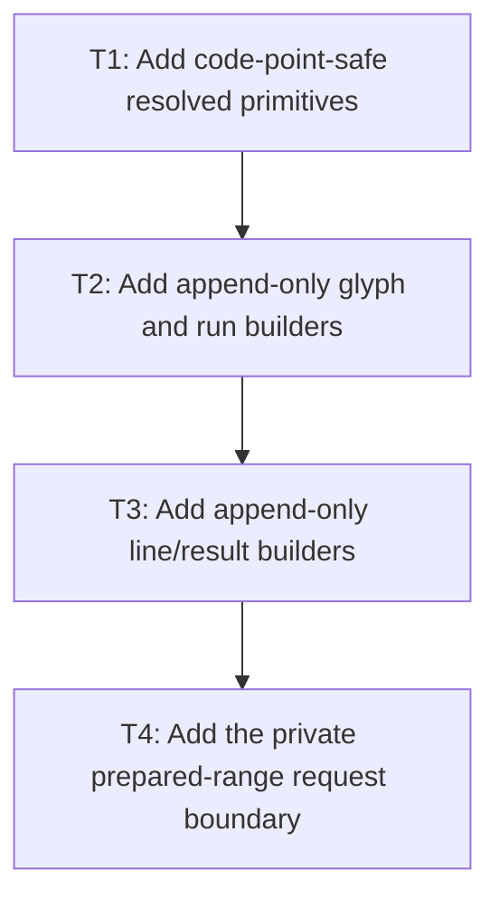

# P2: Build Resolved Primitives and Append-Only Builders

**Status:** Complete

## Document Context

- **Parent:** [M2 - Approve measurement contracts and implement linear resolution](../M2%20-%20Approve%20measurement%20contracts%20and%20implement%20linear%20resolution.md)
- **Previous:** [P1 - Approve resolved-measurement contracts](P1%20-%20Approve%20resolved-measurement%20contracts.md)
- **Next:** [P3 - Integrate wrapping, line materialization, and caret queries](P3%20-%20Integrate%20wrapping%20line%20materialization%20and%20caret%20queries.md)

## Goal

Scan source code points once into measurement-local resolved primitives and private append-only glyph/
run/line builders whose invariant checks, optional private freeze, and slot movement are linear in
output size without publishing incomplete public line results.

## Non-Goals

- Persistent caching or final width-keyed reuse.
- Changing any P1-approved behavior during implementation.
- Publishing public `TextLineMetrics`, `ResolvedTextRun`, or caret arrays before P3 final wrapping,
  deferred-suffix placement, and line-start kerning reset.

## Context

- Parent milestone: `docs/work/E5/M2 - Approve measurement contracts and implement linear resolution.md`.
- Phase entry gate: M2/P1 decisions and fixtures are approved.
- Contract authority: [P1 - Approved resolved-measurement contracts](P1%20-%20Approve%20resolved-measurement%20contracts.md).
- Current `resolveRuns` already appends accepted glyphs linearly and freezes once at each public run
  boundary. Preserve that accepted narrow optimization, but do not mistake it for the M2 target:
  `measureText` still scans/resolves source, accepted line ranges are resolved again for public runs,
  wrap replay can revisit a deferred suffix, and caret lookup scans/resolves independently.

## Implementation Handoff

- **Primary source:** `spinygui.core/src/main/java/com/spinyowl/spinygui/core/system/font/impl/FontServiceImpl.java`
- **Contract and diagnostics:** `spinygui.core/src/main/java/com/spinyowl/spinygui/core/system/font/TextMeasurer.java`, `ResolvedGlyph.java`, `ResolvedTextRun.java`, and `spinygui.core/src/main/java/com/spinyowl/spinygui/core/diagnostic/TextDiagnosticCounter.java`
- **Focused core evidence:** `spinygui.core/src/test/java/com/spinyowl/spinygui/core/system/font/impl/FontServiceImplTest.java` and `FontServiceImplMeasurementContractTest.java`
- **Counter evidence:** `spinygui.benchmark/src/test/java/com/spinyowl/spinygui/benchmark/diagnostic/DiagnosticWorkloadSpecificationsTest.java`
- **Accepted baseline:** P1 is complete in the current shared diff; its active characterization and disabled migration targets are authoritative. Preserve the existing append-only `resolveRuns` evidence until the private replacement is proven.
- **Worktree constraint:** Preserve unrelated `.worktrees/nested-scroll-text-rendering` state and accepted P1/M4-M7 documentation changes. Do not stage or commit during implementation.

## Phase Tasks

### T1: Add code-point-safe resolved primitives
**Purpose:** Retain all width-independent information needed after each logical source resolution.

**Depends on:** None.
**Enables:** T2.
**Parallelizable with:** None.

**Changes:**
- [x] Define a measurement-local primitive with original UTF-16 start/end, source/rendered code point,
  selected semantic font/face, glyph index, replacement state, base advance input/value, and previous-
  pair kerning inputs needed for later line materialization.
- [x] Resolve each source code point logically once while counting every candidate native glyph-index
  probe separately; apply P1 empty-chain/replacement selection exactly.
- [x] Carry approved CR/LF/newline and UTF-16 code-point boundaries without splitting valid surrogate
  pairs; retain no source-global cumulative advance array.

**Acceptance Checks:**
- [x] Fixtures show one logical resolution per measured source code point and potentially multiple
  native probes for fallback, with exact selected source/rendered mappings.
- [x] No primitive contains max width, wrap offset, final line x, or final line-specific run advance.
- [x] Primitive advance state is limited to raw base advance and pair-kerning inputs/values that P3
  can rebase after line-start reset.

**Risks / Stop Criteria:** Stop if resolution data must be recomputed to identify a later line/run or
if the primitive conflates source and rendered code points.

### T2: Generalize append-only glyph and run builders
**Purpose:** Retain the existing append-only run behavior while moving shared measurement data to
private ranges that avoid duplicate resolution and premature public publication.

**Depends on:** T1.
**Enables:** T3.
**Parallelizable with:** None.

**Changes:**
- [x] Reuse or adapt the accepted append-only glyph storage for measurement-local resolved glyphs
  and contiguous face runs with amortized-linear growth and explicit slot append/move counters.
- [x] Represent run boundaries as ranges over builder storage until P3's one final public freeze rather
  than replacing a public run on each glyph; any P2 frozen snapshot is a private test representation.
- [x] Reserve P1 defensive-copy/record compatibility for P3's final public publication boundary; do
  not construct an incomplete public `ResolvedTextRun` in P2.
- [x] Preserve the current linear copied/moved-slot evidence while extending counters to distinguish
  initial source resolution from later range materialization.

**Acceptance Checks:**
- [x] A long single-face run performs one append per glyph and at most one private invariant-fixture
  freeze in P2, not a growing prefix copy per glyph.
- [x] Fallback/replacement transitions create exact private run ranges; already-final boundary fixtures
  may freeze once, while incomplete pre-wrap ranges remain unpublished.

**Risks / Stop Criteria:** Stop if a builder leaks through a public result or if final immutability is
achieved by repeated intermediate `List.copyOf` calls.

### T3: Add append-only line/result builders
**Purpose:** Prepare private line/result storage while leaving public lines/runs and final line-local
cumulative advances to post-wrap P3 materialization and publication.

**Depends on:** T2.
**Enables:** T4.
**Parallelizable with:** None.

**Changes:**
- [x] Add line/result builders that retain primitive ranges, UTF-16 caret boundaries, source ranges/
  `charCount`, raw/rebased advance slots, width/height/baseline, and selected vertical metrics.
- [x] Provide private mutable/frozen builder representations for characters/run ranges/glyph slots and
  nested storage without rescanning accepted source ranges; do not publish public line/run records.
- [x] Handle empty text/lines/chains and approved exceptional/narrow numeric inputs at one explicit
  private or already-final boundary.

**Acceptance Checks:**
- [x] Builder append/freeze/copy/move counts grow linearly with source/output across same-face and
  alternating-fallback fixtures.
- [x] Pre-wrap builder results pass private structure/invariant fixtures, retain no source-global
  cumulative array, expose no mutable builder arrays, and cannot escape as public result types.
- [x] Any immutable P2 result fixture is either a private test representation or proves its boundary
  is already final and needs no P3 wrap/deferred-suffix/line-start rebase work.

**Risks / Stop Criteria:** Stop if a private freeze invokes glyph resolution, advance, or kerning
native calls, if incomplete public results escape, or if P3 would need to refreeze a published value.

### T4: Add the private prepared-range request boundary
**Purpose:** Give P3 one exact validated shared-source request/private-result seam without allocating
a temporary `String` per range or changing existing public abstract methods.

**Depends on:** T3.
**Enables:** None.
**Parallelizable with:** None.

**Changes:**
- [x] Add an exact immutable internal `PreparedRange` over a shared `String` source, half-open
  start/end offsets, fonts, numeric/wrap inputs, and shared validation/range-local-to-absolute index
  translation. Route it into the private zero-copy `PrivatePreparedMeasurement` result.
- [x] Preserve all existing public `TextMeasurer` signatures/default behavior. Defer
  `RangeTextMeasurerCapability`, `RangeTextMeasurerAdapter`, legacy `TextMetrics` translation, and
  final `ResolvedMeasurement` dispatch/activation together to P3 so no temporary capability result
  type or incomplete adapter contract is published in P2.
- [x] Attribute private range preparations, source scans, logical resolution, native work, builders,
  and materialization independently from public API entries and complete final measurements.

**Acceptance Checks:**
- [x] Preparing many ranges over one source allocates zero temporary range `String` values and yields
  exact private absolute source/offset outcomes without publishing incomplete public line/run/caret
  values. Source/bytecode inspection is required.
- [x] Invalid, reversed, out-of-bounds, surrogate-interior, and CRLF-interior boundaries plus empty
  ranges and numeric/font-chain parity follow P1; public callers remain source compatible.

**Risks / Stop Criteria:** Stop if the private prepared-range seam calls `substring`, if validation
requires scanning/copying the selected range, if incomplete public results escape, or if private
preparation is misattributed as a public entry/final complete measurement.

## Verification Strategy

- Run `./gradlew :spinygui.core:test --tests 'com.spinyowl.spinygui.core.system.font.impl.FontServiceImplTest'`.
- Run `./gradlew :spinygui.benchmark:test` for counter fixture support.
- Use diagnostics-enabled tests only; do not evaluate timed performance until P4.

## Review Boundaries

- Review primitive shape/resolution counts, then run storage, line/result builder boundaries, then the
  private prepared-range request boundary.

## Deferred Work

- Wrap replay and line-start materialization belong to P3.
- Final `RangeTextMeasurerCapability`, `RangeTextMeasurerAdapter`, legacy `TextMetrics` translation,
  and `ResolvedMeasurement` dispatch belong together to P3.
- Persistent primitive/wrap caches belong to M7.

## Dependency Graph

