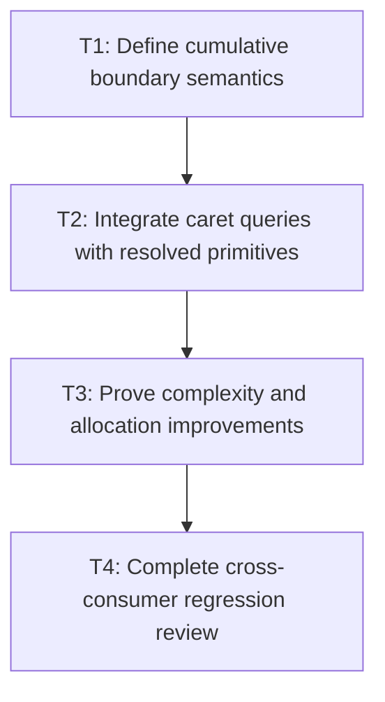

# P3: Integrate caret primitives and prove linear scaling

## Goal

Expose only the general cumulative measurement primitives needed by M4 and prove the uncached
single-pass result scales linearly while remaining behaviorally equivalent.

## Non-Goals

- Owning editable-control snapshots.
- Adding persistent glyph, resolved-sequence, or wrap caches.

## Context

- Parent milestone: `docs/work/E5/M2 - Produce resolved measurement in one linear pass.md`.
- Controls need UTF-16-safe cumulative advances, but general text measurement must remain control-neutral.

## Phase Tasks

### T1: Define cumulative boundary semantics
**Purpose:** Provide a minimal immutable primitive for prefix widths and hit testing.

**Depends on:** M2/P2/T4.
**Enables:** T2.
**Parallelizable with:** None.

**Changes:**
- [ ] Specify cumulative advances at valid UTF-16 code-point boundaries, including line starts/ends,
  fallback runs, replacement glyphs, and kerning.
- [ ] Decide whether all measurements retain advances or whether an opt-in result/query derives them
  from already resolved primitives without native remeasurement.

**Acceptance Checks:**
- [ ] Every returned index is a valid public UTF-16 boundary.
- [ ] Prefix width and nearest-caret semantics match existing `TextCaretMetrics` behavior.

**Risks:** Reject a design that imposes control-specific retained data on every unrelated measurement.

### T2: Integrate caret queries with resolved primitives
**Purpose:** Avoid substring/native remeasurement where the measured result is already available.

**Depends on:** T1.
**Enables:** T3.
**Parallelizable with:** None.

**Changes:**
- [ ] Route compatible caret/prefix queries through cumulative advances or resolved glyph advances.
- [ ] Preserve standalone `TextMeasurer` API behavior for consumers without a retained result.

**Acceptance Checks:**
- [ ] Caret positions across supplementary/fallback text match compatibility fixtures.
- [ ] Reusing a measured result performs no additional glyph resolution for prefix queries.

**Risks:** Maintain exact half-advance hit-test boundaries and rounding.

### T3: Prove complexity and allocation improvements
**Purpose:** Validate the algorithm before any cache can mask its behavior.

**Depends on:** T2.
**Enables:** T4.
**Parallelizable with:** None.

**Changes:**
- [ ] Run M1 size series with caches absent/disabled and collect lookup, run-copy, latency, and allocation evidence.
- [ ] Compare E4/M1 results only on equivalent environments with identical workload shape/counters.

**Acceptance Checks:**
- [ ] Glyph/run operations grow approximately linearly with code-point count.
- [ ] Long same-font allocation drops materially without behavioral drift.

**Risks:** Investigate counter shape before attributing a noisy timing change to the algorithm.

### T4: Complete cross-consumer regression review
**Purpose:** Confirm measurement changes are safe for inline, controls, and NanoVG rendering.

**Depends on:** T3.
**Enables:** M3/P1, M4/P1.
**Parallelizable with:** None.

**Changes:**
- [ ] Run font, inline, input/textarea, and backend suites plus structural/pixel fixtures.
- [ ] Document any compatibility decision required by later snapshot consumers.

**Acceptance Checks:**
- [ ] Ranges, fallback, replacement, wrapping, run geometry, caret behavior, and pixels remain equivalent.
- [ ] No persistent cache or mutable `ResolvedStyle` key was introduced.

**Risks:** Stop milestone completion on any surrogate split or unexplained geometry difference.

## Verification Strategy

- Run `./gradlew :spinygui.core:test --tests '*FontServiceImplTest' --tests '*Inline*' --tests '*TextInput*' --tests '*Textarea*'`.
- Run `./gradlew :spinygui.core.backend.lwjgl.nanovg:test`.
- Run `./gradlew :spinygui.benchmark:jmhCpu` locally with equivalent-environment comparisons.
- Run `./gradlew test`.

## Review Boundaries

- Review cumulative semantics/API separately from benchmark evidence and broad regression confirmation.

## Deferred Work

- Control-owned reuse belongs to M4; persistent primitive and sequence reuse belongs to M6.

## Dependency Graph

