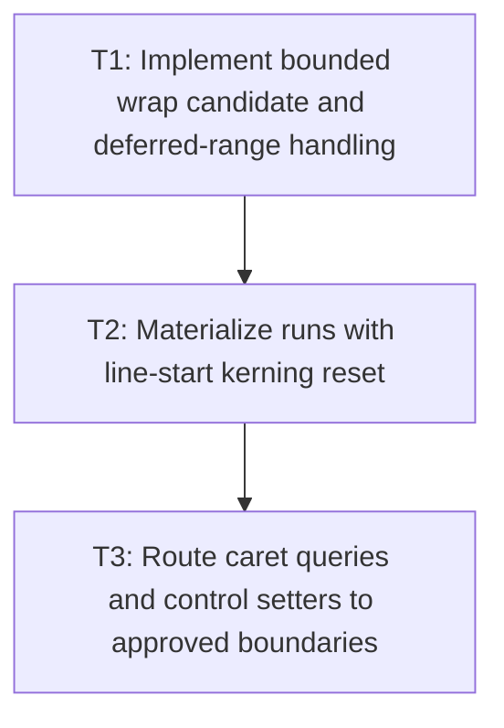

# P3: Integrate Wrapping, Line Materialization, and Caret Queries

## Goal

Use retained resolved primitives for wrapping and caret queries without rescanning/reprobing deferred
suffixes, and materialize final runs only after correct line-start kerning reset.

## Non-Goals

- Adding width-keyed/persistent caches.
- Expanding Unicode line-breaking beyond the approved M2 contract.

## Context

- Parent milestone: `docs/work/E5/M2 - Approve measurement contracts and implement linear resolution.md`.
- Phase entry gate: M2/P2 primitives/private builders are structurally correct and no incomplete
  public line/run/caret result has been published.
- Deferred suffixes and narrow widths are adversarial: implementation must not repeatedly copy/move a
  suffix or repeat native probes when choosing a wrap boundary.

## Phase Tasks

### T1: Implement bounded wrap candidate and deferred-range handling
**Purpose:** Choose line boundaries from scanned primitives with linear total replay/movement.

**Depends on:** None.
**Enables:** T2.
**Parallelizable with:** None.

**Changes:**
- [ ] Implement explicit newline and approved word/character wrap candidates as primitive indexes/
  ranges, including first-line offset, zero/narrow width, oversized first primitive, spaces, and
  trailing separators.
- [ ] Transfer/defer suffix ranges without source rescan or native glyph/advance reprobe and bound
  candidate state by the active line/result.
- [ ] Count primitive visits and glyph slots moved/copied for long suffix and one-code-point-per-line
  adversarial cases.

**Acceptance Checks:**
- [ ] Each accepted/deferred primitive is visited/moved a constant bounded number of times across the
  complete result.
- [ ] Supplementary code points and replacement source ranges cross a wrap boundary atomically.

**Risks / Stop Criteria:** Stop if resetting a line sets the source cursor backward and repeats
resolution or if suffix storage can grow/copy quadratically.

### T2: Materialize runs with line-start kerning reset
**Purpose:** Produce final line widths/run advances from width-independent primitives correctly.

**Depends on:** T1.
**Enables:** T3.
**Parallelizable with:** None.

**Changes:**
- [ ] Reset previous-glyph/pair contribution at every explicit or wrapped line start before
  accumulating final run/line advances.
- [ ] Preserve kerning within same-face runs, reset across selected face changes as approved, and keep
  source range/char-count/newline semantics from P1.
- [ ] Rebase from raw primitive base advances/pair inputs only after final wrapping, deferred-suffix
  placement, and line-start reset; then freeze and publish each public `TextLineMetrics`,
  `ResolvedTextRun`, and line-local cumulative caret-advance array exactly once using P2 builders. Do
  not create or retain a source-global cumulative array.

**Acceptance Checks:**
- [ ] Fixtures distinguish same text at source start versus wrapped line start and prove no leading
  inherited kerning.
- [ ] Fallback transitions and replacement markers have exact run x advances and source ranges.
- [ ] Fractional/rounded advances and vertical metrics follow P1's exact accumulation order before
  final line arrays/results are frozen.
- [ ] No public line/run/caret value existed at an incomplete P2 boundary or requires a second freeze
  after publication.

**Risks / Stop Criteria:** Stop if primitive base values already include inseparable prior-line
kerning or if final run values are reused across different line starts.

### T3: Route caret queries and control setters to approved boundaries
**Purpose:** Reuse cumulative boundaries/advances for caret placement and enforce one surrogate-index
policy.

**Depends on:** T2.
**Enables:** None.
**Parallelizable with:** None.

**Changes:**
- [ ] Implement caret lookup over final line-local cumulative code-point boundaries/advances with the
  approved below/exactly-at/above midpoint tie, offset, empty-line, replacement, and coordinate behavior.
- [ ] Update input/textarea setter/helper behavior to apply the P1 surrogate-interior decision
  consistently, with migration tests.
- [ ] Ensure all `TextMeasurer` caret/line/default entry points delegate without duplicate full scans
  beyond their documented call semantics.

**Acceptance Checks:**
- [ ] Caret lookup never returns the interior of a valid surrogate pair and agrees with line/run
  coordinates across fallback/replacement fixtures.
- [ ] The same raw primitive sequence wrapped at different widths produces independent rebased line
  arrays with correct first-glyph zero-kerning and midpoint behavior.
- [ ] Control setters and measurement APIs share one boundary policy; no prefix substring measure is
  required by the new primitive result.

**Risks / Stop Criteria:** Stop if caret coordinates depend on remeasuring source prefixes or if API
delegation creates hidden duplicate scans.

## Verification Strategy

- Run `./gradlew :spinygui.core:test --tests 'com.spinyowl.spinygui.core.system.font.impl.FontServiceImplTest'`.
- Run `./gradlew :spinygui.core:test --tests 'com.spinyowl.spinygui.core.system.input.TextInputBehaviorTest' --tests 'com.spinyowl.spinygui.core.system.input.TextareaBehaviorTest'`.
- Run diagnostics counter fixtures for narrow/deferred/fallback/line-start cases.

## Review Boundaries

- Review wrap candidate/movement algorithm, then line materialization/kerning, then caret/setter
  integration.

## Deferred Work

- Full compatibility/scaling proof belongs to P4.
- M5 consumes cumulative geometry; M7 may later cache width-independent primitives and wraps.

## Dependency Graph

