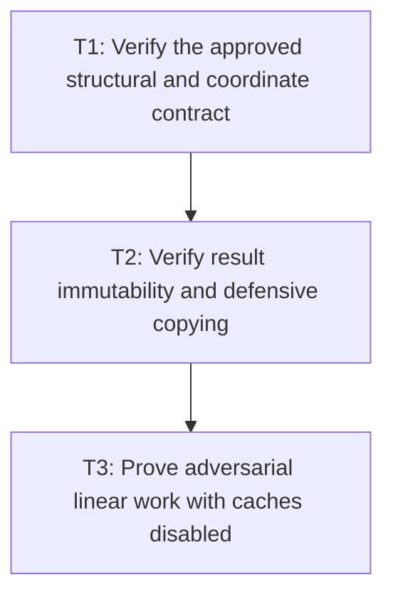

# P4: Prove Compatibility, Immutability, and Linear Scaling

**Status:** Planned

## Document Context

- **Parent:** [M2 - Approve measurement contracts and implement linear resolution](../M2%20-%20Approve%20measurement%20contracts%20and%20implement%20linear%20resolution.md)
- **Previous:** [P3 - Integrate wrapping, line materialization, and caret queries](P3%20-%20Integrate%20wrapping%20line%20materialization%20and%20caret%20queries.md)
- **Next:** [M4 - Prepare inline text with ranges and code points](../M4%20-%20Prepare%20inline%20text%20with%20ranges%20and%20code%20points.md) and [M5 - Share bounded editable-control snapshots](../M5%20-%20Share%20bounded%20editable-control%20snapshots.md)

## Goal

Prove that uncached measurement follows every approved M2 contract, exposes deep immutable results,
and scales linearly under adversarial wrapping/fallback workloads.

## Non-Goals

- Using persistent caches to make counters look linear.
- Treating local timing improvement as a substitute for structural/counter proof.

## Context

- Parent milestone: `docs/work/E5/M2 - Approve measurement contracts and implement linear resolution.md`.
- Phase entry gate: M2/P3 integration is complete.
- M1 counters distinguish logical resolutions, native probes, advances, kerning, appends/freezes, and
  copied/moved glyph slots.

## Phase Tasks

### T1: Verify the approved structural and coordinate contract
**Purpose:** Detect behavior drift separately from intentional P1 migrations.

**Depends on:** None.
**Enables:** T2.
**Parallelizable with:** None.

**Changes:**
- [ ] Assert exact text metrics, line ranges/characters/`charCount`, glyph/run ranges, selected fonts,
  replacement state, widths/advances, horizontal/vertical rounding/accumulation, vertical metrics,
  line-local cumulative caret arrays/midpoint ties, and source/local coordinates.
- [ ] Cover empty chains/text/lines, CR/LF/CRLF, zero/narrow/invalid widths selected by P1, offsets,
  trailing newlines, fallback transitions, and supplementary code points.
- [ ] Label intentional migration expectations explicitly rather than accepting arbitrary old/new
  differences.

**Acceptance Checks:**
- [ ] Every P1 decision row has at least one executable target fixture and no valid surrogate split.
- [ ] All `TextMeasurer` entry points return/delegate consistently under the approved semantics.
- [ ] Public whole-string and internal range-aware fixtures are structurally equivalent after source-
  offset translation and allocate no per-range temporary `String`.

**Risks / Stop Criteria:** Stop if a fixture is weakened to accommodate implementation drift or if a
behavior change lacks P1 approval/migration notes.

### T2: Verify result immutability and defensive copying
**Purpose:** Prove the selected public mutation contract through all nested boundaries.

**Depends on:** T1.
**Enables:** T3.
**Parallelizable with:** None.

**Changes:**
- [ ] Attempt mutation of source lists after construction and every
  returned line/run/glyph/line-local cumulative-caret/nested collection.
- [ ] Verify records/builders/accessors/equality/hash/string remain compatible as approved and no
  measurement-local builder storage escapes.
- [ ] Document observable compatibility impact where callers previously could mutate a result.

**Acceptance Checks:**
- [ ] Source-list mutation cannot alter a frozen result and returned nested collections reject or
  isolate mutation according to P1.
- [ ] No public result or nested value retains a mutable source/builder alias.

**Risks / Stop Criteria:** Do not describe a result as immutable while any nested mutable alias can
change it.

### T3: Prove adversarial linear work with caches disabled
**Purpose:** Establish the uncached complexity boundary consumed by later milestones.

**Depends on:** T2.
**Enables:** None.
**Parallelizable with:** None.

**Changes:**
- [ ] Run size-scaled long same-face, alternating fallback, missing/replacement, narrow-width,
  one-code-point-per-line, long deferred suffix, offset, and line-start kerning workloads.
- [ ] Add shared-source many-range workloads and counters for range-aware measurement calls and
  materializations, asserting zero temporary range strings.
- [ ] Assert source scans/logical resolutions/builder appends/freezes and copied/moved glyph slots are
  linear; native probes are bounded by logical resolutions times font-chain/replacement policy.
- [ ] Verify wrapping/run construction does not add native glyph probes, advance calls, or kerning
  calls for already resolved accepted ranges beyond the approved materialization model.
- [ ] Capture diagnostics-disabled local timing/allocation evidence only after deterministic counters
  pass, preserving M1 fingerprints.

**Acceptance Checks:**
- [ ] Counter ratios across scaled workloads meet explicit linear formulas/upper bounds rather than
  hardware-specific time thresholds.
- [ ] No persistent cache is enabled and local reports remain comparable to the M1 baseline.

**Risks / Stop Criteria:** Do not complete M2 while slot movement/scans are superlinear or while
cached/warmed native calls hide uncached duplicate work.

## Verification Strategy

- Run `./gradlew :spinygui.core:test --tests 'com.spinyowl.spinygui.core.system.font.impl.FontServiceImplTest'`.
- Run `./gradlew :spinygui.core:test --tests 'com.spinyowl.spinygui.core.system.input.*'`.
- Run `./gradlew :spinygui.benchmark:test`.
- Use M1 paired reporting only after deterministic proof and with diagnostics disabled.

## Review Boundaries

- Review behavior/coordinates, immutability, then counter complexity; timing/allocation evidence is a
  final supporting review.

## Deferred Work

- M4 integrates prepared ranges, M5 snapshots cumulative control geometry, and M7 adds bounded reuse.
- Shaping/bidi/grapheme/expanded line breaking remain deferred.

## Dependency Graph

