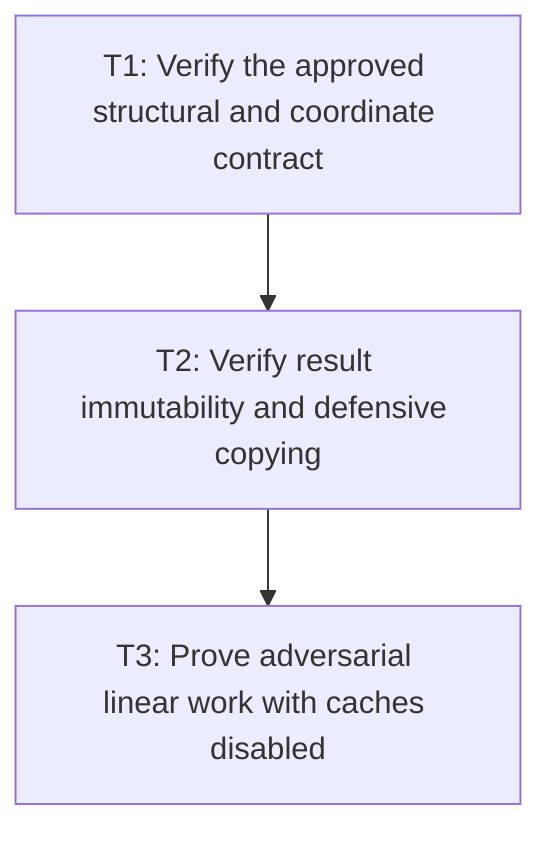

# P4: Prove Compatibility, Immutability, and Linear Scaling

**Status:** Complete

## Document Context

- **Parent:** [M2 - Approve measurement contracts and implement linear resolution](../M2%20-%20Approve%20measurement%20contracts%20and%20implement%20linear%20resolution.md)
- **Previous:** [P3 - Integrate wrapping, line materialization, and caret queries](P3%20-%20Integrate%20wrapping%20line%20materialization%20and%20caret%20queries.md)
- **Next:** [M3 - Establish font identity, generations, and lifecycle](../M3%20-%20Establish%20font%20identity%20generations%20and%20lifecycle.md); M4 and M5 remain downstream consumers after M3.

## Goal

Prove that uncached measurement follows every approved M2 contract, exposes deep immutable results,
and scales linearly under adversarial wrapping/fallback workloads.

## Non-Goals

- Using persistent caches to make counters look linear.
- Treating local timing improvement as a substitute for structural/counter proof.

## Context

- Parent milestone: `docs/work/E5/M2 - Approve measurement contracts and implement linear resolution.md`.
- Phase entry gate: M2/P3 integration is complete.
- M1 counters distinguish logical resolutions, native probes, advances, kerning, appends/freezes, and
  copied/moved glyph slots.

## Implementation Handoff

- **Contract authority:** [P1 - Approved resolved-measurement contracts](P1%20-%20Approve%20resolved-measurement%20contracts.md)
- **Implementation baseline:** Completed [P2](P2%20-%20Build%20resolved%20primitives%20and%20append-only%20builders.md) and [P3](P3%20-%20Integrate%20wrapping%20line%20materialization%20and%20caret%20queries.md)
- **Focused core evidence:** `FontServiceImplTest.java`, `FontServiceImplMeasurementContractTest.java`, `TextInputBehaviorTest.java`, and `TextareaBehaviorTest.java`
- **Diagnostics and workload evidence:** `spinygui.core/DIAGNOSTICS.md`, `TextDiagnosticCounter.java`, and benchmark diagnostic vocabulary/workload tests
- **Timed/allocation evidence:** use the supported paired `:spinygui.benchmark:benchmarkReport` boundary only after T1/T2 and deterministic T3 counters pass; do not present standalone `jmhCpu`/`jmhRendering` artifacts as the M2 baseline
- **Worktree constraint:** preserve all accepted P1-P3 changes plus unrelated `.worktrees/nested-scroll-text-rendering` state. Do not stage or commit during implementation.

## Phase Tasks

### T1: Verify the approved structural and coordinate contract
**Purpose:** Detect behavior drift separately from intentional P1 migrations.

**Depends on:** None.
**Enables:** T2.
**Parallelizable with:** None.

**Changes:**
- [x] Assert exact text metrics, line ranges/characters/`charCount`, glyph/run ranges, selected fonts,
  replacement state, widths/advances, horizontal/vertical rounding/accumulation, vertical metrics,
  line-local cumulative caret arrays/midpoint ties, and source/local coordinates.
- [x] Cover empty chains/text/lines, CR/LF/CRLF, zero/narrow/invalid widths selected by P1, offsets,
  trailing newlines, fallback transitions, and supplementary code points.
- [x] Label intentional migration expectations explicitly rather than accepting arbitrary old/new
  differences.

**Acceptance Checks:**
- [x] Every P1 decision row has at least one executable target fixture and no valid surrogate split.
- [x] All `TextMeasurer` entry points return/delegate consistently under the approved semantics.
- [x] Public whole-string and internal range-aware fixtures are structurally equivalent after source-
  offset translation and allocate no per-range temporary `String`.

**Risks / Stop Criteria:** Stop if a fixture is weakened to accommodate implementation drift or if a
behavior change lacks P1 approval/migration notes.

### T2: Verify result immutability and defensive copying
**Purpose:** Prove the selected public mutation contract through all nested boundaries.

**Depends on:** T1.
**Enables:** T3.
**Parallelizable with:** None.

**Changes:**
- [x] Attempt mutation of source lists after construction and every
  returned line/run/glyph/line-local cumulative-caret/nested collection.
- [x] Verify records/builders/accessors/equality/hash/string remain compatible as approved and no
  measurement-local builder storage escapes.
- [x] Document observable compatibility impact where callers previously could mutate a result.

**Acceptance Checks:**
- [x] Source-list mutation cannot alter a frozen result and returned nested collections reject or
  isolate mutation according to P1.
- [x] No public result or nested value retains a mutable source/builder alias.

**Compatibility impact:** Public constructors, builders, accessors, scalar types, and record
components remain unchanged. Callers that previously relied on mutating a supplied `CharSequence` or
collection—or a collection returned by a metric accessor—now observe the approved canonical snapshot;
returned collections reject mutation rather than altering an already published measurement.

**Risks / Stop Criteria:** Do not describe a result as immutable while any nested mutable alias can
change it.

### T3: Prove adversarial linear work with caches disabled
**Purpose:** Establish the uncached complexity boundary consumed by later milestones.

**Depends on:** T2.
**Enables:** None.
**Parallelizable with:** None.

**Changes:**
- [x] Run size-scaled long same-face, alternating fallback, missing/replacement, narrow-width,
  one-code-point-per-line, long deferred suffix, offset, and line-start kerning workloads.
- [x] Add shared-source many-range workloads and counters for range-aware measurement calls and
  materializations, asserting zero temporary range strings.
- [x] Assert source scans/logical resolutions/builder appends/freezes and copied/moved glyph slots are
  linear; native probes are bounded by logical resolutions times font-chain/replacement policy.
- [x] Verify wrapping/run construction does not add native glyph probes, advance calls, or kerning
  calls for already resolved accepted ranges beyond the approved materialization model.
- [x] Capture diagnostics-disabled local timing/allocation evidence only after deterministic counters
  pass, preserving M1 fingerprint rules and honest suppression of incomparable deltas.

**Acceptance Checks:**
- [x] Counter ratios across scaled workloads meet explicit linear formulas/upper bounds rather than
  hardware-specific time thresholds.
- [x] No persistent cache is enabled; the local report remains internally paired and applies M1
  comparability rules without presenting a cross-environment M1 delta.

## T3 Evidence

- `FontServiceImplLinearScalingTest` uses a fresh `FontServiceImpl`, `FontStorageImpl`, diagnostics
  session, and source fixture for every scale. Whole-string sizes `8/16/32` cover direct character
  and word wrapping, a long unbreakable word, a deferred suffix, zero-width progress, first-line
  offset, LF/CR/CRLF with supplementary code points, alternating fallback, and replacement. Exact
  assertions bind source scans and wrap visits to source code points; logical resolutions, advances,
  and initial copies to resolved glyphs; final copies and freezes to materialized glyph/run/line
  counts; movement and temporary range strings to zero; and native probes to the approved
  font-chain/replacement bound.
- Shared-source direct-capability batches use `16/32/64` disjoint `A雪` ranges. For `R` ranges they
  assert exactly `R` preparations/results/lines, `2R` scans/resolutions/advances/wrap visits/initial
  copies/final copies, `3R` native probes, zero kerning/movement/temporary strings, and exact
  append/freeze formulas for every primitive, run, line, caret, advance, and result builder.
- `2,048` x-coordinate plus `2,048` source-index queries over `1,025` final stops assert at most
  `2Q * (ceil(log2(stops)) + 1)` comparisons after diagnostics reset, while every scan, resolution,
  native call, wrap, copy/move, preparation, measurement, and temporary-string counter remains zero.
  Structural reflection additionally proves `FontServiceImpl` retains only its font-info map and no
  persistent text, range, result, collection, or array cache.
- Only after those deterministic checks passed, the supported paired
  `:spinygui.benchmark:benchmarkReport` workflow produced run `20260815-213944-045890100` with
  diagnostics-disabled timing/allocation fingerprints, a complete CPU/rendering pair, passed
  rendering structural validation (`4` scenes, `2,557` commands), and the generated
  `spinygui.benchmark/reports/index.html` plus `report-manifest.json`. These local measurements are
  supporting evidence only; no hardware-specific pass threshold or improvement claim is inferred.
- The accepted M1 baseline is run `20260812-155701-296656400`, but its ignored CPU/rendering
  artifacts are not present in this checkout. Historical JVM `25.0.1` pairs remain in the report
  archive, but none is that accepted baseline and the available toolchain/current run use JVM
  `25.0.3`. Therefore run `20260815-213944-045890100` is a complete internally paired standalone
  supporting measurement, not comparison-qualified against M1. The report correctly suppresses all
  current-run deltas as `not comparable: environment.jvm-version differs`.

Current paired CPU evidence from that run:

| Operation | Latency (us/op) | Allocation (B/op) |
| --- | ---: | ---: |
| `findCaretNearBeginning` | 770.964 | 2,081,586.753 |
| `findCaretNearEnd` | 744.615 | 2,081,586.396 |
| `layoutTextDenseInlineContent` | 310.291 | 1,133,340.352 |
| `measureLatin` | 6.107 | 17,320.085 |
| `measureLongSingleFont` | 745.929 | 2,081,562.417 |
| `measureMissingGlyphs` | 4.772 | 12,888.066 |
| `measureMixedCjk` | 7.215 | 19,144.101 |
| `measureSupplementaryUnicode` | 3.905 | 11,588.054 |
| `measureWrappedParagraph` | 36.951 | 108,368.518 |

Current paired renderer evidence from that run (all timing values are microseconds):

| Scene | Nodes / glyphs | CPU median/p95/p99 | GPU median/p95/p99 | GPU 120 Hz |
| --- | ---: | ---: | ---: | ---: |
| Small | 100 / 3,800 | 480.9 / 657.5 / 1,006.3 | 859.5 / 1,157.0 / 1,554.4 | 10.314% |
| Large | 1,000 / 38,000 | 4,647.2 / 5,270.6 / 6,018.5 | 6,466.8 / 7,211.2 / 8,230.6 | 77.602% |

## Phase Exit

P1 contract parity, deep immutable publication, deterministic uncached linear work, structural
zero-copy dispatch, and one complete standalone paired supporting report are all proved. The
deterministic counters and structural fixtures—not a timing/allocation delta—are the M2 completion
gate. P4 and M2 are complete; M4 and M5 may consume the approved range/snapshot boundaries without
introducing M7 cache behavior.

**Risks / Stop Criteria:** Do not complete M2 while slot movement/scans are superlinear or while
cached/warmed native calls hide uncached duplicate work.

## Verification Strategy

- Run `./gradlew :spinygui.core:test --tests 'com.spinyowl.spinygui.core.system.font.impl.FontServiceImplTest'`.
- Run `./gradlew :spinygui.core:test --tests 'com.spinyowl.spinygui.core.system.input.*'`.
- Run `./gradlew :spinygui.benchmark:test`.
- Use the M1 paired-reporting workflow only after deterministic proof and with diagnostics disabled;
  apply its fingerprint rules and do not claim a baseline delta when the accepted artifacts or
  matching environment are unavailable.

## Review Boundaries

- Review behavior/coordinates, immutability, then counter complexity; timing/allocation evidence is a
  final supporting review.

## Deferred Work

- M4 integrates prepared ranges, M5 snapshots cumulative control geometry, and M7 adds bounded reuse.
- Shaping/bidi/grapheme/expanded line breaking remain deferred.

## Dependency Graph

