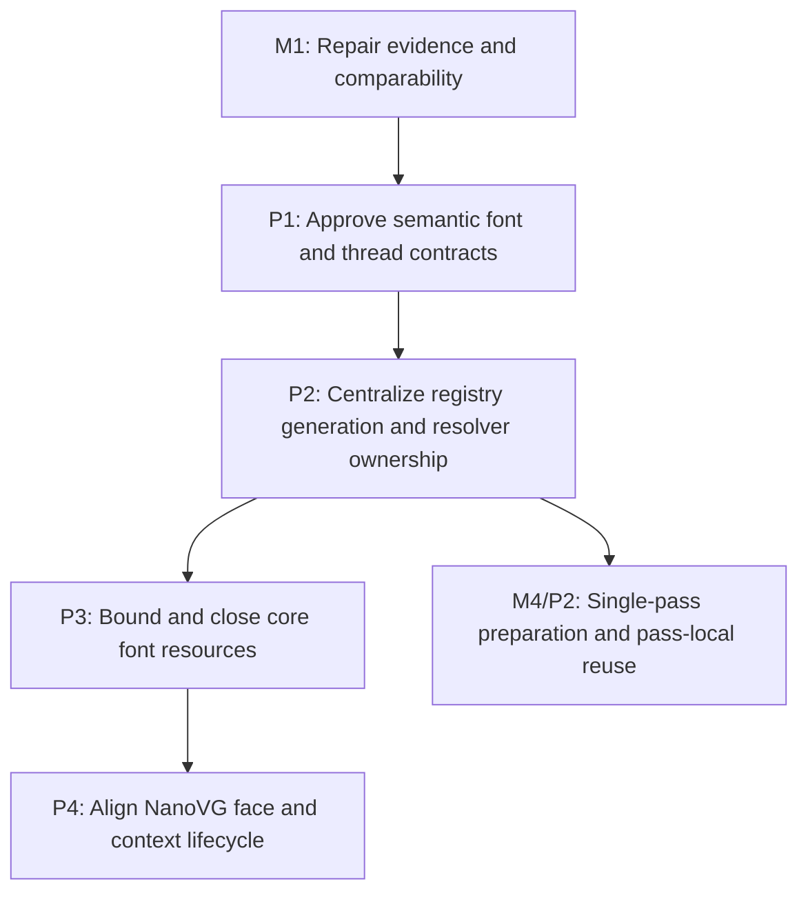

# M3: Establish Font Identity, Generations, and Lifecycle

**Status:** Planned

Parent plan: `docs/work/E5 - Text performance improvements.md`

## Goal

Provide one real core semantic font identity and monotonic generation under UI-thread confinement,
centralize resolver/registry ownership, and make core and NanoVG font/native resource teardown
deterministic before inline preparation, snapshots, rendering, or persistent caches consume font-
dependent state.

## Context

- M1 provides lifecycle diagnostics and renderer recording evidence.
- Core registry generation is semantic state; context-local NanoVG face creation is backend state and
  cannot define or advance the core generation.
- Current core and backend font maps retain bytes/STB info/faces without explicit close/clear order,
  and production call sites can bypass injected ownership through `FontChainResolver.DEFAULT`.

## Phases

### P1: Approve semantic font and thread contracts

**Document:** [P1 - Approve semantic font and thread contracts](M3/P1%20-%20Approve%20semantic%20font%20and%20thread%20contracts.md)

**Purpose:** Define semantic identity, generation transitions, UI-thread ownership, and the
core/backend boundary before registry implementation changes.

**Depends on:** M1.
**Enables:** P2.
**Parallelizable with:** None.

**Architectural Proposition:** Registry mutation, resolver use, measurement, cache access, and
rendering occur on one documented UI thread. Successful semantic changes advance a monotonic core
generation; no-op and failed mutations follow explicit non-advancing behavior.

**Key Work:**
- Define identity fields and generation behavior for successful add, replacement, byte reload/
  replacement, bootstrap registration, clear/removal if supported, duplicate/no-op, and failed
  operations, including initial value and overflow posture.
- Specify UI-thread establishment/checking, unsupported off-thread calls, and renderer/context thread
  affinity without introducing concurrent atomic snapshots.
- Separate semantic registry state from context-local face IDs/names and face-creation retries.
- Inventory every public/production mutation alias (`Font.addFont`, `SystemFontLoader`,
  `FontStorage.loadFont`, bootstrap/static registration, replacement/reload, clear/removal) for atomic
  delegation to the semantic owner or explicit rejection.

**Validation:** An approved mutation/state table and thread-use contract cover every public load,
resolve, measure, face-create, clear, close, and destroy path.

**Risks / Stop Criteria:** Stop if identity depends on a NanoVG handle or if off-thread behavior is
left accidentally concurrent rather than rejected/documented.

### P2: Centralize registry generation and resolver ownership

**Document:** [P2 - Centralize registry generation and resolver ownership](M3/P2%20-%20Centralize%20registry%20generation%20and%20resolver%20ownership.md)

**Purpose:** Implement the production semantic generation and ensure every production font-chain
resolution observes the same registry owner.

**Depends on:** P1.
**Enables:** P3, M4/P2.
**Parallelizable with:** None.

**Architectural Proposition:** One core registry/service composition owns font content, semantic
identity/generation, and the resolver. Default compatibility entry points may delegate to that owner
but cannot create bypass state invisible to snapshots/caches.

**Key Work:**
- Add the real monotonic generation and successful/no-op/failure mutation semantics selected in P1.
- Route every accepted mutation alias through the same UI-thread owner and reject unsupported direct
  storage/bootstrap/removal operations before they bypass generation.
- Inventory and replace/inject production `FontChainResolver.DEFAULT` call sites across font,
  layout, controls, debug, and renderer-facing composition.
- Expose immutable generation/identity observations required by M5/M7 without exposing mutable maps
  or backend context handles.
- Freeze the centralized resolver/UI-thread mutation contract consumed by M4/P2 pass-local inline
  preparation and chain reuse.

**Validation:** All production resolution paths share one owner; mutation tests prove the exact
generation table; M4/P2 can consume the resolver/thread contract and M5 can consume the production
generation without a fake intermediary.

**Risks / Stop Criteria:** Do not advance while a production default resolver can bypass generation
or cache ownership.

### P3: Bound and close core font resources

**Document:** [P3 - Bound and close core font resources](M3/P3%20-%20Bound%20and%20close%20core%20font%20resources.md)

**Purpose:** Define and implement ownership, natural/hard bounds, clear/close, and teardown order for
font bytes and STB font info in core.

**Depends on:** P2.
**Enables:** P4.
**Parallelizable with:** None.

**Architectural Proposition:** `FontStorage` bytes and `FontService` STB information have an explicit
owner and compatible alias/lifetime contract. Dependent info never outlives backing bytes; deterministic
release is claimed only for resources whose previously returned aliases/leases can be controlled.

**Key Work:**
- Select natural scope or hard bounds for loaded byte and STB-info maps, including replacement and
  failed-load cleanup.
- Decide raw direct-buffer compatibility/lifetime: remove the backing alias, return a read-only owned
  lease/view, make a defensive owned copy, or explicitly retain JVM-managed natural lifetime; address
  previously returned aliases before claiming release.
- Add clear/close contracts and downstream-before-upstream teardown so STB info is released before
  backing byte storage.
- Test no-op/repeated close, unsupported use after close, partial initialization failure, and
  registry replacement while preserving generation rules.

**Validation:** Retention is bounded/explainable, owner-controlled resources release once in
documented order, caller-retainable/JVM-managed aliases follow the approved compatibility lifetime,
and diagnostics expose both without extending lifetime.

**Risks / Stop Criteria:** Stop if STB info can reference released/replaced bytes or if clear/close
can silently leave a resolver observing stale identity.

### P4: Align NanoVG face and context lifecycle

**Document:** [P4 - Align NanoVG face and context lifecycle](M3/P4%20-%20Align%20NanoVG%20face%20and%20context%20lifecycle.md)

**Purpose:** Make context-local face/buffer/info ownership and renderer lifecycle follow the P1-P3
contracts without changing core generation on face creation.

**Depends on:** P3.
**Enables:** None.
**Parallelizable with:** None.

**Architectural Proposition:** A renderer/context owner retains each `freeData=false` font buffer
until NanoVG context deletion, then releases faces/info/buffers. Context replacement is either fully
supported through an explicit state transition or explicitly rejected.

**Key Work:**
- Define and implement uninitialized/initialized/destroyed renderer states, context replacement
  support or rejection, repeated destroy, use-after-destroy, and partial initialization cleanup.
- Handle face-creation failure without inventing semantic generation changes or leaking retry state.
- For same-path semantic reload with `freeData=false`, select rejection while an affected context is
  active, context rotation/recreation, or versioned retention with forced rotation at a hard bound;
  test the selected strategy and prohibit unbounded old-buffer retention.
- Delete the NanoVG context before releasing buffers/STB info/faces and align reset/teardown with
  future M6 staging ownership.
- Prove backend-local face caches observe core identity/generation changes without becoming the
  identity source.

**Validation:** Recording/lifecycle tests cover success, failure, repeat, context mismatch, and exact
delete-before-release order under UI-thread enforcement.

**Risks / Stop Criteria:** Stop if any `freeData=false` buffer can be released while its context is
alive or if renderer reinitialization behavior remains implicit.

## Milestone Validation

- `./gradlew :spinygui.core:test --tests 'com.spinyowl.spinygui.core.system.font.*'`
- `./gradlew :spinygui.core.backend.lwjgl.nanovg:test --tests 'com.spinyowl.spinygui.core.backend.renderer.lwjgl.nanovg.NvgFontRegistryTest'`
- `./gradlew :spinygui.core.backend.lwjgl.nanovg:test --tests 'com.spinyowl.spinygui.core.backend.renderer.lwjgl.nanovg.NvgRendererTransformStateTest'`
- Run `./gradlew test` after integrated teardown verification.

## Dependency Graph

