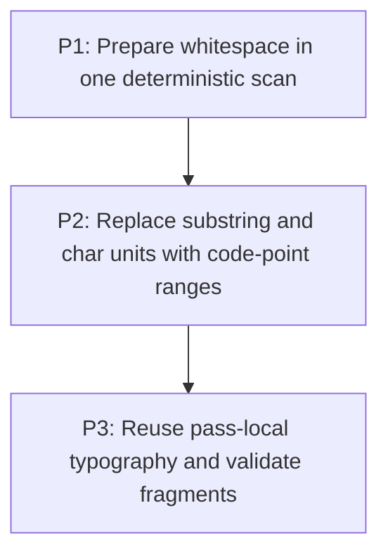

# M3: Make inline text preparation range- and code-point-based

## Goal

Prepare and lay out inline text using one normalization scan, code-point-safe ranges, and
pass-local value reuse while preserving equivalent fragments and geometry.

**Depends on:** M2.
**Enables:** M6.
**Parallelizable with:** M4, M5.

## Context

- Parent epic: `docs/work/E5 - Text performance improvements.md`.
- `InlineWhitespace` chains replacements and regex passes; `InlineFormattingContext` creates
  substrings and can split preserved text by UTF-16 `char`.
- Full shaping, bidi, grapheme handling, and persistent fragment caching remain deferred.

## Phases

### P1: Prepare whitespace in one deterministic scan
**Document:** [P1 - Prepare whitespace in one deterministic scan](M3/P1%20-%20Prepare%20whitespace%20in%20one%20deterministic%20scan.md)
**Purpose:** Replace chained normalization with an immutable prepared-text result.

**Depends on:** M2/P3.
**Enables:** P2.
**Parallelizable with:** M4/P1.

**Architectural Proposition:** Preparation records normalized text and explicit break/space metadata
in one pass while preserving current `white-space`, CR/LF, and `tab-size` behavior.

**Key Work:**
- Freeze mode-by-mode normalization compatibility.
- Implement a range-addressable prepared result without persistent node caching.

**Validation:**
- Counters show one normalization scan per prepared node in a formatting pass.
- Existing whitespace and parsed-style regressions remain equivalent.

### P2: Replace substring and char units with code-point ranges
**Document:** [P2 - Replace substring and char units with code-point ranges](M3/P2%20-%20Replace%20substring%20and%20char%20units%20with%20code-point%20ranges.md)
**Purpose:** Remove per-character strings/units and make all break paths surrogate-safe.

**Depends on:** P1.
**Enables:** P3.
**Parallelizable with:** M4/P1.

**Architectural Proposition:** Inline units reference prepared ranges plus compact newline, space,
spacer, and inline-block variants; durable fragment strings materialize only at output boundaries.

**Key Work:**
- Traverse and split ranges by code point for preserve-space, break-all, and overflow-wrap paths.
- Preserve line-edge trimming, ownership, baselines, unions, and wrap modes.

**Validation:**
- No valid surrogate pair is split and break-heavy cases avoid one object per UTF-16 code unit.
- Fragment text, order, ranges, and geometry match compatibility fixtures.

### P3: Reuse pass-local typography and validate fragments
**Document:** [P3 - Reuse pass-local typography and validate fragments](M3/P3%20-%20Reuse%20pass-local%20typography%20and%20validate%20fragments.md)
**Purpose:** Eliminate repeated compatible font-chain and measurement setup within one layout pass.

**Depends on:** P2.
**Enables:** M6/P1.
**Parallelizable with:** M4/P1, M5/P1.

**Architectural Proposition:** Pass-local keys use immutable typography values, never mutable
`ResolvedStyle` identity, and cannot outlive the formatting pass.

**Key Work:**
- Reuse font chains, font size, line height, and equivalent range measurements by value.
- Validate inline elements, fallback runs, alignment, and text-dense allocation/counters.

**Validation:**
- Compatible values resolve once per pass and incompatible values remain separated.
- Equivalent-environment benchmarks preserve workload shape and show lower transient allocation.

## Risks and Stop Criteria

- Stop if a range representation loses a mapping required for current fragment ownership or UTF-16
  output indices.
- Do not retain prepared text or fragments across passes; M6 and M7 own those later decisions.

## Dependency Graph

