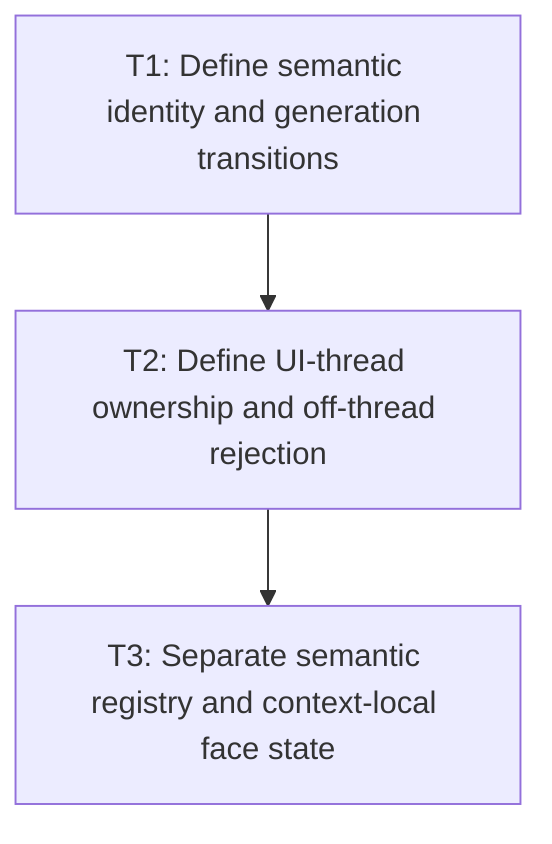

# P1: Approve Semantic Font and Thread Contracts

## Goal

Approve one core semantic font identity/generation model, exact mutation transitions, UI-thread
confinement, and separation from context-local NanoVG faces before changing ownership.

## Non-Goals

- Implementing concurrent atomic registry snapshots.
- Treating NanoVG face IDs/names as semantic core font identity.

## Context

- Parent milestone: `docs/work/E5/M3 - Establish font identity generations and lifecycle.md`.
- Phase entry gate: M1 evidence/counters are accepted.
- M5 and M7 require a production generation whose semantics cover actual font byte and registry
  mutation, not a temporary cache version.

## Phase Tasks

### T1: Define semantic identity and generation transitions
**Purpose:** Give every font-dependent value one stable invalidation input.

**Depends on:** None.
**Enables:** T2.
**Parallelizable with:** None.

**Changes:**
- [ ] Define semantic font identity fields independently of object/map/context identity, including
  family/style/weight/stretch/path/resource revision distinctions required by replacement/reload.
- [ ] Define initial monotonic generation, observation semantics, overflow posture, and exact behavior
  for bootstrap/static registration, successful add, same-key replacement, changed-byte reload/
  replacement, clear/removal if supported, duplicate/no-op, and failed load/parse/registration.
- [ ] Define whether one mutation advances once globally and how compound operations avoid exposing
  content under an old generation.
- [ ] Inventory `Font.addFont`, `SystemFontLoader`, `FontStorage.loadFont`, `FontService.loadFont`,
  built-in/static bootstrap, replacement/reload, and clear/removal aliases; require atomic UI-thread
  delegation to the semantic owner or explicit unsupported rejection.

**Acceptance Checks:**
- [ ] A state table identifies content/identity outcome, generation delta, retained old resources,
  and error outcome for every operation.
- [ ] The table includes bootstrap order/repeat behavior, clear/removal, every public alias, duplicate/
  no-op, and each partial/failure point in compound system-font loading.
- [ ] No successful semantic byte/content change can remain visible under the prior generation; no-
  op/failed behavior is explicit and testable.

**Risks / Stop Criteria:** Stop if identity can alias two different byte resources, if failure can
partially change content without a generation transition, or if any public mutation alias bypasses
the table/owner.

### T2: Define UI-thread ownership and off-thread rejection
**Purpose:** Replace accidental concurrent-map semantics with one supported execution model.

**Depends on:** T1.
**Enables:** T3.
**Parallelizable with:** None.

**Changes:**
- [ ] Define how the owner UI thread is established and checked for registry mutation, resolver use,
  measurement, future cache access, renderer face creation, and teardown.
- [ ] Define bootstrap behavior before/while the UI-thread owner is established and prohibit public
  aliases from mutating a separate static registry after ownership begins.
- [ ] Specify deterministic unsupported off-thread behavior and documentation for callers; define
  bootstrap/shutdown exceptions only if necessary and bounded.
- [ ] Define non-reentrant mutation expectations during a measurement/layout/render pass so immutable
  generation/chain values remain coherent for the pass.

**Acceptance Checks:**
- [ ] Contract fixtures cover supported owner-thread calls and rejected off-thread mutation/read/use.
- [ ] No requirement introduces locks/atomic registry snapshots or promises cross-thread visibility.

**Risks / Stop Criteria:** Stop if concurrent maps remain as an implied promise or if owner-thread
checks can silently migrate between threads.

### T3: Separate semantic registry and context-local face state
**Purpose:** Prevent backend face creation/retry/context transitions from corrupting core identity.

**Depends on:** T2.
**Enables:** None.
**Parallelizable with:** None.

**Changes:**
- [ ] Define core registry/resolver/generation responsibilities versus per-NanoVG-context face name/
  ID, copied/duplicated buffer view, STB info, and failure/retry state.
- [ ] Define how a backend observes a new semantic identity/generation and retires/recreates context-
  local faces without advancing core generation on face creation.
- [ ] Record allowed context replacement/reinitialization options to be selected/implemented in P4.

**Acceptance Checks:**
- [ ] Face creation success/failure/retry has no core generation effect; semantic registry mutation
  has a defined backend invalidation effect.
- [ ] M5/M7 can depend only on core identity/generation and remain backend-neutral.

**Risks / Stop Criteria:** Reject any design that stores context handles in core cache/snapshot keys
or uses face-creation count as semantic versioning.

## Verification Strategy

- Run `./gradlew :spinygui.core:test --tests 'com.spinyowl.spinygui.core.system.font.FontChainResolverTest' --tests 'com.spinyowl.spinygui.core.system.font.impl.FontServiceImplTest'`.
- Run `./gradlew :spinygui.core.backend.lwjgl.nanovg:test --tests 'com.spinyowl.spinygui.core.backend.renderer.lwjgl.nanovg.NvgFontRegistryTest'`.
- Review transition/thread tables; do not implement registry/resource changes yet.

## Review Boundaries

- Approve identity/generation, then thread model, then core/backend split.

## Deferred Work

- Production owner/resolver implementation belongs to P2; resource closure belongs to P3/P4.
- Concurrent registry snapshots remain outside E5.

## Dependency Graph

