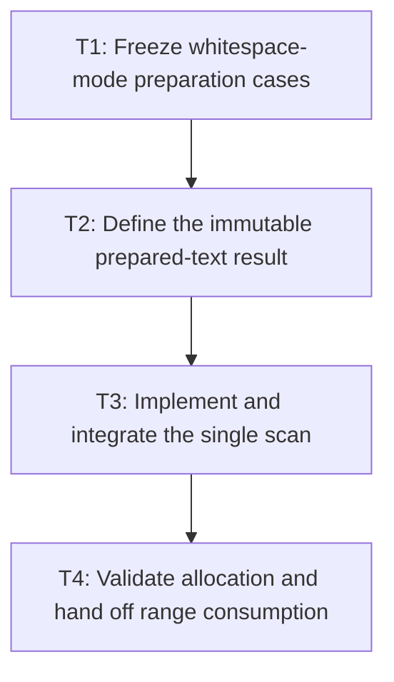

# P1: Prepare whitespace in one deterministic scan

## Goal

Replace chained string replacement and regex normalization with one deterministic, range-addressable
prepared-text scan that preserves current whitespace behavior.

## Non-Goals

- Unicode line-breaking, grapheme segmentation, shaping, or bidi.
- Retaining prepared text across layout passes.

## Context

- Parent milestone: `docs/work/E5/M3 - Make inline text preparation range- and code-point-based.md`.
- `InlineWhitespace.normalize` currently normalizes CR/LF, expands tabs, and applies mode-specific regex passes.

## Phase Tasks

### T1: Freeze whitespace-mode preparation cases
**Purpose:** Define exact compatibility for the one-scan implementation.

**Depends on:** M2/P3/T4.
**Enables:** T2.
**Parallelizable with:** None.

**Changes:**
- [ ] Cover CRLF/CR, tabs, form feed/vertical tab, repeated spaces/newlines, empty text, and supplementary characters.
- [ ] Assert `normal`, `nowrap`, `pre`, `pre-wrap`, and `pre-line` outputs with current `tab-size` defaults/bounds.

**Acceptance Checks:**
- [ ] Mode fixtures match current normalized text and line-break semantics exactly.
- [ ] Code-point content outside whitespace transformations remains unchanged.

**Risks:** Java regex `\s` behavior is part of current compatibility; enumerate it before replacement.

### T2: Define the immutable prepared-text result
**Purpose:** Represent normalized content and break/space metadata without premature fragments.

**Depends on:** T1.
**Enables:** T3.
**Parallelizable with:** None.

**Changes:**
- [ ] Define prepared text plus range metadata for explicit breaks, collapsible spaces, preserved spaces, and tab expansion.
- [ ] Preserve mappings needed for node ownership and UTF-16-safe traversal without promising original-source indices not currently exposed.

**Acceptance Checks:**
- [ ] Consumers can traverse normalized ranges without substring creation.
- [ ] The result is immutable and pass-local at this milestone.

**Risks:** Do not over-design a shaping/token model for deferred functionality.

### T3: Implement and integrate the single scan
**Purpose:** Produce the prepared result with one traversal and no regex pipeline.

**Depends on:** T2.
**Enables:** T4.
**Parallelizable with:** None.

**Changes:**
- [ ] Replace chained normalization with one deterministic scan and bounded builder allocation.
- [ ] Adapt initial inline preparation to consume the result without changing line construction yet.

**Acceptance Checks:**
- [ ] M1 counters report one preparation scan per text node per pass.
- [ ] Whitespace and parsed-style layout tests remain equivalent.

**Risks:** Avoid retaining both multiple full normalized copies and the original through unnecessary wrappers.

### T4: Validate allocation and hand off range consumption
**Purpose:** Prove preparation is ready for code-point range units.

**Depends on:** T3.
**Enables:** M3/P2.
**Parallelizable with:** None.

**Changes:**
- [ ] Measure preparation allocation/scan counts on text-dense and preserved-space workloads.
- [ ] Document range iteration and special metadata assumptions consumed by P2.

**Acceptance Checks:**
- [ ] Workload shape/counters are unchanged except for the intended scan/allocation reduction.
- [ ] No prepared result survives the formatting pass.

**Risks:** Local timing comparisons require equivalent environments and are informational.

## Verification Strategy

- Run `./gradlew :spinygui.core:test --tests '*InlineWhitespaceTest' --tests '*ParsedInlineWhitespaceLayoutTest' --tests '*InlineFormattingContextTest'`.
- Run `./gradlew :spinygui.benchmark:jmhCpu` locally with equivalent workload shape/counters.

## Review Boundaries

- Review compatibility fixtures, prepared-result contract, and scanner integration separately.

## Deferred Work

- Persistent prepared-node reuse belongs to M6; full fragment reuse remains deferred beyond M7.

## Dependency Graph

