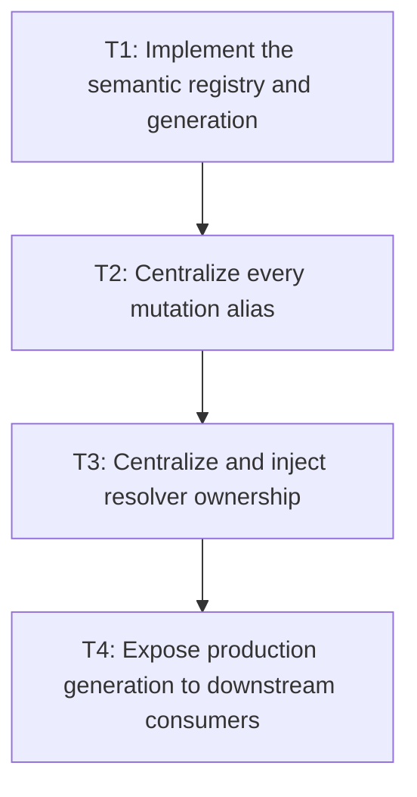

# P2: Centralize Registry Generation and Resolver Ownership

## Goal

Implement the real core semantic generation and route every production/public mutation and font-chain
resolution through one injected/central owner so M4 inline passes, snapshots, and caches cannot be
bypassed.

## Non-Goals

- Closing native/core/backend resources; P3/P4 own lifecycle completion.
- Adding M7 caches or a concurrent registry.

## Context

- Parent milestone: `docs/work/E5/M3 - Establish font identity generations and lifecycle.md`.
- Phase entry gate: M3/P1 identity/thread/core-backend contracts are approved.
- Production `FontChainResolver.DEFAULT` uses currently appear in font service, inline/block/text
  layout, control behavior/metrics, input/debug rendering helpers, and other composition paths.
- Mutation bypasses currently include static `Font.addFont`, built-in bootstrap, `SystemFontLoader`,
  direct `FontStorage.loadFont`, and compound storage/service/registry calls.

## Phase Tasks

### T1: Implement the semantic registry and generation
**Purpose:** Make P1's mutation state table executable in one core owner.

**Depends on:** None.
**Enables:** T2.
**Parallelizable with:** None.

**Changes:**
- [ ] Introduce the semantic registry/owner API that exposes immutable identity and current generation
  observations and performs UI-thread checks.
- [ ] Implement bootstrap, successful add/replace/changed-byte reload, clear/removal if supported,
  duplicate/no-op, and failed mutation transitions exactly once per semantic operation.
- [ ] Ensure content/resource replacement is not published under an old generation and exceptions do
  not leave partial registry state.

**Acceptance Checks:**
- [ ] Mutation table tests assert exact generation values/content visibility for success, no-op,
  bootstrap/repeat bootstrap, byte change, clear/removal, parse/load failure, and duplicate cases.
- [ ] The generation is monotonic, production-owned, and independent of NanoVG context/face state.

**Risks / Stop Criteria:** Stop if generation increment and content publication can be observed in
different orders on the owner thread or if failed mutation changes resolver output.

### T2: Centralize every mutation alias
**Purpose:** Prevent public/static/storage/bootstrap paths from mutating semantic font content outside
the owner or generation transaction.

**Depends on:** T1.
**Enables:** T3.
**Parallelizable with:** None.

**Changes:**
- [ ] Route `Font.addFont`, built-in/static bootstrap registration, `SystemFontLoader`,
  `FontStorage.loadFont`, `FontService.loadFont`, replacement/reload, and supported clear/removal
  through one owner transaction on the UI thread.
- [ ] For aliases that cannot preserve atomic identity/content/generation semantics compatibly,
  explicitly reject/deprecate them or make them delegate without exposing intermediate storage state.
- [ ] Make compound system-font loading publish each approved atomic unit exactly once and clean up
  storage/service partial failures before registry publication.

**Acceptance Checks:**
- [ ] Alias-by-alias tests prove identical generation/content outcomes for bootstrap, success,
  replacement/reload, clear/removal, duplicate/no-op, and failure; unsupported aliases fail before
  mutation.
- [ ] Source search and mutation diagnostics find no production/public mutation path to a separate
  static map or direct storage publication.

**Risks / Stop Criteria:** Stop if an alias can mutate bytes/registry before the owner transaction or
if bootstrap creates a second post-start registry.

### T3: Centralize and inject resolver ownership
**Purpose:** Eliminate production bypasses through independent/default resolver state.

**Depends on:** T2.
**Enables:** T4.
**Parallelizable with:** None.

**Changes:**
- [ ] Inventory every production `FontChainResolver.DEFAULT` call site and classify constructor/API
  compatibility requirements.
- [ ] Inject or delegate all font service, text/block/inline layout, control metrics/viewport/caret,
  debug, and renderer-facing composition through the registry-owned resolver.
- [ ] Retain a compatibility default only if it delegates to the same owner and cannot establish
  separate generation/cache state; document explicit composition for hosts/tests.

**Acceptance Checks:**
- [ ] Source search finds no production call site that can resolve outside the selected owner; tests
  may use isolated resolvers deliberately.
- [ ] A registry mutation changes resolver results/generation consistently for every layout/control/
  renderer consumer under the UI-thread contract.

**Risks / Stop Criteria:** Do not retain a convenience constructor/default that silently creates an
untracked owner.

### T4: Expose production generation to downstream consumers
**Purpose:** Provide the stable backend-neutral observation/ownership required by M4/M5/M7 and
lifecycle users.

**Depends on:** T3.
**Enables:** None.
**Parallelizable with:** None.

**Changes:**
- [ ] Add immutable identity/generation observation to the shared core service/composition surface
  without exposing mutable maps or native resources.
- [ ] Wire measurement/resolution diagnostics to report observed generation/identity consistently.
- [ ] Add integration fixtures proving a snapshot/cache-style key can detect semantic change and
  remains valid across no-op/failed mutations.

**Acceptance Checks:**
- [ ] M4/P2 can consume the centralized resolver/UI-thread contract and M5 can consume the real
  production generation with no test-only/fake production bridge.
- [ ] Core downstream APIs remain independent of NanoVG and reject unsupported off-thread use.

**Risks / Stop Criteria:** Stop if downstream code must inspect font bytes/map identity or backend
faces to determine validity.

## Verification Strategy

- Run `./gradlew :spinygui.core:test --tests 'com.spinyowl.spinygui.core.system.font.FontChainResolverTest' --tests 'com.spinyowl.spinygui.core.system.font.impl.FontServiceImplTest'`.
- Run `./gradlew :spinygui.core:test --tests 'com.spinyowl.spinygui.core.layout.impl.InlineFormattingContextTest' --tests 'com.spinyowl.spinygui.core.system.input.*'`.
- Run `./gradlew :spinygui.core.backend.lwjgl.nanovg:test` after composition updates.

## Review Boundaries

- Review registry/generation, mutation-alias migration, resolver migration, then downstream
  observation as separate boundaries.

## Deferred Work

- Core storage/STB close/bounds belong to P3; backend context/face lifecycle belongs to P4.
- M4/P2 consumes this phase's centralized resolver/UI-thread mutation contract.
- Cache families belong to M7.

## Dependency Graph

