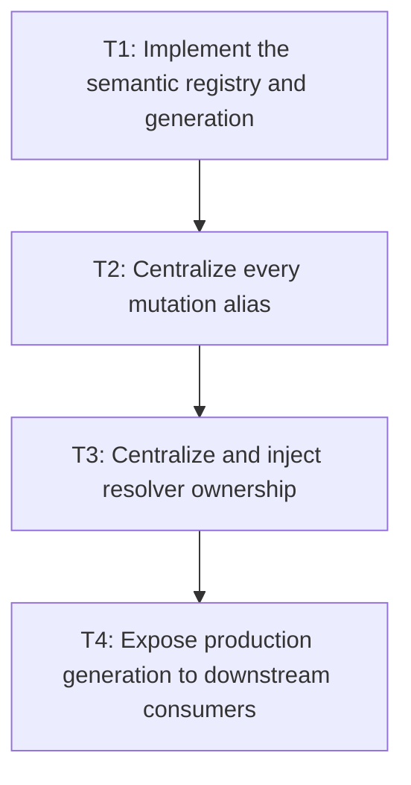

# P2: Centralize Registry Generation and Resolver Ownership

**Status:** Complete

## Document Context

- Parent: [M3 - Establish font identity generations and lifecycle](../M3%20-%20Establish%20font%20identity%20generations%20and%20lifecycle.md)
- Prerequisite: [P1 - Approve semantic font and thread contracts](P1%20-%20Approve%20semantic%20font%20and%20thread%20contracts.md)
- Next: [P3 - Bound and close core font resources](P3%20-%20Bound%20and%20close%20core%20font%20resources.md)

## Goal

Implement the real core semantic generation and route every production/public mutation and font-chain
resolution through one injected/central owner so M4 inline passes, snapshots, and caches cannot be
bypassed.

## Non-Goals

- Closing native/core/backend resources; P3/P4 own lifecycle completion.
- Adding M7 caches or a concurrent registry.

## Context

- Parent milestone: `docs/work/E5/M3 - Establish font identity generations and lifecycle.md`.
- Phase entry gate: M3/P1 identity/thread/core-backend contracts are approved.
- The pre-T3 production `FontChainResolver.DEFAULT` inventory covered font-service constructors,
  inline/block/text layout, control behavior/metrics, input/debug rendering helpers, benchmark
  specifications, and composition paths.
- Mutation bypasses currently include static `Font.addFont`, built-in bootstrap, `SystemFontLoader`,
  direct `FontStorage.loadFont`, and compound storage/service/registry calls.

## Phase Tasks

### T1: Implement the semantic registry and generation
**Purpose:** Make P1's mutation state table executable in one core owner.

**Depends on:** None.
**Enables:** T2.
**Parallelizable with:** None.

**Changes:**
- [x] Introduce the semantic registry/owner API that exposes immutable identity and current generation
  observations and performs UI-thread checks.
- [x] Implement bootstrap, successful add/replace/changed-byte reload, clear/removal if supported,
  duplicate/no-op, and failed mutation transitions exactly once per semantic operation.
- [x] Ensure content/resource replacement is not published under an old generation and exceptions do
  not leave partial registry state.

**Acceptance Checks:**
- [x] Mutation table tests assert exact generation values/content visibility for success, no-op,
  bootstrap/repeat bootstrap, byte change, clear/removal, parse/load failure, and duplicate cases.
- [x] The generation is monotonic, production-owned, and independent of NanoVG context/face state.

**T1 evidence:** `SemanticFontOwner` is an explicit, initially uninstalled owner whose successful
installation binds `Thread.currentThread()` and publishes its prepared built-ins through one
immutable `Snapshot` containing generation and ordered identities. Face keys normalize family,
style, weight, and stretch case-insensitively; identities add a normalized locator and SHA-256
revision derived from loaded bytes only after parse and validation succeed. Add, replacement,
changed-byte reload, non-empty clear, and each changed system-font transaction advance exactly once;
exact duplicates, unchanged reload, repeated bootstrap, and empty clear do not advance. Load, parse,
validation, overflow, and unsupported removal reject without replacing the snapshot. Immutable
observations, exact-thread checks, nested read/use scopes, mutation exclusion, and the post-resource-
teardown closed guard are active; resource release remains P3. A mutation-in-progress guard is set
before load, parse, or validation and released in `finally`; callback reentrancy and read/use-scope
entry reject without partial publication, while ordinary Windows and file locators containing spaces
normalize to their `%20` URI form.

Seventeen P1 migration targets owned by T1 are active, covering identity/generation transitions,
atomic failure and overflow, per-face system-font transactions, installation, exact/off-thread use,
non-migrating ownership, and nested scope rules. Seven direct production-owner tests cover immutable
observations, the closed-state integration guard, atomic failed-install retry, reentrant single/batch/
system-font mutation rejection and recovery, callback read/use exclusion, and locator normalization.
The P3 close/resource-teardown target remains disabled, as do backend P4 targets. At the T1 review
boundary the focused contract class discovered 32 tests (31 active, one P3 target disabled), and the
full core suite discovered 557 tests with one disabled and no failures. T2 subsequently migrated the
production mutation aliases described below without changing the accepted T1 semantics.

**Risks / Stop Criteria:** Stop if generation increment and content publication can be observed in
different orders on the owner thread or if failed mutation changes resolver output.

### T2: Centralize every mutation alias
**Purpose:** Prevent public/static/storage/bootstrap paths from mutating semantic font content outside
the owner or generation transaction.

**Depends on:** T1.
**Enables:** T3.
**Parallelizable with:** None.

**Changes:**
- [x] Route `Font.addFont`, built-in/static bootstrap registration, `SystemFontLoader`,
  `FontStorage.loadFont`, `FontService.loadFont`, replacement/reload, and supported clear/removal
  through one owner transaction on the UI thread.
- [x] For aliases that cannot preserve atomic identity/content/generation semantics compatibly,
  explicitly reject/deprecate them or make them delegate without exposing intermediate storage state.
- [x] Make compound system-font loading publish each approved atomic unit exactly once and clean up
  storage/service partial failures before registry publication.

**Acceptance Checks:**
- [x] Alias-by-alias tests prove identical generation/content outcomes for bootstrap, success,
  replacement/reload, clear/removal, duplicate/no-op, and failure; unsupported aliases fail before
  mutation.
- [x] Source search and mutation diagnostics find no production/public mutation path to a separate
  static map or direct storage publication.

**T2 evidence:** `Font` built-ins are immutable descriptors and no longer mutate state during class
initialization. `FontService.installSemanticOwner()` is the explicit production composition
boundary: it stages and validates all built-ins, atomically bootstraps or joins the one installed
owner on the current UI thread, and only then commits service/storage compatibility caches.
`FontService.loadFont` stages bytes, STB metadata, and the descriptor inside that owner's load
transaction; success and changed-byte reload publish once, an exact duplicate is a no-op, and load,
container-header, parse, or publication rejection leaves all layers unchanged. Committed storage
buffers are exposed only as read-only views. The public canonical descriptor preserves the first
successfully loaded locator spelling so direct path consumers remain loadable; only semantic
identity and storage/font-info cache keys use the normalized URI spelling. Equivalent backslash,
slash, space, encoded-space, and dot-segment aliases return that exact registered descriptor without
a generation, registry, or cache-cardinality change. `SystemFontLoader` invokes the service exactly
once per discovered face, records only successful publications, and continues after an isolated
failure.

Aliases that cannot preserve the transaction are explicit compatibility failures: descriptor-only
`Font.addFont` and direct `FontStorage.loadFont` are deprecated for removal and reject before
mutation. `Font.clear` delegates to the semantic owner (`+1` for non-empty, `+0` when repeated),
while arbitrary face removal remains unsupported. Production `Font.fonts`/`find`/`hasFont` queries
observe the installed owner and enforce its exact-thread contract. General resolver call-site
injection remains T3; the retained compatibility resolver observes these same `Font` owner queries
and cannot establish another registry. `FontService.installSemanticOwner` requires the production
staged `FontStorageImpl`; a custom storage throws `IllegalStateException` before installing a global
owner or publishing storage, service-cache, or registry state, as documented by the public API.

Eleven active T2 alias fixtures cover explicit bootstrap, rejected legacy aliases, service success/
duplicate/reload/failure, read-only storage publication, supported clear, pre-install and off-thread
rejection, normalized-locator canonical return/cache behavior, custom-storage pre-install rejection,
mocked and real compound system-font isolation, and backend-neutral immutable descriptors. Together
with the T1/P1 targets, the focused semantic contract discovers 36 tests (35 active, one P3 target
disabled); the focused owner/resolver/service selection discovers 71 tests (70 active), and the full
core suite discovers 561 tests with one disabled and no failures. The NanoVG backend suite
discovers 84 tests with 10 P4 targets disabled and no failures when the known unrelated JaCoCo report
output issue is excluded; its contract selection discovers 13 tests, three active and 10 disabled,
including an active real-font loadability seam for a preserved path containing spaces.
Affected demo and benchmark tests also pass. Source inspection finds no `Font` static registry, no
production call to `Font.addFont`, and no direct production storage publication outside the
owner-authorized commit seam.

**Risks / Stop Criteria:** Stop if an alias can mutate bytes/registry before the owner transaction or
if bootstrap creates a second post-start registry.

### T3: Centralize and inject resolver ownership
**Purpose:** Eliminate production bypasses through independent/default resolver state.

**Depends on:** T2.
**Enables:** T4.
**Parallelizable with:** None.

**Changes:**
- [x] Inventory every production `FontChainResolver.DEFAULT` call site and classify constructor/API
  compatibility requirements.
- [x] Inject or delegate all font service, text/block/inline layout, control metrics/viewport/caret,
  debug, and renderer-facing composition through the registry-owned resolver.
- [x] Retain a compatibility default only if it delegates to the same owner and cannot establish
  separate generation/cache state; document explicit composition for hosts/tests.

**Acceptance Checks:**
- [x] Source search finds no production call site that can resolve outside the selected owner; tests
  may use isolated resolvers deliberately.
- [x] A registry mutation changes resolver results/generation consistently for every layout/control/
  renderer consumer under the UI-thread contract.

**T3 evidence:** `SemanticFontOwner` now constructs exactly one `SemanticFontChainResolver` and
returns it only after active owner-thread verification. The resolver reads one immutable owner
snapshot and preserves the approved CSS-family order and deterministic exact/nearest face ordering.
`FontService.fontChainResolver()` exposes that installed owner resolver to `TextLayoutImpl`; block
and inline layout, input/textarea metrics, caret and viewport behavior, NanoVG input/debug helpers,
and benchmark text specifications delegate directly to the same installed owner. Production
benchmark composition now uses the resolver-free diagnostic service constructor. The retained
`FontChainResolver.DEFAULT` creates no owner, thread, registry, generation, or cache state during
static initialization and delegates each call to the installed owner's resolver.

Benchmark workload specifications declare their exact expected resolved faces as immutable input
metadata, so rendering/report class initialization and CPU outer-process report enrichment do not
require a process owner. Rendering and CPU execution composition explicitly install the service
owner and fail closed if its resolver result differs from that declaration. Three fresh-JVM fixtures
prove rendering-main argument-safe startup, HTML report-generator static access, and CPU report
enrichment all complete without a test-global owner or hidden owner installation; the rendering
probe also exercises the current scene identity and input manifests without running timed frames.

The legacy `FontServiceImpl` constructors that accept a resolver remain source-compatible but are
deprecated: they validate and discard the argument because production resolver selection belongs to
the installed semantic owner. An active compatibility fixture proves that such a constructor cannot
install or return an independent resolver. Explicit resolver instances remain available to isolated
tests without becoming production service state. Source proof scans every production Java source
outside nested worktrees and permits no `FontChainResolver.DEFAULT` access; bytecode proof rejects a
`GETSTATIC FontChainResolver.DEFAULT` instruction in every core layout/control/service consumer,
both NanoVG helper consumers, and every formerly affected benchmark composition class.

Six active core T3 fixtures cover owner/service/default identity and delegation, legacy-constructor
isolation, text-layout and textarea mutation observation, and source/bytecode ownership. Two active
NanoVG fixtures cover input/debug mutation observation and backend bytecode ownership; one benchmark
fixture covers its composition bytecode. The focused selection discovers 13 core tests and two
backend tests, all active and passing. The full core suite
discovers 567 tests (566 active, one P3 target disabled); the full NanoVG suite discovers 86 tests
(76 active, 10 P4 targets disabled). Benchmark regression discovers 116 active tests, complex-demo
regression discovers four active tests, and the simple demo has no tests; all pass. Javadocs pass
with the repository's pre-existing warning backlog. The known unrelated JaCoCo report-generation
failure remains excluded from core/backend test verification.

**Risks / Stop Criteria:** Do not retain a convenience constructor/default that silently creates an
untracked owner.

### T4: Expose production generation to downstream consumers
**Purpose:** Provide the stable backend-neutral observation/ownership required by M4/M5/M7 and
lifecycle users.

**Depends on:** T3.
**Enables:** None.
**Parallelizable with:** None.

**Changes:**
- [x] Add immutable identity/generation observation to the shared core service/composition surface
  without exposing mutable maps or native resources.
- [x] Wire measurement/resolution diagnostics to report observed generation/identity consistently
  when the approved vocabulary requires it; the current counter-only vocabulary requires no new
  identity/generation field.
- [x] Add integration fixtures proving a snapshot/cache-style key can detect semantic change and
  remains valid across no-op/failed mutations.

**Acceptance Checks:**
- [x] M4/P2 can consume the centralized resolver/UI-thread contract and M5 can consume the real
  production generation with no test-only/fake production bridge.
- [x] Core downstream APIs remain independent of NanoVG and reject unsupported off-thread use.

**T4 evidence:** `FontService.semanticObservation()` exposes one immutable, backend-neutral
`FontSemanticObservation` containing the real monotonic generation and an ordered immutable list of
normalized family/style/weight/stretch, normalized locator, and SHA-256 revision identities. The
public type contains no mutable map, raw buffer, STB information, semantic-owner type, NanoVG handle,
face name, or context state. `FontServiceImpl` obtains the observation from its installed production
owner and therefore preserves the same pre-install, exact owner-thread, off-thread, and closed-state
guards as resolution and measurement. The interface method is a source/binary-compatible default
for legacy implementations, which explicitly rejects unsupported observation; the production
implementation overrides it.

Two active integration fixtures consume only the public `FontService` surface. They prove the
observation is immutable and structurally renderer-neutral, rejects pre-install and off-thread use,
changes a snapshot/cache-style key on one successful real service publication, and remains exactly
equal after an exact duplicate/no-op, missing-resource load failure, invalid-header validation
failure, and supported-header parse failure. The same fixture consumes the installed resolver and
the observation generation directly, providing the production seams required by M4/P2 and M5
without a fake counter or test-only bridge. The approved `TextDiagnosticCounter` vocabulary contains
operation counters only and defines no identity/generation gauge or metadata field, so T4 does not
invent a cumulative generation counter; measurement and resolution diagnostics can capture the
service observation beside their existing counter snapshot when their later artifact contract asks
for it.

The focused semantic contract discovers 38 tests (37 active, one P3 teardown target disabled). The
full core suite discovers 569 tests (568 active, one P3 target disabled), the NanoVG suite discovers
86 tests (76 active, 10 P4 targets disabled), the benchmark suite discovers 116 active tests, and
the complex demo discovers four active tests; the simple demo has no tests. All pass. Core, NanoVG,
benchmark, and demo Javadocs pass with the repository's pre-existing warning backlog. The known
unrelated JaCoCo report-generation failure remains excluded from core verification.

**Risks / Stop Criteria:** Stop if downstream code must inspect font bytes/map identity or backend
faces to determine validity.

## Verification Strategy

- Run `./gradlew :spinygui.core:test --tests 'com.spinyowl.spinygui.core.system.font.FontChainResolverTest' --tests 'com.spinyowl.spinygui.core.system.font.impl.FontServiceImplTest'`.
- Run `./gradlew :spinygui.core:test --tests 'com.spinyowl.spinygui.core.layout.impl.InlineFormattingContextTest' --tests 'com.spinyowl.spinygui.core.system.input.*'`.
- Run `./gradlew :spinygui.core.backend.lwjgl.nanovg:test` after composition updates.

## Review Boundaries

- Review registry/generation, mutation-alias migration, resolver migration, then downstream
  observation as separate boundaries.

## Deferred Work

- Core storage/STB close/bounds belong to P3; backend context/face lifecycle belongs to P4.
- M4/P2 consumes this phase's centralized resolver/UI-thread mutation contract.
- Cache families belong to M7.

## Dependency Graph

