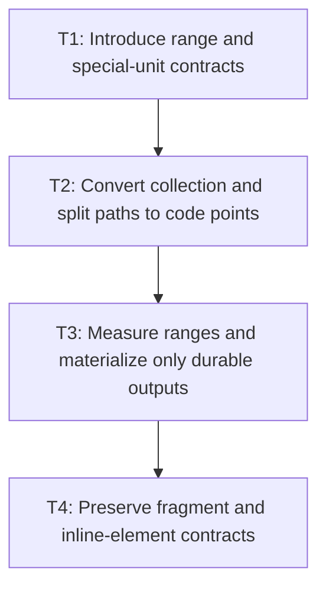

# P2: Replace substring and char units with code-point ranges

## Goal

Represent inline text work as code-point-safe ranges and compact special units, materializing strings
only when durable fragments require them.

## Non-Goals

- Grapheme-aware editing or shaping clusters.
- Persistent full-fragment caching.

## Context

- Parent milestone: `docs/work/E5/M3 - Make inline text preparation range- and code-point-based.md`.
- `InlineFormattingContext.textUnits` currently creates substrings and splits preserved text by UTF-16 `char`.

## Phase Tasks

### T1: Introduce range and special-unit contracts
**Purpose:** Separate text ranges from newline, space, spacer, and inline-block semantics.

**Depends on:** M3/P1/T4.
**Enables:** T2.
**Parallelizable with:** None.

**Changes:**
- [ ] Define units referencing prepared text start/end UTF-16 boundaries plus explicit unit variants.
- [ ] Keep node/style/fragment ownership inputs explicit without using style identity as a value-reuse key.

**Acceptance Checks:**
- [ ] Unit constructors reject boundaries inside valid surrogate pairs.
- [ ] Special units do not require placeholder text strings.

**Risks:** Keep contracts local to inline layout unless a proven consumer requires a public type.

### T2: Convert collection and split paths to code points
**Purpose:** Remove substring and per-code-unit proliferation.

**Depends on:** T1.
**Enables:** T3.
**Parallelizable with:** None.

**Changes:**
- [ ] Collect normal/preserved text, collapsible spaces, explicit breaks, spacers, and inline blocks from prepared ranges.
- [ ] Split `break-all`, `overflow-wrap`, and preserved-space ranges with `codePointAt`/`charCount` semantics.

**Acceptance Checks:**
- [ ] Supplementary code points remain atomic in every split and wrap mode.
- [ ] Break-heavy workloads no longer create one string/object per UTF-16 code unit.

**Risks:** Do not imply grapheme semantics; the approved contract is code-point based.

### T3: Measure ranges and materialize only durable outputs
**Purpose:** Preserve font/run measurement while delaying text creation.

**Depends on:** T2.
**Enables:** T4.
**Parallelizable with:** None.

**Changes:**
- [ ] Measure range views or bounded materializations through the M2 result boundary.
- [ ] Materialize fragment text only when closing durable fragments; retain resolved runs and geometry.

**Acceptance Checks:**
- [ ] Font fallback, advances, runs, line widths, and baseline geometry match fixtures.
- [ ] Temporary break candidates do not retain duplicate full strings.

**Risks:** If `TextMeasurer` requires strings, constrain copying to reviewed boundaries rather than adding speculative APIs.

### T4: Preserve fragment and inline-element contracts
**Purpose:** Verify the representation change does not alter layout outputs.

**Depends on:** T3.
**Enables:** M3/P3.
**Parallelizable with:** None.

**Changes:**
- [ ] Regress trimming, wrapping modes, alignment, fallback, fragment ownership, union boxes, and inline-block spacers.
- [ ] Compare structural fragments and text-dense allocation/counters.

**Acceptance Checks:**
- [ ] Fragment order/text/geometry and element union boxes are equivalent.
- [ ] Allocation reductions do not depend on changed content or width.

**Risks:** Stop on any supplementary split or line-edge whitespace drift.

## Verification Strategy

- Run `./gradlew :spinygui.core:test --tests '*InlineFormattingContextTest' --tests '*InlineWhitespaceTest' --tests '*ParsedInlineWhitespaceLayoutTest'`.
- Run `./gradlew :spinygui.core:test --tests '*FontServiceImplTest'`.
- Run `./gradlew :spinygui.benchmark:jmhCpu` locally with equivalent environment/workload counters.

## Review Boundaries

- Review unit contracts, code-point splitting, and fragment integration as separate reviewable changes.

## Deferred Work

- Pass-local typography reuse belongs to P3; persistent preparation/resolution reuse belongs to M6.

## Dependency Graph

