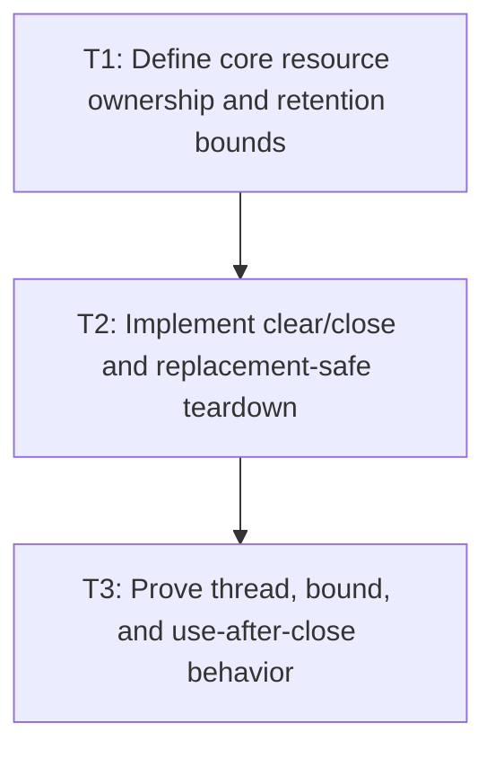

# P3: Bound and Close Core Font Resources

**Status:** Complete

## Document Context

- Parent: [M3 - Establish font identity generations and lifecycle](../M3%20-%20Establish%20font%20identity%20generations%20and%20lifecycle.md)
- Prerequisite: [P2 - Centralize registry generation and resolver ownership](P2%20-%20Centralize%20registry%20generation%20and%20resolver%20ownership.md)
- Next: [P4 - Align NanoVG face and context lifecycle](P4%20-%20Align%20NanoVG%20face%20and%20context%20lifecycle.md)

## Goal

Give `FontStorage` byte data and `FontService` STB font information explicit owners, natural/hard
bounds, a compatible raw-buffer alias/lifetime contract, clear/close behavior, and safe downstream-
before-upstream teardown where deterministic release is actually enforceable.

## Non-Goals

- Deleting NanoVG contexts/faces; P4 owns backend lifecycle.
- Adding primitive performance caches from M7.

## Context

- Parent milestone: `docs/work/E5/M3 - Establish font identity generations and lifecycle.md`.
- Phase entry gate: M3/P2 central registry/resolver/generation is production-ready.
- STB font info references backing font bytes; replacement/close must not release bytes while
  dependent info remains usable.
- Current `FontStorage.getFontData` returns read-only direct-buffer aliases whose callers may outlive
  map replacement/close; the legacy direct `loadFont` alias is already rejected by P2.

## Approved T1 Ownership Contract

P3 uses the semantic owner/service aggregate as the natural retention boundary. It does not add an
LRU, arbitrary entry cap, or oversized-font admission threshold before M7 has an aggregate budget.
The retained owner set is nevertheless finite: after T2, core maps contain only resources for the
current semantic faces. A successful different-locator replacement retires the prior face entry;
an exact duplicate adds nothing. A valid large font may become the one current face resource if its
ordinary load/allocation succeeds. Load, allocation, header, parse, validation, or publication
failure retains the complete prior state and no staged entry.

`IOUtil.asByteBuffer(byte[])` uses `ByteBuffer.allocateDirect`, not LWJGL `memAlloc`. These byte
allocations are JVM-managed. `FontStorage.getFontData()` returns a new read-only duplicate view that
shares that backing allocation. The view prevents mutation through the public alias but cannot be
revoked: a caller-retained alias remains readable after replacement, clear, or close, and its memory
becomes collectible only under normal JVM reachability rules. P3 must never report that alias or its
backing allocation as deterministically freed.

The current service creates `STBTTFontinfo` with `STBTTFontinfo.create()`, whose pinned LWJGL source
uses a BufferUtils-owned container. T2 must instead allocate staged info with LWJGL
`STBTTFontinfo.malloc()`/`calloc()`. The mutation transaction owns that allocation until successful
publication transfers it to the service aggregate. Rejected/failed preparation frees the staged
allocation exactly once; successful replacement/clear/close frees each retained owner-controlled
allocation exactly once after all dependent references have been cleared. Only those explicitly
owned STB structures are eligible for a deterministic release claim. Borrowed STB name/table views,
internal byte-buffer views, and caller-retained public byte aliases are discarded as Java views
only and are never independently freed.

### Ownership and retention table

| Retained value | Owner and lifetime | Natural bound | Replacement/failure rule | Release rule |
| --- | --- | --- | --- | --- |
| Staged font bytes | One owner-thread mutation until validation/publication completes | One candidate per in-flight single transaction; bounded batch bootstrap input | Failure drops the unpublished reference and changes no map/generation | JVM reachability only; never call LWJGL free on an `allocateDirect` buffer |
| Staged `STBTTFontinfo` | Mutation transaction from `malloc`/`calloc` until successful transfer to the service aggregate | One per candidate currently being prepared | Success transfers ownership once; init/parse/validation/publication failure retains no entry | On failure, discard borrowed views, free the transaction-owned allocation exactly once, then drop staged byte references |
| Current `FontStorageImpl` byte buffer | Installed font-service/semantic-owner aggregate | One entry for each current semantic face/normalized locator; no history and no LRU | Exact duplicate reuses current entry; changed face atomically installs new then retires the old locator entry; failure retains old | Clear/close drops owner references only after dependent info is retired; allocation remains while any public alias is reachable |
| `FontStorage.getFontData()` result | Caller-retained read-only duplicate sharing the current direct buffer | Not owner-countable after return; diagnostics can count issued views, not live aliases | Existing alias keeps the old content; later calls observe current content | JVM reachability only across replacement/clear/close; no invalidation or deterministic-free claim |
| Current `STBTTFontinfo` | Font service aggregate after successful transaction-to-service transfer; depends on its current backing byte entry | One owner-controlled info per current semantic face/locator | Exact duplicate adds nothing; replacement clears dependent references and retires old info before dropping old bytes | Free the retained owner-controlled allocation exactly once after use stops and dependent references clear |
| Borrowed STB name/table and internal byte-buffer views | Temporary parse/use operation, backed by an owner-controlled info structure and/or JVM-managed face bytes | Operation-local; never cached as an independent owner | Discard before the owning info/bytes are retired | Drop Java views only; never invoke a native free for borrowed views |
| Semantic descriptors/identity observation | `SemanticFontOwner` immutable current snapshot | One descriptor/identity per current face | Existing P2 atomic generation rules | Java objects only; clear before native/byte owner closure becomes observable |

M7 must include current core owner byte capacity and STB-info entry cost in its later aggregate
retention budget. Caller-retained aliases are reported separately as JVM-managed compatibility
exposure and are never subtracted as if P3 had freed them.

### Transition and lifecycle contract

| Operation | Owner resource outcome | Generation/compatibility outcome |
| --- | --- | --- |
| Initial load/bootstrap | Allocate staged info under transaction ownership; discard staged borrowed views and transfer the info to the service owner only after all preparation succeeds | Existing P2 transaction result |
| Exact duplicate/equivalent locator | Reuse the current byte/info entries; retain no alias-key duplicate | Generation unchanged; return the first canonical descriptor |
| Changed-byte or different-locator face replacement | Prepare transaction-owned new info; for old retained state stop affected use, clear dependent references, discard borrowed views, free the retained owner-controlled info, then drop the old byte-owner reference; transfer new info only on successful publication | Publish the new semantic state once; aliases previously returned for old bytes remain readable |
| Failed load/header/init/parse/validation/publication | Discard staged borrowed views, free any transaction-owned staged info exactly once, then drop staged JVM-managed byte references; retain no partial entry or ownership transfer | Prior content and generation remain unchanged |
| Oversized valid font | No special P3 admission cap; retain it only as a current semantic face if ordinary allocation/preparation succeeds | Normal successful mutation; M7 later accounts aggregate weight |
| Clear | On first non-empty clear, use the exact teardown order for every current face; repeated/empty clear does no release work | First non-empty clear follows P2 `+1`; repeated clear is `+0`; service remains reusable |
| Close | Reject before install, off owner thread, or during read/use; otherwise use the exact teardown order and close the owner | Repeated close is idempotent; every later service/owner operation rejects, while old public aliases remain readable |

The exact retained-resource teardown sequence is: **stop use -> clear dependent measurement/info
references -> discard borrowed STB name/table and internal byte-buffer views -> free retained
owner-controlled `STBTTFontinfo` -> drop byte-owner references**. Replacement, clear, and close
record this order and free each retained owner-controlled STB allocation once. Borrowed views are
never passed to a free operation.

Failed preparation has its own transaction-local sequence: **allocate transaction-owned staged
`STBTTFontinfo` -> discard staged borrowed views -> free the staged owner-controlled allocation
exactly once -> drop staged byte-owner references**. Successful preparation replaces the free step
with one ownership transfer to the service aggregate. A rejected transaction never leaves a staged
allocation or map entry behind.

Retention diagnostics report current owner byte entries/capacity, current owner-controlled STB-info
entries, cumulative public read-only alias views issued, and the
`JVM_MANAGED_CALLER_RETAINABLE` alias policy. They must not label aliases live, released, or freed,
because the service cannot observe caller reachability.

## Phase Tasks

### T1: Define core resource ownership and retention bounds
**Purpose:** Make existing byte/info maps part of an explicit aggregate lifecycle and memory claim.

**Depends on:** None.
**Enables:** T2.
**Parallelizable with:** None.

**Changes:**
- [x] Assign owners/lifetimes to loaded `ByteBuffer` font data and `STBTTFontinfo` instances and
  select natural service/registry scope and/or hard entry/byte bounds.
- [x] Define load/reload/replacement, duplicate, failed-init, clear, close, diagnostics, and oversized
  font behavior without overlapping M7 cache policy.
- [x] Select the API compatibility/lifetime strategy for raw buffers: remove the backing alias,
  return a read-only owned view with a documented lease, return a defensive owned copy, or explicitly
  keep JVM-managed natural lifetime instead of claiming deterministic release.
- [x] Define behavior for aliases returned before replacement/clear/close, including mutation,
  reachability, lease invalidation if enforceable, and whether compatibility requires natural lifetime.
- [x] Define references and exact teardown order: stop use, clear dependent measurements/info,
  discard borrowed views, free owner-controlled STB structures, then release backing bytes/owner.

**Acceptance Checks:**
- [x] An ownership table explains every retained core byte/info value, bound, replacement, and
  releasing operation.
- [x] The table distinguishes controlled owner resources from previously returned aliases and makes
  no deterministic-release claim for memory that callers can still retain/use.
- [x] Existing core resource retention is included in the later M7 aggregate budget contract.

**T1 evidence:** `FontResourceOwnershipContractTest` adds three active characterizations and five
disabled lifecycle targets. The active fixtures prove the bootstrap maps currently use natural
service scope with no LRU/lifecycle API, `IOUtil` direct data is exposed as distinct read-only views
sharing JVM-managed backing and old views survive entry replacement, and invalid header/STB
preparation retains no partial byte/info entry or generation change. The targets assign current-only
byte/info retention plus old-alias survival on different-locator replacement; transaction ownership,
transfer, and exact-once staged free on failure; separately recorded borrowed-view discard and
retained STB free events; exact ordered and idempotent clear/close; owner-thread/read-use/use-after-
close rejection; and external-alias diagnostics to T2/T3. The existing disabled P1 owner-close target
now encodes idempotent repeated close under this approved P3 contract. No public clear/close or
release behavior is implemented by T1. The focused ownership/service/resolver/semantic selection
discovers 83 tests (77 active, six P3 targets disabled) with no failures; core Javadocs and local
document-link checks pass.

**Risks / Stop Criteria:** Stop if retention remains process-global/unbounded without explicit
approval or if ownership of buffers loaded by `IOUtil` is unclear.

### T2: Implement clear/close and replacement-safe teardown
**Purpose:** Make successful, repeated, and partial-failure cleanup deterministic.

**Depends on:** T1.
**Enables:** T3.
**Parallelizable with:** None.

**Changes:**
- [x] Add explicit close/clear lifecycle to the selected storage/service/registry owner and document
  whether interfaces extend `AutoCloseable` or use another compatible contract.
- [x] Implement the selected raw-buffer API/lease/copy/natural-lifetime behavior without silently
  invalidating previously returned public aliases.
- [x] On semantic replacement, retire dependent info before old bytes and integrate generation state
  without exposing partially replaced resources.
- [x] Handle failed byte load/STB init and construction exceptions without retaining partial map
  entries; make repeated close/clear idempotent as approved.

**Acceptance Checks:**
- [x] Lifecycle probes record exact once-only release/order for owner-controlled resources on success,
  replacement, failed init, and repeated close; JVM-managed alias lifetime is reported, not falsely
  asserted released.
- [x] Alias compatibility tests cover mutation attempts, previously returned aliases across
  replacement/clear/close, read-only/lease/copy semantics, and natural lifetime where selected.
- [x] No resolver/measurement can access old/released bytes/info after replacement/close.

**T2 evidence:** `FontService` now extends `AutoCloseable`, supplies a source-compatible default
`close`, and exposes coordinated `clear`; `FontServiceImpl` provides the production lifecycle and
routes the legacy `Font.clear` alias through it. Owner-controlled `STBTTFontinfo` instances use
`malloc`, remain transaction-owned until publication, and are freed exactly once on rejected staged
preparation or after dependent references and borrowed views are discarded during replacement,
clear, or close. Storage retirement only drops JVM references: read-only public aliases keep their
JVM-managed direct backing and remain readable across all three operations. The production lifecycle
recorder proves the approved preparation and retained teardown sequences; cached measurement,
resolver, mutation, and observation paths reject after owner-thread idempotent close. A second
`FontServiceImpl` joins the already installed service aggregate without restaging, rebinding, or
retaining a separate native/storage map; closing either reference closes that one aggregate. A
custom `FontStorage` cannot create measurement-native info and rejects before reading bytes or
allocating STB state. The public owner-only installation overload is rejected; only the coordinated
owner/service binding overload may publish global state, and it validates both halves before changing
either. Transaction failure injection covers runtime exceptions and errors after native allocation,
descriptor parsing, provisional semantic publication, retained-resource retirement/free approval,
byte-cache commit, info-map publication, and resource transfer. The semantic owner keeps its mutation
guard active through dependent publication and restores the prior snapshot when that publication
fails; the service restores the exact prior byte/info entries and frees the untransferred candidate
or rolled-back transferred candidate exactly once. Ten T2 fixtures are active (the five original
activation targets plus aggregate-sharing, custom-storage, bootstrap-failure, orphan-binding, and
load-rollback review fixtures); the T3 diagnostics/churn target was still deferred at this T2
boundary and is activated below by T3. The prescribed four-class font selection at the T2 boundary
discovered 88 tests (87 active, one T3 target skipped); the additional structural selection brought
that point-in-time focused run to 94 tests (93 active, one skipped). Focused and full core tests,
NanoVG tests, benchmark tests, complex-demo tests, simple-demo compilation, core Javadocs,
source/structural checks, links, and diff
checks pass; known JaCoCo report generation remains excluded.

**Risks / Stop Criteria:** Stop if compatibility forces silent use after close; choose and document
explicit rejection rather than undefined native access.

### T3: Prove thread, bound, and use-after-close behavior
**Purpose:** Verify core resource policy under realistic mutation/churn and unsupported calls.

**Depends on:** T2.
**Enables:** None.
**Parallelizable with:** None.

**Changes:**
- [x] Add owner-thread and off-thread tests for load/resolve/measure/clear/close under P1.
- [x] Exercise many font loads/replacements/failed loads and assert selected entry/byte/natural-scope
  retention plus diagnostics.
- [x] Test calls after close, repeated close, no-op clear, and generation behavior after failure/
  replacement.
- [x] Verify retention diagnostics separately report owner-controlled bytes and any caller-retainable
  JVM-managed aliases; do not count the latter as deterministically freed.

**Acceptance Checks:**
- [x] Retention never exceeds policy, off-thread/use-after-close behavior is deterministic, and no
  stale info references released bytes.
- [x] Disabled/normal measurement output remains M2-compatible before close.

**T3 evidence:** `FontResourceObservation` is an immutable, backend-neutral snapshot of current
owner-controlled byte entries/capacity, current owner-controlled STB-info entries, cumulative public
read-only aliases issued, and the explicit `JVM_MANAGED_CALLER_RETAINABLE` lifetime policy. It exposes
no owner maps, raw buffers, native handles, liveness estimate, or deterministic alias-release claim.
The previously deferred diagnostics target is active, and two focused lifecycle fixtures exercise
the full owner/off-thread operation matrix plus twenty successful same-face replacements and five
interleaved invalid loads. Every failed load preserves the exact semantic/resource observation;
every successful replacement keeps owner byte/info entry counts equal to current semantic face
cardinality, makes the retired descriptor unmeasurable, and leaves all caller-retained read-only
aliases readable. Owner-thread resolve/load/measure/clear/close succeed as specified; all six
off-thread variants reject without state change, the second clear is a generation/resource no-op,
repeated close is idempotent, and every post-close operation rejects. Pre-close font metrics after
churn equal the M2 baseline. Public `FontStorageImpl.getFontData()` is bound to the exact installed
owner/service aggregate: preinstall, off-thread, and post-close reads reject before map lookup or
alias-counter mutation, while owner-thread reads return the compatible caller-retainable view.
Rejected existing and missing-locator reads leave the resource observation invariant. The four
font-contract classes now run 91/91 active tests, and the seven structural fixtures bring the
focused selection to 98/98 active tests with no failures or skips.

**Risks / Stop Criteria:** P3 is complete: teardown order is observable, alias compatibility is
explicit, and natural current-map bounds exclude caller-retained JVM backing from release claims.
NanoVG context-local retention and teardown remain P4 work.

## Verification Strategy

- Run `./gradlew :spinygui.core:test --tests 'com.spinyowl.spinygui.core.system.font.impl.FontResourceOwnershipContractTest' --tests 'com.spinyowl.spinygui.core.system.font.impl.FontServiceImplTest' --tests 'com.spinyowl.spinygui.core.system.font.FontChainResolverTest' --tests 'com.spinyowl.spinygui.core.system.font.FontSemanticContractTest' -x :spinygui.core:jacocoTestReport` while the known unrelated JaCoCo report-output failure remains.
- Run `./gradlew :spinygui.core:test --tests 'com.spinyowl.spinygui.core.system.font.impl.FontServiceImplTest'`.
- Run `./gradlew :spinygui.core:test --tests 'com.spinyowl.spinygui.core.system.font.FontChainResolverTest'`.
- Run `./gradlew :spinygui.core:test` after interface/lifecycle integration.

## Review Boundaries

- Review ownership/bounds, then API lifecycle compatibility, then replacement/failure/churn proof.

## Deferred Work

- NanoVG buffers/faces/context order belongs to P4.
- Primitive/cache policies beyond existing core resource maps belong to M7.

## Dependency Graph

