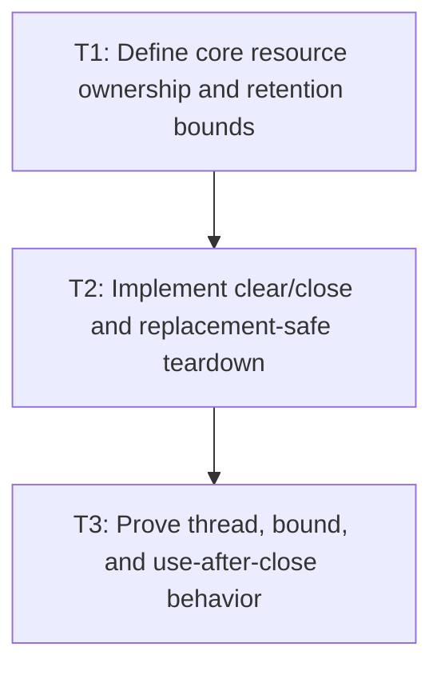

# P3: Bound and Close Core Font Resources

## Goal

Give `FontStorage` byte data and `FontService` STB font information explicit owners, natural/hard
bounds, a compatible raw-buffer alias/lifetime contract, clear/close behavior, and safe downstream-
before-upstream teardown where deterministic release is actually enforceable.

## Non-Goals

- Deleting NanoVG contexts/faces; P4 owns backend lifecycle.
- Adding primitive performance caches from M7.

## Context

- Parent milestone: `docs/work/E5/M3 - Establish font identity generations and lifecycle.md`.
- Phase entry gate: M3/P2 central registry/resolver/generation is production-ready.
- STB font info references backing font bytes; replacement/close must not release bytes while
  dependent info remains usable.
- Current `FontStorage.getFontData`/`loadFont` can expose mutable direct-buffer aliases whose prior
  callers may outlive map replacement/close.

## Phase Tasks

### T1: Define core resource ownership and retention bounds
**Purpose:** Make existing byte/info maps part of an explicit aggregate lifecycle and memory claim.

**Depends on:** None.
**Enables:** T2.
**Parallelizable with:** None.

**Changes:**
- [ ] Assign owners/lifetimes to loaded `ByteBuffer` font data and `STBTTFontinfo` instances and
  select natural service/registry scope and/or hard entry/byte bounds.
- [ ] Define load/reload/replacement, duplicate, failed-init, clear, close, diagnostics, and oversized
  font behavior without overlapping M7 cache policy.
- [ ] Select the API compatibility/lifetime strategy for raw buffers: remove the backing alias,
  return a read-only owned view with a documented lease, return a defensive owned copy, or explicitly
  keep JVM-managed natural lifetime instead of claiming deterministic release.
- [ ] Define behavior for aliases returned before replacement/clear/close, including mutation,
  reachability, lease invalidation if enforceable, and whether compatibility requires natural lifetime.
- [ ] Define references and exact teardown order: stop use, clear dependent measurements/info, release
  STB structures/views, then release backing bytes/owner.

**Acceptance Checks:**
- [ ] An ownership table explains every retained core byte/info value, bound, replacement, and
  releasing operation.
- [ ] The table distinguishes controlled owner resources from previously returned aliases and makes
  no deterministic-release claim for memory that callers can still retain/use.
- [ ] Existing core resource retention is included in the later M7 aggregate budget contract.

**Risks / Stop Criteria:** Stop if retention remains process-global/unbounded without explicit
approval or if ownership of buffers loaded by `IOUtil` is unclear.

### T2: Implement clear/close and replacement-safe teardown
**Purpose:** Make successful, repeated, and partial-failure cleanup deterministic.

**Depends on:** T1.
**Enables:** T3.
**Parallelizable with:** None.

**Changes:**
- [ ] Add explicit close/clear lifecycle to the selected storage/service/registry owner and document
  whether interfaces extend `AutoCloseable` or use another compatible contract.
- [ ] Implement the selected raw-buffer API/lease/copy/natural-lifetime behavior without silently
  invalidating previously returned public aliases.
- [ ] On semantic replacement, retire dependent info before old bytes and integrate generation state
  without exposing partially replaced resources.
- [ ] Handle failed byte load/STB init and construction exceptions without retaining partial map
  entries; make repeated close/clear idempotent as approved.

**Acceptance Checks:**
- [ ] Lifecycle probes record exact once-only release/order for owner-controlled resources on success,
  replacement, failed init, and repeated close; JVM-managed alias lifetime is reported, not falsely
  asserted released.
- [ ] Alias compatibility tests cover mutation attempts, previously returned aliases across
  replacement/clear/close, read-only/lease/copy semantics, and natural lifetime where selected.
- [ ] No resolver/measurement can access old/released bytes/info after replacement/close.

**Risks / Stop Criteria:** Stop if compatibility forces silent use after close; choose and document
explicit rejection rather than undefined native access.

### T3: Prove thread, bound, and use-after-close behavior
**Purpose:** Verify core resource policy under realistic mutation/churn and unsupported calls.

**Depends on:** T2.
**Enables:** None.
**Parallelizable with:** None.

**Changes:**
- [ ] Add owner-thread and off-thread tests for load/resolve/measure/clear/close under P1.
- [ ] Exercise many font loads/replacements/failed loads and assert selected entry/byte/natural-scope
  retention plus diagnostics.
- [ ] Test calls after close, repeated close, no-op clear, and generation behavior after failure/
  replacement.
- [ ] Verify retention diagnostics separately report owner-controlled bytes and any caller-retainable
  JVM-managed aliases; do not count the latter as deterministically freed.

**Acceptance Checks:**
- [ ] Retention never exceeds policy, off-thread/use-after-close behavior is deterministic, and no
  stale info references released bytes.
- [ ] Disabled/normal measurement output remains M2-compatible before close.

**Risks / Stop Criteria:** Do not proceed to P4 if teardown order cannot be observed/tested, raw alias
compatibility remains ambiguous, or bounds/release claims exclude caller-retained backing allocations.

## Verification Strategy

- Run `./gradlew :spinygui.core:test --tests 'com.spinyowl.spinygui.core.system.font.impl.FontServiceImplTest'`.
- Run `./gradlew :spinygui.core:test --tests 'com.spinyowl.spinygui.core.system.font.FontChainResolverTest'`.
- Run `./gradlew :spinygui.core:test` after interface/lifecycle integration.

## Review Boundaries

- Review ownership/bounds, then API lifecycle compatibility, then replacement/failure/churn proof.

## Deferred Work

- NanoVG buffers/faces/context order belongs to P4.
- Primitive/cache policies beyond existing core resource maps belong to M7.

## Dependency Graph

