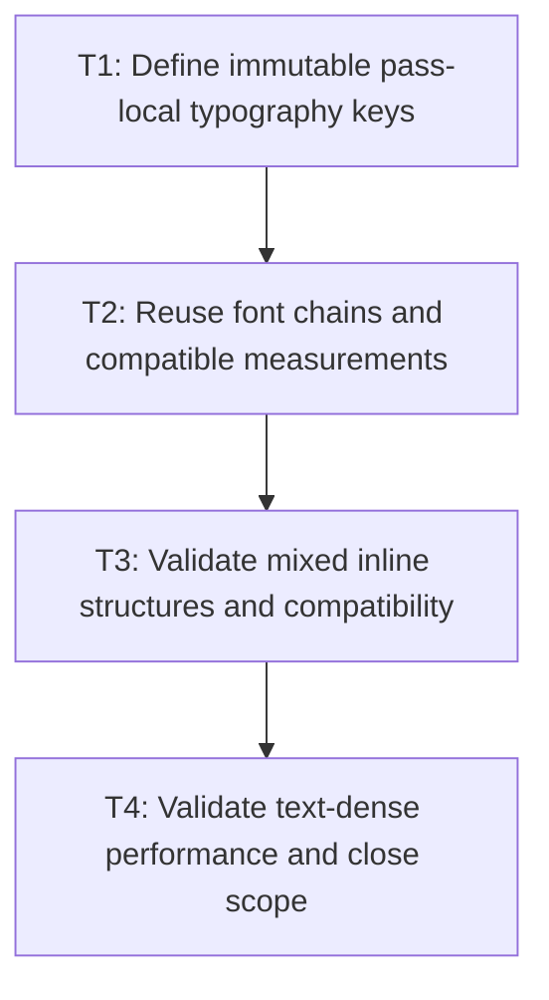

# P3: Reuse pass-local typography and validate fragments

## Goal

Reuse compatible typography, font chains, and range measurements within one formatting pass and
prove final inline fragments remain equivalent.

## Non-Goals

- Persistent caches or keys based on mutable `ResolvedStyle` identity.
- Skipping repeated whole layout passes during scrollbar convergence.

## Context

- Parent milestone: `docs/work/E5/M3 - Make inline text preparation range- and code-point-based.md`.
- Inline units currently resolve font chains and typography independently even when style values match.

## Phase Tasks

### T1: Define immutable pass-local typography keys
**Purpose:** Reuse setup by semantic values without introducing long-lived invalidation concerns.

**Depends on:** M3/P2/T4.
**Enables:** T2.
**Parallelizable with:** None.

**Changes:**
- [ ] Define keys from ordered family names, style/weight/stretch, resolved font size, and line height.
- [ ] Include only other values proven to affect a reused measurement and exclude `ResolvedStyle` identity.

**Acceptance Checks:**
- [ ] Equal value inputs share a key; any typography difference that affects output separates entries.
- [ ] Key and map lifetime end with one `InlineFormattingContext.layout` pass.

**Risks:** Do not prefigure M6 persistent key ownership or font generation decisions.

### T2: Reuse font chains and compatible measurements
**Purpose:** Remove repeated setup and duplicate range measurements during one pass.

**Depends on:** T1.
**Enables:** T3.
**Parallelizable with:** None.

**Changes:**
- [ ] Resolve font chains/typography once per pass-local key.
- [ ] Reuse immutable range measurements only when text range and all output-affecting values match.

**Acceptance Checks:**
- [ ] M1 counters show one font-chain resolution per compatible value key per pass.
- [ ] Different text/ranges or typography never share an incompatible result.

**Risks:** Keep pass-local maps bounded by units/values in the active layout operation.

### T3: Validate mixed inline structures and compatibility
**Purpose:** Prove reuse does not cross ownership or geometry boundaries.

**Depends on:** T2.
**Enables:** T4.
**Parallelizable with:** None.

**Changes:**
- [ ] Cover nested inline elements, inline blocks, mixed typography, fallback, alignment, wrapping, and supplementary text.
- [ ] Compare fragment node ownership, run order, baselines, line boxes, and union boxes.

**Acceptance Checks:**
- [ ] All structural and renderer fixtures remain equivalent.
- [ ] Pass-local reuse never causes fragments to reference another node's ownership.

**Risks:** None identified.

### T4: Validate text-dense performance and close scope
**Purpose:** Demonstrate the complete M3 outcome without claiming retained layout reuse.

**Depends on:** T3.
**Enables:** M6/P1.
**Parallelizable with:** None.

**Changes:**
- [ ] Run text-dense size/allocation/counter workloads with equivalent environments and workload shape.
- [ ] Document that repeated scrollbar-convergence passes remain possible until M7.

**Acceptance Checks:**
- [ ] One-scan preparation, code-point units, and pass-local reuse are visible in deterministic counters.
- [ ] No full-fragment, prepared-node, or persistent resolved-sequence cache was added.

**Risks:** Treat timing as informational; require structure, counters, and allocation evidence.

## Verification Strategy

- Run `./gradlew :spinygui.core:test --tests '*Inline*' --tests '*FontServiceImplTest'`.
- Run `./gradlew :spinygui.core.backend.lwjgl.nanovg:test --tests '*NvgTextRendererTest' --tests '*NvgInlineFormattingOffsetTest'`.
- Run `./gradlew :spinygui.benchmark:jmhCpu` locally and `./gradlew test` before completion.

## Review Boundaries

- Review key semantics before reuse integration; review mixed-layout regressions before benchmark claims.

## Deferred Work

- Persistent prepared/resolved/wrap reuse belongs to M6; unchanged-frame retained fragments remain
  deferred until after M7 prerequisites.

## Dependency Graph

