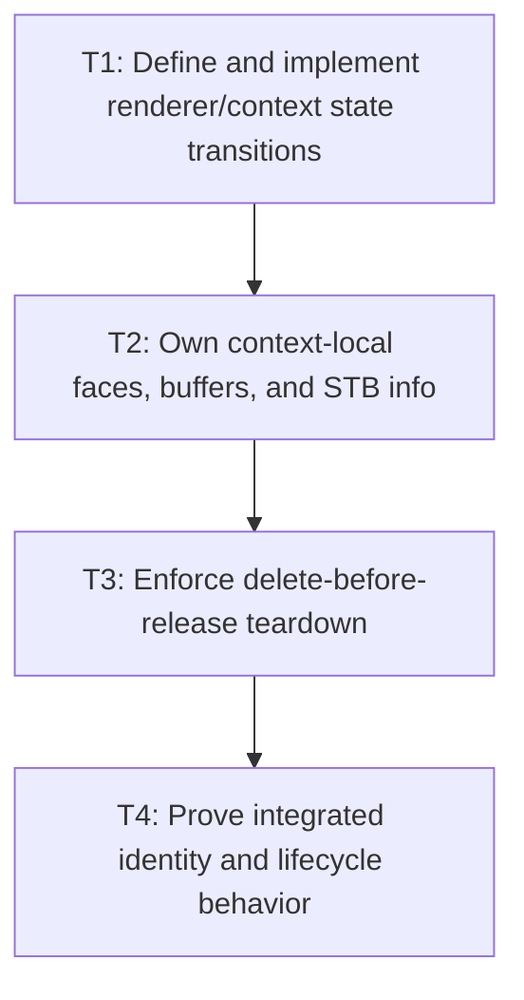

# P4: Align NanoVG Face and Context Lifecycle

**Status:** In progress

## Goal

Implement explicit renderer/context/font-face states and teardown so context deletion precedes the
release of every `freeData=false` font buffer and backend STB resource.

## Non-Goals

- Adding M6 UTF-8 staging/state suppression.
- Advancing core semantic generation when a context-local face is created or fails.

## Context

- Parent milestone: `docs/work/E5/M3 - Establish font identity generations and lifecycle.md`.
- Phase entry gate: M3/P3 core owner/resources close safely.
- `nvgCreateFontMem(..., false)` requires font data to remain valid for the NanoVG context lifetime.
- Replacing bytes at the same semantic path while a context remains active cannot simply swap faces
  and keep every old `freeData=false` buffer indefinitely.

## Phase Tasks

### T1: Define and implement renderer/context state transitions
**Purpose:** Make initialization, context identity, replacement/reinitialization, failure, destroy, and
use-after-destroy explicit.

**Depends on:** None.
**Enables:** T2.
**Parallelizable with:** None.

**Changes:**
- [x] Define renderer states for new/uninitialized, initializing, initialized with context identity,
  failed/partially initialized, destroying, and destroyed.
- [x] Select full context replacement/reinitialization support or explicit rejection; specify calls
  to initialize/render/fontFace/destroy in every state.
- [x] Select one active-context same-path semantic reload strategy: reject reload while an affected
  context is active, rotate/recreate the context, or retain versioned buffers only until forced
  context rotation at a hard bound.
- [x] Implement UI-thread checks, repeated destroy behavior, use-after-destroy rejection, and partial
  initialization rollback without relying only on `AtomicBoolean` concurrency semantics.

**Acceptance Checks:**
- [x] Transition tests cover initialize twice, render before init, replacement/mismatched context,
  creation failure, destroy twice, use after destroy, and the selected active-context reload strategy.
- [x] State transitions do not imply concurrent renderer support.

**Risks / Stop Criteria:** Stop if a failed initialize leaves a context/resource set that later
appears initialized or if context replacement is accidentally partially supported.

#### T1 lifecycle and reload contract

All operations are confined to the exact semantic-owner installation/UI thread; the state machine
does not provide concurrent renderer support.

| State | `initialize` | `render` / `fontFace` | `destroy` |
|---|---|---|---|
| `NEW` | Create one context, bind its exact identity and semantic replacement preflight | Reject | Transition directly to `DESTROYED` without creating a context |
| `INITIALIZING` | Reject re-entry | Reject | Reject re-entry |
| `INITIALIZED` | Reject a second initialization or context replacement | Allow only for the bound context identity | Delete the bound context, unregister preflight, then enter `DESTROYED` |
| `FAILED` | Reject retry on the same renderer | Reject | Retry any remaining context rollback, then enter `DESTROYED` |
| `DESTROYING` | Reject | Reject | Reject re-entry |
| `DESTROYED` | Reject use-after-destroy | Reject use-after-destroy | Owner-thread no-op |

Initialization failure after native context creation deletes that partial context and enters
`FAILED`; the same renderer cannot silently appear initialized later. A delete failure remains
`FAILED` so explicit destroy can retry the outstanding rollback.

The active-face policy is explicit rejection. An initialized renderer registers a backend-neutral
semantic preflight. Exact duplicate/no-op loads and additions for a different face key remain legal,
but a same-key/different-identity mutation is rejected before core generation, descriptor, byte, or
native-info publication when that renderer has created the affected face. The caller must destroy
that renderer and construct/initialize a new renderer before the reload. T1 neither auto-rotates a
context nor retains versioned buffers; context-local map ownership and release remain T2/T3 work.

#### T1 evidence

- `NvgRendererLifecycleTest` covers the six states, context identity mismatch, initialize/destroy
  repetition, owner-thread confinement, post-create rollback, and active-face replacement rejection
  before semantic/resource publication.
- Four active P4 characterization targets in `NvgFontSemanticContractTest` exercise initialized
  creation/reuse, off-thread rejection, destroy/use-after-destroy, and partial-create retry policy.
- `FontSemanticContractTest` proves the renderer-neutral preflight leaves semantic and resource
  observations unchanged on rejection, bypasses exact duplicates, and unregisters before a later
  accepted replacement.

### T2: Own context-local faces, buffers, and STB info
**Purpose:** Retain backend resources exactly as long as the context/native contract requires.

**Depends on:** T1.
**Enables:** T3.
**Parallelizable with:** None.

**Changes:**
- [x] Assign the renderer/context owner to loaded face names/IDs, font buffers, buffer duplicates/
  views, backend STB info, and failed face-creation retry state.
- [x] Observe M3 semantic identity/generation so replaced fonts retire/recreate context-local state
  according to the selected rejection/rotation/versioned-bound strategy without mutating core generation.
- [x] Define natural/hard bounds and diagnostics for existing backend face/buffer/info maps and make
  them visible to M7 aggregate retention accounting.

**Acceptance Checks:**
- [x] One context cannot reuse a face ID/name created for another context; accepted semantic reload
  either fails before mutation or rotates/recreates before new drawing. Versioned retention, if
  selected, forces rotation at the hard bound before accepting another retained version.
- [x] Face-creation failure retains/releases only documented state and supports the selected retry
  behavior without leaks.

**Risks / Stop Criteria:** Stop if context-local entries are keyed only by a semantic font while
context identity can change, if same-path reload has no selected strategy, or if failure/old-version
retention is unbounded.

#### T2 ownership, reconciliation, and bounds

`NvgFontRegistry` is owned by one renderer and binds permanently to the renderer's single non-zero
NanoVG context identity during initialization. A context mismatch is rejected before lookup or face
creation. Glyph conversion receives and binds the render context before the later face-selection
step, so the first buffer/info entry and its face share one resource key. An unbound registry cannot
create resources, and its observation must report zero context/resource/failure counts. Recording-
only sinks use an explicit non-zero logical recording context rather than creating context-zero
entries. Face names/IDs, `freeData=false` backing buffers, backend `STBTTFontinfo` Java views, and
retryable face-failure keys are indexed by the bound context plus the current semantic identity. An
explicitly supplied unregistered compatibility descriptor uses its normalized locator as a local
identity and cannot displace a registered semantic face. If that face key later becomes registered,
an unused compatibility entry yields to the installed semantic identity during reconciliation.

| Resource | Retention and retry rule | Bound visible to M7 |
|---|---|---|
| NanoVG face name/ID | Publish only after `nvgCreateFontMem` succeeds; reuse only for the same resource identity in the same bound context | Natural one per successfully used current identity; hard one-context owner |
| `freeData=false` backing buffer | Retain the owner buffer for every live face; reuse it across retries for the same resource key | Natural one per resource key represented by the context |
| Submitted duplicate buffer view | Create per native call and never retain the Java view; NanoVG may retain the shared address while the owner buffer remains live | Hard retained-view count of zero |
| Backend `STBTTFontinfo` | Retain the current JVM-managed structure view only after successful initialization; discard unused stale-version map references during generation reconciliation | Natural one per inspected current resource key; deterministic allocation/free conversion remains T3 |
| Failed face attempt | Retain no name, ID, or submitted view; retain one retry marker and its reusable backing buffer whether native creation returns `-1` or throws | Retry markers never exceed retained backing-buffer entries; success removes the marker |

Every face/glyph-inspection/diagnostic use reconciles the owner's immutable semantic observation.
Unchanged generations do no work. A changed generation discards unused stale-version buffer/info/
retry references before creating current entries; a stale caller descriptor is rejected. The T1
preflight continues to reject same-key replacement while a successful face is active, so no old
face or `freeData=false` buffer is silently reused after core publication. Backend creation,
failure, retry, and observation never mutate core generation.

`NvgFontResourceObservation` exposes the reconciled generation, exact context identity/count,
face/buffer/info/retry counts, cumulative face failures, the hard zero retained-submitted-view count,
and immutable retained semantic identities. There is no speculative LRU or arbitrary font-entry cap:
the current semantic identities actually used by the one context are the natural production bound;
M7 can aggregate these explicit counts and apply its later weighted budget.

#### T2 evidence

- `NvgFontRegistryTest.displayBeforeFaceSelectionBindsOneContextWithoutDuplication` freezes the
  production display-before-face order, proves context zero is rejected without allocation, and
  observes one shared buffer/info/face entry after binding the real context.
- `NvgRendererLifecycleTest.fontResourcesAreContextOwnedAndCannotReuseAcrossRenderers` proves exact
  context binding, independent face creation, same-context reuse, shared backing addresses for
  call-local duplicate views, the hard zero retained-view count, and no core-generation effect.
- `failedFaceCreationIsBoundedAndSuccessfulRetryPublishesOnce` proves returned and thrown native
  failures retain one bounded retry key/buffer, no face, and no submitted view; successful retry
  publishes one face and clears the marker without changing semantic generation.
- `semanticObservationKeepsOnlyCurrentUnusedBackendIdentity` proves an accepted replacement with no
  active face advances only core generation, discards the unused prior backend identity, recreates
  one current buffer/info pair, and rejects later use of the stale descriptor.
- `unregisteredCompatibilityStateYieldsToInstalledSemanticIdentity` proves an unused local
  compatibility entry is retired rather than duplicated when its face key becomes registered.

### T3: Enforce delete-before-release teardown
**Purpose:** Honor `freeData=false` and align all font/context resources with one close sequence.

**Depends on:** T2.
**Enables:** T4.
**Parallelizable with:** None.

**Changes:**
- [ ] Stop frame/submission use, delete the NanoVG context, then release/clear context-local faces,
  backend STB info, and font buffers/views; close shared core resources only after backend dependents.
- [ ] Integrate success, face failure, context creation failure, and repeated destroy cleanup paths.
- [ ] Expose lifecycle hooks M6 staging can later join without changing teardown order.

**Acceptance Checks:**
- [ ] Lifecycle recording asserts context-delete occurs before any `freeData=false` backing buffer/
  info release and each resource releases once.
- [ ] Partial initialization and repeated destroy leak no retained buffer/info/face entry.

**Risks / Stop Criteria:** Never release/reload a backing buffer in-place while an active context can
still reference it.

### T4: Prove integrated identity and lifecycle behavior
**Purpose:** Establish the M3 production gate consumed by snapshots, submission, and caches.

**Depends on:** T3.
**Enables:** None.
**Parallelizable with:** None.

**Changes:**
- [ ] Test successful add/replacement/byte reload/no-op/failure through core resolution, measurement,
  face creation, rendering recording, and teardown.
- [ ] Test repeated same-path reload to the selected rejection/rotation/hard-bound limit and prove
  old `freeData=false` buffers cannot accumulate without forced context deletion.
- [ ] Test off-thread rejection across core/backend, context mismatch/replacement policy, face failure
  x-independent lifecycle, and use-after-destroy.
- [ ] Reconcile core plus backend entry/byte/native retention diagnostics and teardown order.

**Acceptance Checks:**
- [ ] M5 can query the production generation before/after exact mutations; M6 can attach staging to a
  deterministic context lifecycle; M7 can include all existing retention.
- [ ] Full tests show no default resolver bypass, stale face, early buffer release, or hidden
  concurrent behavior.

**Risks / Stop Criteria:** M3 is not complete while any downstream milestone would need a fake
generation, undocumented context reset, or different font owner.

## Verification Strategy

- Run `./gradlew :spinygui.core:test --tests 'com.spinyowl.spinygui.core.system.font.*'`.
- Run `./gradlew :spinygui.core.backend.lwjgl.nanovg:test --tests 'com.spinyowl.spinygui.core.backend.renderer.lwjgl.nanovg.NvgFontRegistryTest'`.
- Run `./gradlew :spinygui.core.backend.lwjgl.nanovg:test --tests 'com.spinyowl.spinygui.core.backend.renderer.lwjgl.nanovg.NvgTextRendererTest'`.
- Run `./gradlew test` before declaring the generation/lifecycle gate production-ready.

## Review Boundaries

- Review state machine, then resource ownership/bounds, then teardown order, then integrated mutation
  scenarios.

## Deferred Work

- UTF-8 staging/state suppression joins this lifecycle in M6.
- New primitive/prepared/wrap cache families belong to M7.

## Dependency Graph

