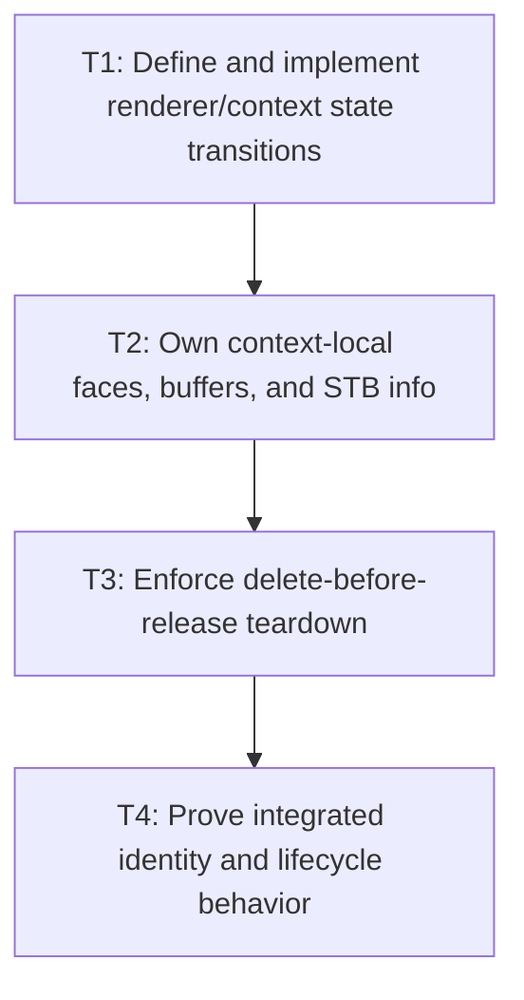

# P4: Align NanoVG Face and Context Lifecycle

## Goal

Implement explicit renderer/context/font-face states and teardown so context deletion precedes the
release of every `freeData=false` font buffer and backend STB resource.

## Non-Goals

- Adding M6 UTF-8 staging/state suppression.
- Advancing core semantic generation when a context-local face is created or fails.

## Context

- Parent milestone: `docs/work/E5/M3 - Establish font identity generations and lifecycle.md`.
- Phase entry gate: M3/P3 core owner/resources close safely.
- `nvgCreateFontMem(..., false)` requires font data to remain valid for the NanoVG context lifetime.
- Replacing bytes at the same semantic path while a context remains active cannot simply swap faces
  and keep every old `freeData=false` buffer indefinitely.

## Phase Tasks

### T1: Define and implement renderer/context state transitions
**Purpose:** Make initialization, context identity, replacement/reinitialization, failure, destroy, and
use-after-destroy explicit.

**Depends on:** None.
**Enables:** T2.
**Parallelizable with:** None.

**Changes:**
- [ ] Define renderer states for new/uninitialized, initializing, initialized with context identity,
  failed/partially initialized, destroying, and destroyed.
- [ ] Select full context replacement/reinitialization support or explicit rejection; specify calls
  to initialize/render/fontFace/destroy in every state.
- [ ] Select one active-context same-path semantic reload strategy: reject reload while an affected
  context is active, rotate/recreate the context, or retain versioned buffers only until forced
  context rotation at a hard bound.
- [ ] Implement UI-thread checks, repeated destroy behavior, use-after-destroy rejection, and partial
  initialization rollback without relying only on `AtomicBoolean` concurrency semantics.

**Acceptance Checks:**
- [ ] Transition tests cover initialize twice, render before init, replacement/mismatched context,
  creation failure, destroy twice, use after destroy, and the selected active-context reload strategy.
- [ ] State transitions do not imply concurrent renderer support.

**Risks / Stop Criteria:** Stop if a failed initialize leaves a context/resource set that later
appears initialized or if context replacement is accidentally partially supported.

### T2: Own context-local faces, buffers, and STB info
**Purpose:** Retain backend resources exactly as long as the context/native contract requires.

**Depends on:** T1.
**Enables:** T3.
**Parallelizable with:** None.

**Changes:**
- [ ] Assign the renderer/context owner to loaded face names/IDs, font buffers, buffer duplicates/
  views, backend STB info, and failed face-creation retry state.
- [ ] Observe M3 semantic identity/generation so replaced fonts retire/recreate context-local state
  according to the selected rejection/rotation/versioned-bound strategy without mutating core generation.
- [ ] Define natural/hard bounds and diagnostics for existing backend face/buffer/info maps and make
  them visible to M7 aggregate retention accounting.

**Acceptance Checks:**
- [ ] One context cannot reuse a face ID/name created for another context; accepted semantic reload
  either fails before mutation or rotates/recreates before new drawing. Versioned retention, if
  selected, forces rotation at the hard bound before accepting another retained version.
- [ ] Face-creation failure retains/releases only documented state and supports the selected retry
  behavior without leaks.

**Risks / Stop Criteria:** Stop if context-local entries are keyed only by a semantic font while
context identity can change, if same-path reload has no selected strategy, or if failure/old-version
retention is unbounded.

### T3: Enforce delete-before-release teardown
**Purpose:** Honor `freeData=false` and align all font/context resources with one close sequence.

**Depends on:** T2.
**Enables:** T4.
**Parallelizable with:** None.

**Changes:**
- [ ] Stop frame/submission use, delete the NanoVG context, then release/clear context-local faces,
  backend STB info, and font buffers/views; close shared core resources only after backend dependents.
- [ ] Integrate success, face failure, context creation failure, and repeated destroy cleanup paths.
- [ ] Expose lifecycle hooks M6 staging can later join without changing teardown order.

**Acceptance Checks:**
- [ ] Lifecycle recording asserts context-delete occurs before any `freeData=false` backing buffer/
  info release and each resource releases once.
- [ ] Partial initialization and repeated destroy leak no retained buffer/info/face entry.

**Risks / Stop Criteria:** Never release/reload a backing buffer in-place while an active context can
still reference it.

### T4: Prove integrated identity and lifecycle behavior
**Purpose:** Establish the M3 production gate consumed by snapshots, submission, and caches.

**Depends on:** T3.
**Enables:** None.
**Parallelizable with:** None.

**Changes:**
- [ ] Test successful add/replacement/byte reload/no-op/failure through core resolution, measurement,
  face creation, rendering recording, and teardown.
- [ ] Test repeated same-path reload to the selected rejection/rotation/hard-bound limit and prove
  old `freeData=false` buffers cannot accumulate without forced context deletion.
- [ ] Test off-thread rejection across core/backend, context mismatch/replacement policy, face failure
  x-independent lifecycle, and use-after-destroy.
- [ ] Reconcile core plus backend entry/byte/native retention diagnostics and teardown order.

**Acceptance Checks:**
- [ ] M5 can query the production generation before/after exact mutations; M6 can attach staging to a
  deterministic context lifecycle; M7 can include all existing retention.
- [ ] Full tests show no default resolver bypass, stale face, early buffer release, or hidden
  concurrent behavior.

**Risks / Stop Criteria:** M3 is not complete while any downstream milestone would need a fake
generation, undocumented context reset, or different font owner.

## Verification Strategy

- Run `./gradlew :spinygui.core:test --tests 'com.spinyowl.spinygui.core.system.font.*'`.
- Run `./gradlew :spinygui.core.backend.lwjgl.nanovg:test --tests 'com.spinyowl.spinygui.core.backend.renderer.lwjgl.nanovg.NvgFontRegistryTest'`.
- Run `./gradlew :spinygui.core.backend.lwjgl.nanovg:test --tests 'com.spinyowl.spinygui.core.backend.renderer.lwjgl.nanovg.NvgTextRendererTest'`.
- Run `./gradlew test` before declaring the generation/lifecycle gate production-ready.

## Review Boundaries

- Review state machine, then resource ownership/bounds, then teardown order, then integrated mutation
  scenarios.

## Deferred Work

- UTF-8 staging/state suppression joins this lifecycle in M6.
- New primitive/prepared/wrap cache families belong to M7.

## Dependency Graph

