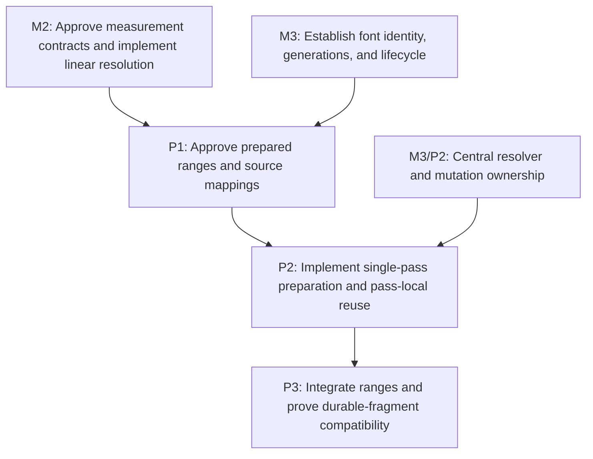

# M4: Prepare Inline Text with Ranges and Code Points

**Status:** Planned

Parent plan: `docs/work/E5 - Text performance improvements.md`

## Goal

Replace repeated regex/substrings and per-character temporary inline units with one mapped
whitespace preparation scan and code-point-safe prepared ranges while preserving the current durable
fragment structure and ownership contract.

## Context

- M2 supplies approved CR/LF, replacement, source-index, wrapping, and resolved-run contracts; M3
  supplies centralized resolver ownership, generation, UI-thread mutation rules, and lifecycle.
- M4 starts after M2 and M3. M4/P2 additionally names M3/P2 as the precise source of its resolver/pass
  assumptions so the cross-phase dependency remains reciprocal and reviewable.
- Existing tests expose durable `InlineFragment` count/text/geometry and ownership; equality excludes
  `node`, so ownership requires reference assertions.
- This milestone claims reduced temporary allocation only. Fragment coalescing and retained fragment
  caching remain deferred and require separate approval.

## Phases

### P1: Approve prepared ranges and source mappings

**Document:** [P1 - Approve prepared ranges and source mappings](M4/P1%20-%20Approve%20prepared%20ranges%20and%20source%20mappings.md)

**Purpose:** Define the preparation data model, coordinate mappings, and durable-output compatibility
boundary before changing `InlineWhitespace` or `InlineFormattingContext`.

**Depends on:** M2, M3.
**Enables:** P2.
**Parallelizable with:** None.

**Architectural Proposition:** One immutable prepared value maps original node UTF-16 offsets to
normalized/prepared offsets, range/unit offsets, fragment-local offsets, and resolved-run offsets;
all split boundaries are code-point safe.

**Key Work:**
- Define bidirectional/partial mapping behavior for CR/LF normalization, tabs, form-feed, vertical
  tab, collapsed whitespace, preserved whitespace, removed source, inserted expansion, and
  replacement glyphs.
- Select prepared range and compact special-unit contracts for text, break, collapsible/preserved
  space, spacer, and atomic inline content.
- Freeze durable fragment count/text/geometry/ownership expectations and require `assertSame`-style
  node checks where equality cannot detect owner drift.
- Classify preserved fragments that require text `String` output versus null-text spacer/element/union
  fragments so later materialization counters have an exact denominator.

**Validation:** Mapping fixtures can trace every prepared/fragment/run position back to the approved
original-node UTF-16 contract without materializing a substring per unit.

**Risks / Stop Criteria:** Stop if a normalized offset is ambiguous without an explicit mapping
policy or if a valid surrogate pair can be split by a range boundary.

### P2: Implement single-pass preparation and pass-local reuse

**Document:** [P2 - Implement single-pass preparation and pass-local reuse](M4/P2%20-%20Implement%20single-pass%20preparation%20and%20pass-local%20reuse.md)

**Purpose:** Produce prepared text/ranges/mappings in one scan and reuse immutable typography/font-
chain values within one layout pass.

**Depends on:** P1, M3/P2.
**Enables:** P3.
**Parallelizable with:** None.

**Architectural Proposition:** Preparation appends to bounded pass-local builders, emits ranges over
one immutable prepared text value, and performs one normalization scan; pass-local value reuse
assumes the UI-thread font registry cannot mutate during the pass.

**Key Work:**
- Replace chained replacement/regex normalization with the approved deterministic scan and mapping
  construction.
- Replace temporary substring/per-UTF-16-char units with code-point ranges and compact special units.
- Consume M2's compatible range-aware boundary with no per-range `String`; materialize exactly one
  `String` per preserved text-bearing fragment that requires one and zero for null-text spacer,
  element, or union fragments.
- Reuse immutable effective typography and ordered font-chain values by value within the pass, never
  by mutable `ResolvedStyle` identity, and restore compatible-range measurement result reuse.

**Validation:** Counters report one normalization scan, zero per-range measurement strings, exactly
one durable `String` per required text-bearing fragment and zero per null-text spacer/element/union
fragment, bounded measurement calls, and no temporary unit per UTF-16 code unit; mappings match P1.

**Risks / Stop Criteria:** Stop if pass-local reuse survives a pass boundary, observes mutable style
identity, or assumes concurrent registry mutation is supported.

### P3: Integrate ranges and prove durable-fragment compatibility

**Document:** [P3 - Integrate ranges and prove durable-fragment compatibility](M4/P3%20-%20Integrate%20ranges%20and%20prove%20durable-fragment%20compatibility.md)

**Purpose:** Route inline layout, wrapping, and resolved measurement through prepared ranges and
demonstrate lower temporary allocation without changing exposed fragment output.

**Depends on:** P2.
**Enables:** None.
**Parallelizable with:** None.

**Architectural Proposition:** `InlineFormattingContext` consumes prepared range/source mappings and
materializes exactly one `String` for each preserved text-bearing fragment that requires one, and zero
for null-text spacer/element/union fragments, only at the existing durable output boundary.

**Key Work:**
- Integrate collection/range-aware measurement, then split/wrap/trim, then alignment/inline elements/
  durable fragment materialization as separate review boundaries with structural checks at each.
- Add exact fragment count/text/geometry and owner-reference fixtures across nested inline elements,
  tabs/form-feed/vertical-tab, collapsed spaces, fallback, supplementary code points, and wrapping.
- Compare normalization scans, temporary allocation, range traversal, chain resolution, and durable
  fragment/measurement materialization and calls in cold/disabled M1 workloads.

**Validation:** Existing durable fragments remain structurally equivalent and owner-identical;
temporary allocations fall; durable-string count equals the required text-bearing fragment subset
and is zero for null-text fragment kinds; no fragment/string elimination or coalescing is claimed.

**Risks / Stop Criteria:** Reject the phase if allocation gains come from changing fragment count,
text, ownership, fallback boundaries, or visible layout without separate approval.

## Milestone Validation

- `./gradlew :spinygui.core:test --tests 'com.spinyowl.spinygui.core.layout.impl.InlineWhitespaceTest'`
- `./gradlew :spinygui.core:test --tests 'com.spinyowl.spinygui.core.layout.impl.InlineFormattingContextTest'`
- `./gradlew :spinygui.core:test --tests 'com.spinyowl.spinygui.core.layout.impl.ParsedInlineWhitespaceLayoutTest'`
- `./gradlew :spinygui.benchmark:test`

## Dependency Graph

