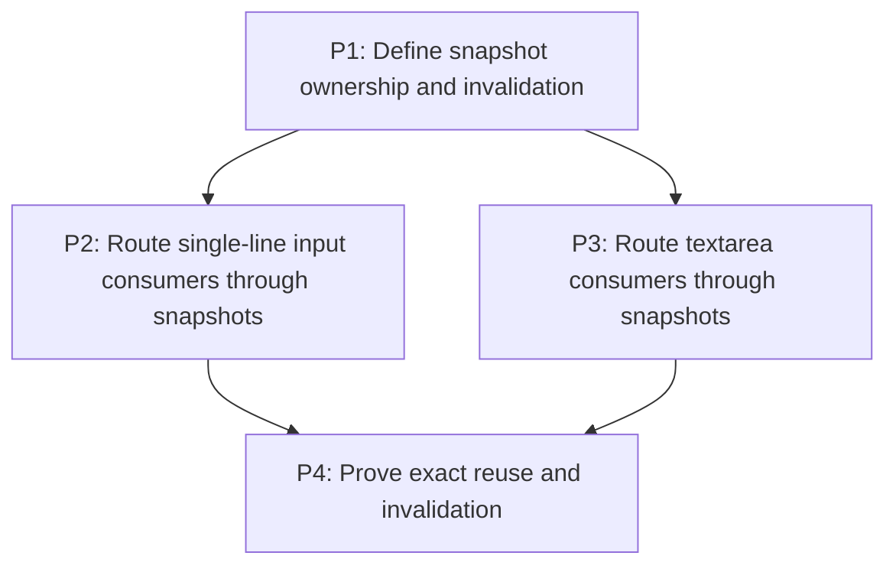

# M4: Share immutable editable-control text snapshots

## Goal

Give each editable control one naturally bounded immutable text snapshot shared by rendering,
caret, selection, hit testing, viewport, and event behavior.

**Depends on:** M2.
**Enables:** M5.
**Parallelizable with:** M3.

## Context

- Parent epic: `docs/work/E5 - Text performance improvements.md`.
- Input rendering measures full values and prefix substrings; textarea consumers repeatedly split,
  wrap, and measure the same value.
- Snapshot ownership must remain in core and must not introduce a core dependency on NanoVG.

## Phases

### P1: Define snapshot ownership and invalidation
**Document:** [P1 - Define snapshot ownership and invalidation](M4/P1%20-%20Define%20snapshot%20ownership%20and%20invalidation.md)
**Purpose:** Select a reachable owner and freeze the immutable query/invalidation contract.

**Depends on:** M2/P3.
**Enables:** P2, P3.
**Parallelizable with:** M3/P1-P3.

**Architectural Proposition:** A control or core control-text service retains at most the current
snapshot, containing resolved lines/runs and cumulative code-point-safe caret advances.

**Key Work:**
- Define line lookup, UTF-16 boundaries, hit testing, extents, runs, and cumulative advances.
- Invalidate only for value, typography, font generation, and textarea width/wrap changes.

**Validation:**
- Caret, selection, focus, color, scroll, and unchanged-frame reads retain snapshot identity.
- Ownership is naturally bounded and renderer-independent.

### P2: Route single-line input consumers through snapshots
**Document:** [P2 - Route single-line input consumers through snapshots](M4/P2%20-%20Route%20single-line%20input%20consumers%20through%20snapshots.md)
**Purpose:** Remove full-value and prefix-substring remeasurement from input behavior and rendering.

**Depends on:** P1.
**Enables:** P4.
**Parallelizable with:** P3.

**Architectural Proposition:** Input renderer, caret/hit testing, and viewport behavior query the
same snapshot and keep presentation/scroll state outside its key.

**Key Work:**
- Integrate input geometry, selection, caret, hit testing, and horizontal viewport consumers.
- Preserve button-input and legacy/fallback behavior where snapshots are not applicable.

**Validation:**
- Prefix widths come from cumulative advances without substring measurement.
- Input editing, fallback, selection, hit testing, and viewport tests remain equivalent.

### P3: Route textarea consumers through snapshots
**Document:** [P3 - Route textarea consumers through snapshots](M4/P3%20-%20Route%20textarea%20consumers%20through%20snapshots.md)
**Purpose:** Share one wrapped multiline result across textarea renderer and event behavior.

**Depends on:** P1.
**Enables:** P4.
**Parallelizable with:** P2.

**Architectural Proposition:** Multiline line/range/run data and cumulative advances replace
repeated `MultilineTextControlMetrics.lines` layouts without retaining historical widths or values.

**Key Work:**
- Integrate render, selection, caret, vertical movement, line lookup, hit testing, and viewport use.
- Preserve explicit newline and wrapping source ranges under UTF-16 indexing.

**Validation:**
- A K-line selection consumes one valid complete layout instead of approximately `2K + 3`.
- Textarea behavior and renderer recording tests preserve geometry and run order.

### P4: Prove exact reuse and invalidation
**Document:** [P4 - Prove exact reuse and invalidation](M4/P4%20-%20Prove%20exact%20reuse%20and%20invalidation.md)
**Purpose:** Verify naturally bounded ownership under unchanged frames, edits, styles, and resize.

**Depends on:** P2, P3.
**Enables:** M5/P1.
**Parallelizable with:** None.

**Architectural Proposition:** Snapshot build counters and identity assertions are the source of
truth for invalidation; timing is supporting local evidence only.

**Key Work:**
- Cover every invalidating and non-invalidating state transition.
- Exercise repeated edits/resizes to prove replacement rather than history accumulation.

**Validation:**
- Value/typography/font generation and textarea width/wrap rebuild exactly when required.
- Caret/selection/focus/color/scroll scenarios reuse and retained snapshots remain bounded per owner.

## Risks and Stop Criteria

- Stop if renderer code becomes the snapshot owner or core types acquire NanoVG state.
- Do not use `ResolvedStyle` identity or retain snapshots for old values/widths.

## Dependency Graph

