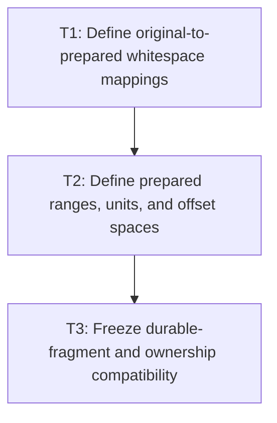

# P1: Approve Prepared Ranges and Source Mappings

**Status:** Complete

## Goal

Approve a code-point-safe prepared-text/range model and explicit UTF-16 mappings from original node
content through durable fragments/resolved runs before changing inline preparation.

## Non-Goals

- Coalescing durable fragments or caching retained layout.
- Implementing whitespace preparation or range traversal.

## Context

- Parent milestone: `docs/work/E5/M4 - Prepare inline text with ranges and code points.md`.
- Phase entry gate: M2 contracts for CR/LF, replacement, wrapping, UTF-16 indices, and coordinates are
  approved and implemented.
- Existing `InlineFragment.equals` excludes `node`; tests must use reference assertions for ownership.

## Approved Mapping Contract

All offsets are UTF-16 boundaries. `PreparedInlineText` scans source code points once and associates
every prepared code point with the half-open source span that produced it. A CRLF pair is one atomic
source span. A tab expansion associates every inserted space with the same tab source span. One
collapsed space associates the entire collapsed source run with that prepared code point.

Boundary lookup returns an inclusive `BoundarySpan` rather than silently selecting an affinity:

| Lookup | Lower boundary | Upper boundary |
| --- | --- | --- |
| Source to prepared | Contributions ending at or before the source boundary | Contributions starting before the source boundary |
| Prepared to source | End of the preceding contribution, or source start | Start of the following contribution, or source end |

Equal lower/upper values are exact. A non-empty span explicitly represents collapse or expansion;
callers choose the lower value for leading affinity and the upper value for trailing affinity.
Removed source, if introduced by a later approved policy, maps to an empty prepared interval by the
same rule. Boundaries inside a valid surrogate pair or CRLF are rejected. Missing-glyph replacement
changes the rendered coordinate length when a supplementary source code point contracts to one
replacement code unit. At durable output, every `ResolvedTextRun` and `ResolvedGlyph` offset is
therefore fragment-local UTF-16 in the concatenated rendered output, not an absolute owning-node
offset. An explicit immutable `InlineFragment.sourceMapping` separately maps every rendered code
unit/boundary/range back to its original owning-node span. It represents collapse, tab expansion,
atomic CRLF, supplementary code points, and replacement contraction without forcing a linear offset
assumption. Fragment `text` remains normalized/prepared text; null-text spacer/element/union
fragments carry the explicit unmapped value.

This is an intentional public API migration: `InlineFragment` has a declared constructor/builder
contract rather than a Lombok-generated all-arguments constructor whose descriptor changes by
accident. Visual `equals`/`hashCode` include text, geometry, typography, color, and rendered runs,
but exclude both `node` identity and source provenance. Owner and provenance are verified with
separate identity/value assertions; differing provenance alone cannot change visual equality.

Prepared units are immutable pass-local ranges with explicit `TEXT`, `COLLAPSIBLE_SPACE`,
`PRESERVED_SPACE`, or `FORCED_BREAK` kind plus prepared and original-source spans. Spacer and atomic
inline units remain null-text layout units outside the prepared text. Splits validate against the
shared M2 range boundary and therefore cannot bisect a surrogate pair. Durable text is materialized
only when an `InlineFragment` is emitted; spacer, atomic, and union fragments retain null text.

## Phase Tasks

### T1: Define original-to-prepared whitespace mappings
**Purpose:** Preserve traceability through normalization that removes, collapses, replaces, or inserts
prepared characters.

**Depends on:** None.
**Enables:** T2.
**Parallelizable with:** None.

**Changes:**
- [x] Define UTF-16 mapping behavior from original node content to normalized/prepared text for CR,
  LF, CRLF, tabs expanded by tab size, form-feed (`U+000C`), vertical tab (`U+000B`), collapsed
  whitespace sequences, preserved spaces/newlines, removed source, and inserted expansion characters.
- [x] Define forward and reverse mapping at exact boundaries, inside collapsed/expanded source spans,
  empty prepared ranges, and valid surrogate pairs.
- [x] Align replacement-glyph source/rendered mappings with M2 and distinguish whitespace preparation
  replacement from missing-glyph rendering replacement.

**Acceptance Checks:**
- [x] Table-driven fixtures trace each original UTF-16 boundary to prepared boundaries and back under
  each `white-space`/tab policy, including form-feed and vertical-tab collapse/preserve behavior.
- [x] No mapping can point to the interior of a valid surrogate pair unless it is an explicitly
  rejected/normalized external input under M2.

**Risks / Stop Criteria:** Stop if a collapse/expansion case has multiple possible answers without a
documented bias/range rule.

### T2: Define prepared ranges, units, and offset spaces
**Purpose:** Replace substring/per-character temporary units with immutable range metadata that all
later stages can map.

**Depends on:** T1.
**Enables:** T3.
**Parallelizable with:** None.

**Changes:**
- [x] Define immutable prepared text plus range/unit kinds for text, collapsible/preserved space,
  forced break, spacer, and atomic inline element, all with code-point-safe start/end boundaries.
- [x] Define mappings among original-node UTF-16, prepared text, unit/range, line candidate,
  fragment-local rendered output, and M2 glyph/run offsets, including split/deferred ranges and
  replacement length changes.
- [x] Define ownership and lifetime as pass-local output suitable for later bounded M7 reuse without
  retaining mutable `ResolvedStyle` identity.

**Acceptance Checks:**
- [x] Every inline layout operation can refer to a prepared value/range and source mapping without
  creating a unit substring.
- [x] Range validation rejects reversed/out-of-bounds/surrogate-splitting boundaries.

**Risks / Stop Criteria:** Stop if a unit requires a standalone one-character `String` for identity
or if an offset space is inferred only from field naming.

### T3: Freeze durable-fragment and ownership compatibility
**Purpose:** Prevent temporary-allocation optimization from silently changing exposed layout output.

**Depends on:** T2.
**Enables:** None.
**Parallelizable with:** None.

**Changes:**
- [x] Characterize exact durable fragment count/text, x/y/width/height/baseline, font/size/color,
  rendered-local runs, source-mapping relationship, and element/text node ownership for whitespace/
  wrapping fixtures.
- [x] Classify each preserved output as a text-bearing fragment that requires one `String` or a null-
  text spacer/element/union fragment that requires zero `String` materializations.
- [x] Add explicit reference-identity assertions for `InlineFragment.node` and owner chains because
  equality/hash cannot detect owner changes.
- [x] Record fragment coalescing and durable string elimination as separate unapproved behavior/data-
  structure changes outside M4.

**Acceptance Checks:**
- [x] Fixtures cover parsed boundary spaces, nested inline elements, inline-blocks, tabs, collapse,
  form-feed, vertical tab, alignment, fallback/replacement, and supplementary code points.
- [x] The approved performance claim is limited to temporary preparation/unit allocation.
- [x] Fixture expectations define exactly one durable `String` per required text-bearing fragment and
  zero for null-text spacer, element, and union fragments.

**Risks / Stop Criteria:** Do not approve a range design that requires changing durable fragment
count/text/ownership to function.

## Verification Strategy

- Run `./gradlew :spinygui.core:test --tests 'com.spinyowl.spinygui.core.layout.impl.InlineWhitespaceTest'`.
- Run `./gradlew :spinygui.core:test --tests 'com.spinyowl.spinygui.core.layout.InlineSourceMappingTest' --tests 'com.spinyowl.spinygui.core.layout.InlineFragmentTest'`.
- Run `./gradlew :spinygui.core:test --tests 'com.spinyowl.spinygui.core.layout.impl.InlineFormattingContextTest'`.
- Run `./gradlew :spinygui.core:test --tests 'com.spinyowl.spinygui.core.layout.impl.ParsedInlineWhitespaceLayoutTest'`.

## Review Boundaries

- Review whitespace mappings, then range/offset model, then durable compatibility fixtures.

## Deferred Work

- Single-pass implementation/pass-local reuse belongs to P2; inline integration/proof belongs to P3.
- Fragment coalescing and full fragment caching remain deferred.

## Dependency Graph

