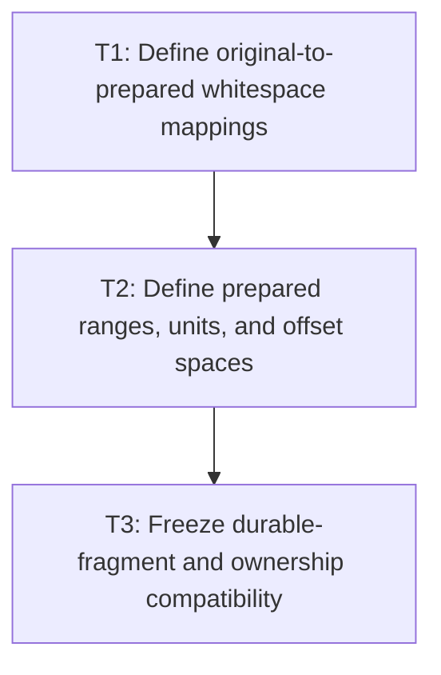

# P1: Approve Prepared Ranges and Source Mappings

## Goal

Approve a code-point-safe prepared-text/range model and explicit UTF-16 mappings from original node
content through durable fragments/resolved runs before changing inline preparation.

## Non-Goals

- Coalescing durable fragments or caching retained layout.
- Implementing whitespace preparation or range traversal.

## Context

- Parent milestone: `docs/work/E5/M4 - Prepare inline text with ranges and code points.md`.
- Phase entry gate: M2 contracts for CR/LF, replacement, wrapping, UTF-16 indices, and coordinates are
  approved and implemented.
- Existing `InlineFragment.equals` excludes `node`; tests must use reference assertions for ownership.

## Phase Tasks

### T1: Define original-to-prepared whitespace mappings
**Purpose:** Preserve traceability through normalization that removes, collapses, replaces, or inserts
prepared characters.

**Depends on:** None.
**Enables:** T2.
**Parallelizable with:** None.

**Changes:**
- [ ] Define UTF-16 mapping behavior from original node content to normalized/prepared text for CR,
  LF, CRLF, tabs expanded by tab size, form-feed (`U+000C`), vertical tab (`U+000B`), collapsed
  whitespace sequences, preserved spaces/newlines, removed source, and inserted expansion characters.
- [ ] Define forward and reverse mapping at exact boundaries, inside collapsed/expanded source spans,
  empty prepared ranges, and valid surrogate pairs.
- [ ] Align replacement-glyph source/rendered mappings with M2 and distinguish whitespace preparation
  replacement from missing-glyph rendering replacement.

**Acceptance Checks:**
- [ ] Table-driven fixtures trace each original UTF-16 boundary to prepared boundaries and back under
  each `white-space`/tab policy, including form-feed and vertical-tab collapse/preserve behavior.
- [ ] No mapping can point to the interior of a valid surrogate pair unless it is an explicitly
  rejected/normalized external input under M2.

**Risks / Stop Criteria:** Stop if a collapse/expansion case has multiple possible answers without a
documented bias/range rule.

### T2: Define prepared ranges, units, and offset spaces
**Purpose:** Replace substring/per-character temporary units with immutable range metadata that all
later stages can map.

**Depends on:** T1.
**Enables:** T3.
**Parallelizable with:** None.

**Changes:**
- [ ] Define immutable prepared text plus range/unit kinds for text, collapsible/preserved space,
  forced break, spacer, and atomic inline element, all with code-point-safe start/end boundaries.
- [ ] Define mappings among original-node UTF-16, prepared text, unit/range, line candidate,
  fragment-local, and M2 glyph/run offsets, including split/deferred ranges.
- [ ] Define ownership and lifetime as pass-local output suitable for later bounded M7 reuse without
  retaining mutable `ResolvedStyle` identity.

**Acceptance Checks:**
- [ ] Every inline layout operation can refer to a prepared value/range and source mapping without
  creating a unit substring.
- [ ] Range validation rejects reversed/out-of-bounds/surrogate-splitting boundaries.

**Risks / Stop Criteria:** Stop if a unit requires a standalone one-character `String` for identity
or if an offset space is inferred only from field naming.

### T3: Freeze durable-fragment and ownership compatibility
**Purpose:** Prevent temporary-allocation optimization from silently changing exposed layout output.

**Depends on:** T2.
**Enables:** None.
**Parallelizable with:** None.

**Changes:**
- [ ] Characterize exact durable fragment count/text, x/y/width/height/baseline, font/size/color,
  runs, source relationship, and element/text node ownership for whitespace/wrapping fixtures.
- [ ] Classify each preserved output as a text-bearing fragment that requires one `String` or a null-
  text spacer/element/union fragment that requires zero `String` materializations.
- [ ] Add explicit reference-identity assertions for `InlineFragment.node` and owner chains because
  equality/hash cannot detect owner changes.
- [ ] Record fragment coalescing and durable string elimination as separate unapproved behavior/data-
  structure changes outside M4.

**Acceptance Checks:**
- [ ] Fixtures cover parsed boundary spaces, nested inline elements, inline-blocks, tabs, collapse,
  form-feed, vertical tab, alignment, fallback/replacement, and supplementary code points.
- [ ] The approved performance claim is limited to temporary preparation/unit allocation.
- [ ] Fixture expectations define exactly one durable `String` per required text-bearing fragment and
  zero for null-text spacer, element, and union fragments.

**Risks / Stop Criteria:** Do not approve a range design that requires changing durable fragment
count/text/ownership to function.

## Verification Strategy

- Run `./gradlew :spinygui.core:test --tests 'com.spinyowl.spinygui.core.layout.impl.InlineWhitespaceTest'`.
- Run `./gradlew :spinygui.core:test --tests 'com.spinyowl.spinygui.core.layout.impl.InlineFormattingContextTest'`.
- Run `./gradlew :spinygui.core:test --tests 'com.spinyowl.spinygui.core.layout.impl.ParsedInlineWhitespaceLayoutTest'`.

## Review Boundaries

- Review whitespace mappings, then range/offset model, then durable compatibility fixtures.

## Deferred Work

- Single-pass implementation/pass-local reuse belongs to P2; inline integration/proof belongs to P3.
- Fragment coalescing and full fragment caching remain deferred.

## Dependency Graph

